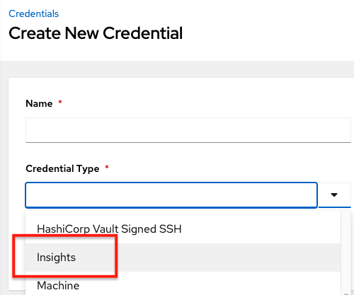
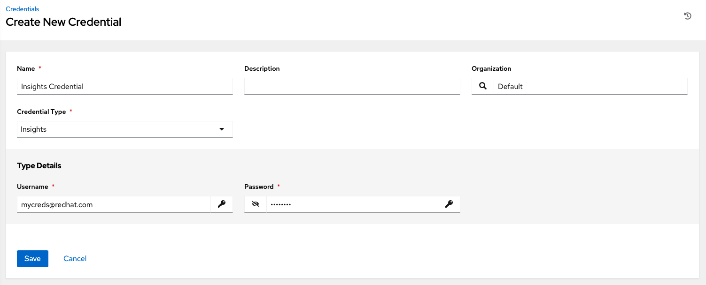
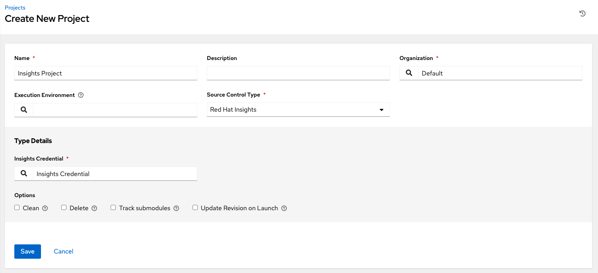
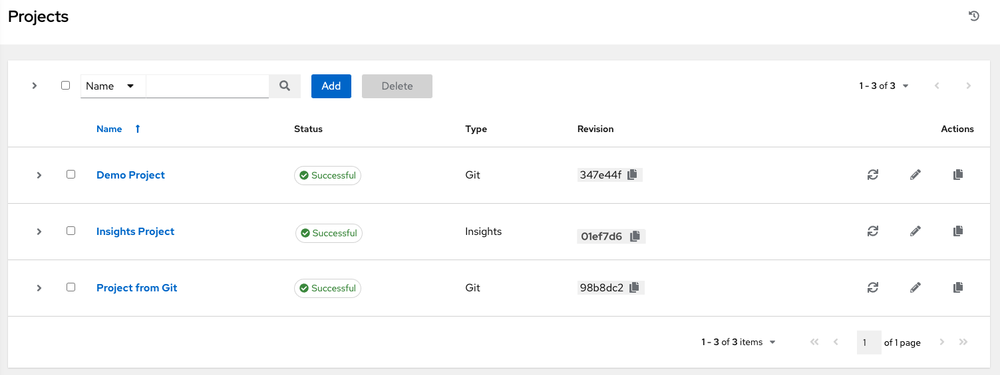
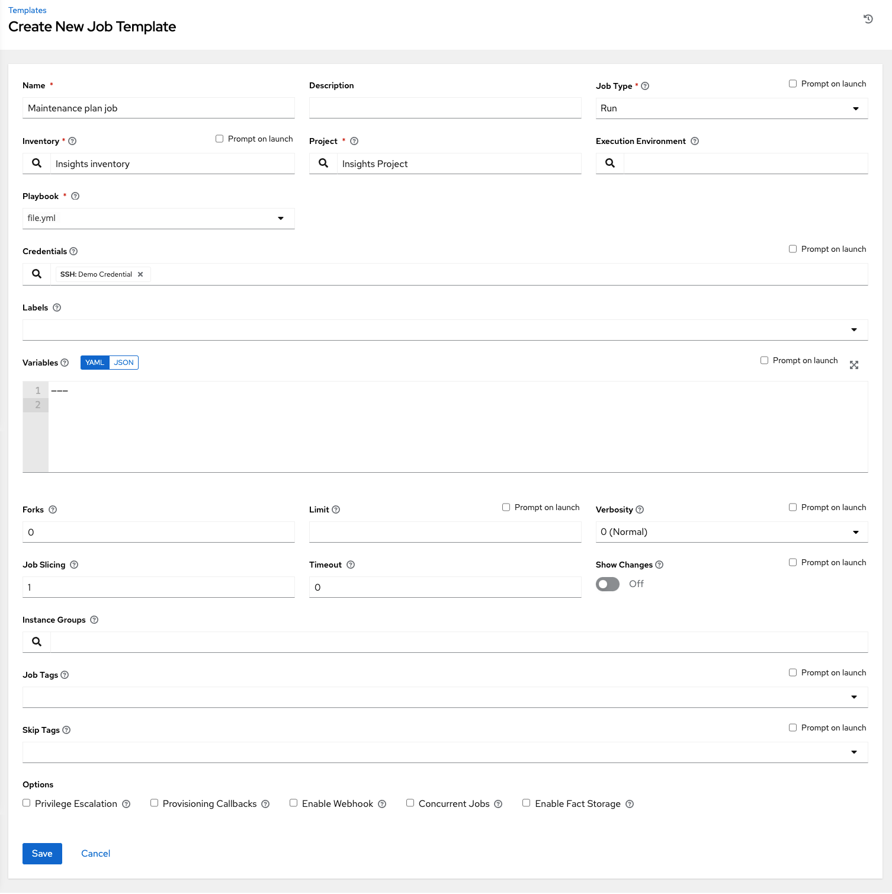

.. _insights:

Setting up Insights Remediations
~~~~~~~~~~~~~~~~~~~~~~~~~~~~~~~~

.. index::
	pair: projects; Insights
   

|At| supports integration with Red Hat Insights. Once a host is registered with Insights, it will be continually scanned for vulnerabilities and known configuration conflicts. Each of the found problems may have an associated fix in the form of an Ansible playbook. Insights users create a maintenance plan to group the fixes and, ultimately, create a playbook to mitigate the problems. |At| tracks the maintenance plan playbooks via an Insights project. Authentication to Insights via Basic Auth is backed by a special Insights Credential, which must first be established in |at|. To ultimately run an Insights Maintenance Plan, you need an Insights project, and an Insights inventory.

Create Insights Credential
^^^^^^^^^^^^^^^^^^^^^^^^^^^^^^

.. index:: 
   pair: credentials; Insights

To create a new credential for use with Insights:

1. Click **Credentials** from the left navigation bar to access the Credentials page.

2. Click the **Add** button located in the upper right corner of the Credentials screen.

3. Enter the name of the credential to be used in the **Name** field.

4. Optionally enter a description for this credential in the **Description** field.

5. In the **Organization** field, optionally enter the name of the organization with which the credential is associated, or click the |search| button and select it from the pop-up window.

.. |search| image:: ../common/images/search-button.png
   :alt: Search button to select the organization from a pop-up window

6. In the **Credential Type** field, enter **Insights** or select it from the drop-down list.

   
7. Enter a valid Insights credential in the **Username** and **Password** fields.

|Credentials - create with demo insights credentials|

8. Click **Save** when done.

Create an Insights Project
^^^^^^^^^^^^^^^^^^^^^^^^^^^^^^

.. index:: 
   pair: project; Insights

To create a new Insights project:

1. Click **Projects** from the left navigation bar to access the Projects page.

2. Click the **Add** button located in the upper right corner of the Projects screen.

3. Enter the appropriate details into the required fields, at minimum. Note the following fields requiring specific Insights-related entries:

-  **Name**: Enter the name for your Insights project.
-  **Organization**: Enter the name of the organization associated with this project, or click the |search| button and select it from the pop-up window.
-  **SCM Type**: Select **Red Hat Insights**. 
-  Upon selecting the SCM type, the **Source Details** field expands. 

4. The **Credential** field is pre-populated with the Insights credential you previously created. If not, enter the credential, or click the |search| button and select it from the pop-up window. 

5. Click to select the update option(s) for this project from the **Options** field, and provide any additional values, if applicable. For information about each option, click the tooltip |tooltip| next to the options.

.. |tooltip| image:: ../common/images/tooltips-icon.png

|Insights - create demo insights project form|

6. Click **Save** when done. 

All SCM/Project syncs occur automatically the first time you save a new project. However, if you want them to be updated to what is current in Insights, manually update the SCM-based project by clicking the |update| button under the project's available Actions.

This process syncs your Insights project with your Insights account solution. Notice that the status dot beside the name of the project updates once the sync has run.

|Insights - demo insights project success|

Create Insights Inventory
^^^^^^^^^^^^^^^^^^^^^^^^^^^^^^

.. index:: 
   pair: inventory; Insights

The Insights playbook contains a `hosts:` line where the value is the hostname that Insights itself knows about,  which may be different than the hostname that AWX knows about. To use an Insights playbook, you will need an Insights inventory.

To create a new inventory for use with Insights, see :ref:`ug_source_insights`.

Remediate Insights Inventory
^^^^^^^^^^^^^^^^^^^^^^^^^^^^^^

.. index:: 
   pair: inventory; Insights

Remediation of an Insights inventory allows AWX to run Insights playbooks with a single click. This is done by creating a Job Template to run the Insights remediation.

1. Click **Job Templates** from the left navigation bar to access the Job Templates page.

2. Create a new Job Template, with the appropriate details into the required fields, at minimum.  Note the following fields requiring specific Insights-related entries:

-  **Name**: Enter the name of your Maintenance Plan.
-  **Job Type**: If not already populated, select **Run** from the drop-down menu list.
-  **Inventory**: Select the Insights Inventory you previously created.
-  **Project**: Select the Insights project you previously created. 
-  **Playbook**: Select a playbook associated with the Maintenance Plan you want to run from the drop-down menu list.
-  **Credential**: Enter the credential to use for this project or click the |search| button and select it from the pop-up window. The credential does not have to be an Insights credential.  
-  **Verbosity**: Keep the default setting, or select the desired verbosity from the drop-down menu list.

|Insights - maintenance plan template filled|

3. Click **Save** when done. 

4. Click the |launch| icon to launch the job template.

.. |launch| image:: ../common/images/launch-button.png
   :alt: Launch icon for starting the job template

Once complete, the job results display in the Job Details page.
