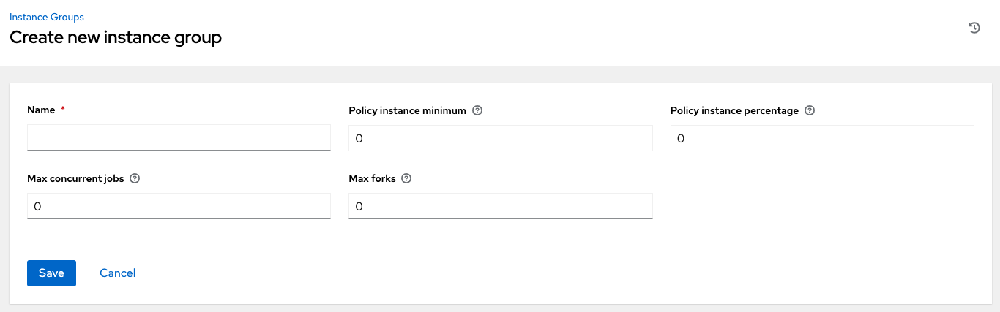
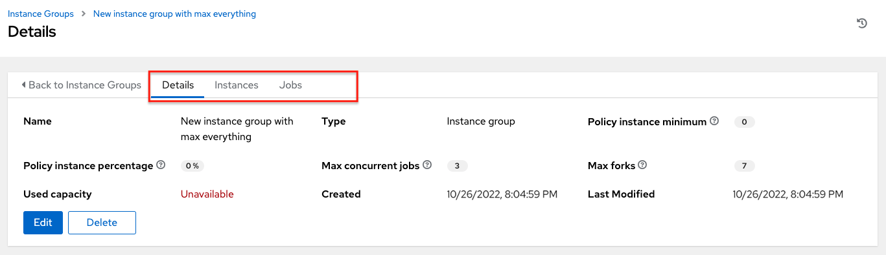
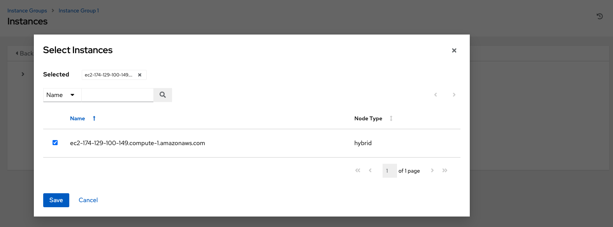
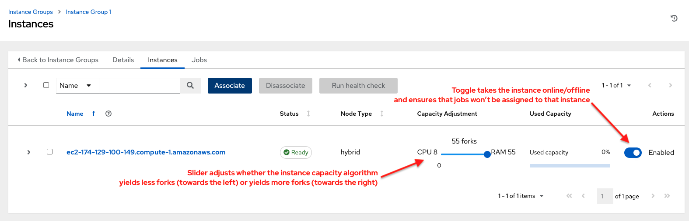
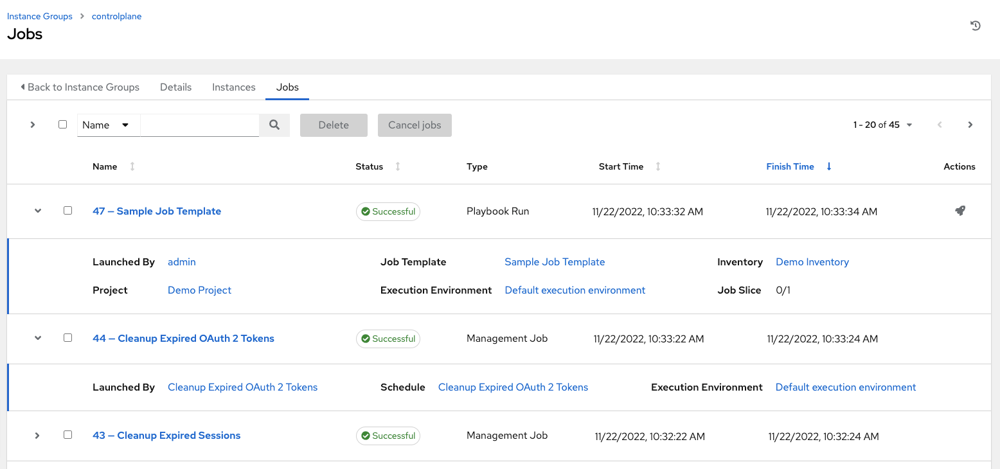

.. _ug_instance_groups:

Instance Groups
====================

.. index::
   single: instance groups

An :term:`Instance Group` provides the ability to group instances in a clustered environment. Additionally, policies dictate how instance groups behave and how jobs are executed. The following view displays the capacity levels based on policy algorithms:

|Instance Group policy example|

.. |Instance Group policy example| image:: ../common/images/instance-groups_list_view.png
   :alt: Instance groups list view showing example instance groups and one with capacity levels

For more information about the policy or rules associated with instance groups, see the :ref:`ag_instance_groups` section of the |ata|.

If you want to connect your instance group to a container, refer to :ref:`ag_container_groups` for further detail.

For an in-depth discussion on these concepts, refer to the *Feature Spotlight: Instance Groups and Isolated Nodes* `blog
<https://www.ansible.com/blog/ansible-tower-feature-spotlight-instance-groups-and-isolated-nodes>`_.

.. _ug_instance_groups_create:

Create an instance group
--------------------------

To create a new instance group:

1. Click **Instance Groups** from the left navigation menu to open the Instance Groups configuration window.

2. Click **Add** and select **Add instance group**.

|IG - create new IG|

3. Enter the appropriate details into the following fields:

-  **Name**. Names must be unique and must not be named *awx*. 
-  **Policy instance minimum**. Enter the minimum number of instances to automatically assign to this group when new instances come online.
-  **Policy instance percentage**. Use the slider to select a minimum percentage of instances to automatically assign to this group when new instances come online.

.. note::

	 Policy instance fields are not required to create a new instance group. If you do not specify values, then the Policy instance minimum and Policy instance percentage default to 0.

-  **Max concurrent jobs**. Specify the maximum number of forks that can be run for any given job.
-  **Max forks**. Specify the maximum number of concurrent jobs that can be run for any given job.

.. note::

	 The default value of 0 for **Max concurrent jobs** and **Max forks** denotes no limit. See :ref:`ag_instancegrp_cpacity` in the |ata| for more detail.

4. Click **Save**.

Once the instance group is successfully created, the **Details** tab of the newly created instance group remains, allowing you to review and edit your instance group information. This is the same screen that opens when the **Edit** (|edit-button|) button is clicked from the **Instance Groups** list view. You can also edit **Instances** and review **Jobs** associated with this instance group.

.. |edit-button| image:: ../common/images/edit-button.png
   :alt: Edit button

|IG - example IG successfully created|

Associate instances to an instance group
~~~~~~~~~~~~~~~~~~~~~~~~~~~~~~~~~~~~~~~~~~~

To associate instances to an instance group:

1. Click the **Instances** tab of the Instance Group window and click the **Associate** button.

2. Click the checkbox next to one or more available instances from the list to select the instance(s) you want to associate with the instance group. 

|IG - select instances|

3. In the following example, the instances added to the instance group displays along with information about their capacity.

This view also allows you to edit some key attributes associated with the instances in your instance group:

|IG - instances in IG callouts|

View jobs associated with an instance group
~~~~~~~~~~~~~~~~~~~~~~~~~~~~~~~~~~~~~~~~~~~~~

To view the jobs associated with the instance group, click the **Jobs** tab of the Instance Group window and then click **Expanded** to expand the view to show details about each job.

|IG - instances jobs|

Each job displays the job status, ID, and name; type of job, time started and completed, who started the job; and applicable resources associated with it, such as template, inventory, project, |ee|, etc.

The instances are run in accordance with instance group policies. Refer to :ref:`Instance Group Policies <ag_instance_group_policies>` in the |ata|.
