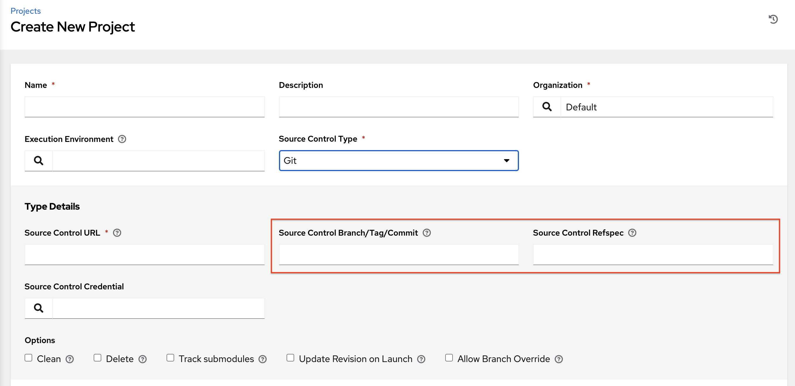
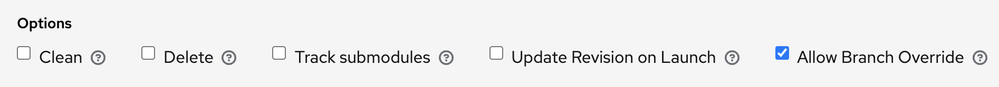
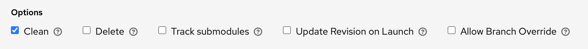
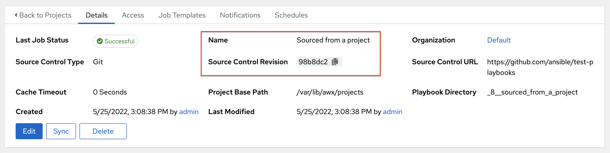

.. _ug_job_branching:

Projects specify the branch, tag, or reference to use from source control in the ``scm_branch`` field. These are represented by the values specified in the Project Details fields as shown.

Projects have the option to "Allow Branch Override". When checked, project admins can delegate branch selection to the job templates that use that project (requiring only project ``use_role``). 

Source tree copy behavior
~~~~~~~~~~~~~~~~~~~~~~~~~~

Every job run has its own private data directory. This directory contains a copy of the project source tree for the given
``scm_branch`` the job is running. Jobs are free to make changes to the project folder and make use of those changes while it is still running. This folder is temporary and is cleaned up at the end of the job run.

If **Clean** is checked, AWX discards modified files in its local copy of the repository through use of the ``force`` parameter in its respective Ansible modules pertaining to `git`_ or `Subversion`_.

.. _`git`: https://docs.ansible.com/ansible/latest/collections/ansible/builtin/git_module.html#parameters
.. _`Subversion`: https://docs.ansible.com/ansible/latest/collections/ansible/builtin/subversion_module.html#parameters

Project revision behavior
~~~~~~~~~~~~~~~~~~~~~~~~~~

Typically, during a project update, the revision of the default branch (specified in the **SCM Branch** field of the project)
is stored when updated, and jobs using that project will employ this revision. Providing a non-default **SCM Branch** (not a commit hash or tag) in a job, the newest revision is pulled from the source control remote immediately before the job starts.
This revision is shown in the **Source Control Revision** field of the job and its respective project update.

Consequently, offline job runs are impossible for non-default branches. To be sure that a job is running a static version from source control, use tags or commit hashes. Project updates do not save the revision of all branches, only the project default branch.

The **SCM Branch** field is not validated, so the project must update to assure it is valid. If this field is provided or prompted for, the **Playbook** field of job templates will not be validated, and you will have to launch the job template in order to verify presence of the expected playbook.

Git Refspec
~~~~~~~~~~~~

.. index::
   pair: git refspec; templates

The **SCM Refspec** field specifies which extra references the update should download from the remote. Examples are:

 1. ``refs/*:refs/remotes/origin/*``: fetches all references, including remotes of the remote
 2. ``refs/pull/*:refs/remotes/origin/pull/*`` (GitHub-specific): fetches all refs for all pull requests
 3. ``refs/pull/62/head:refs/remotes/origin/pull/62/head``: fetches the ref for that one GitHub pull request

For large projects, you should consider performance impact when using the 1st or 2nd examples here.

The **SCM Refspec** parameter affects the availability of the project branch, and can allow access to references not otherwise available. The examples above allow the user to supply a pull request from the **SCM Branch**, which would
not be possible without the **SCM Refspec** field.

The Ansible git module fetches ``refs/heads/*`` by default. This means that a project's branches and tags (and commit hashes therein) can be used as the SCM Branch if **SCM Refspec** is blank. The value specified in the **SCM Refspec** field affects which **SCM Branch** fields can be used as overrides. Project updates (of any type) will perform an extra ``git fetch`` command to pull that refspec from the remote.

For example: You could set up a project that allows branch override with the 1st or 2nd refspec example --> Use this in a job template that prompts for the **SCM Branch** --> A client could launch the job template when a new pull request is created, providing the branch ``pull/N/head`` --> The job template would run against the provided GitGub pull request reference.

For more information on the Ansible git module, see https://docs.ansible.com/ansible/latest/collections/ansible/builtin/git_module.html.
