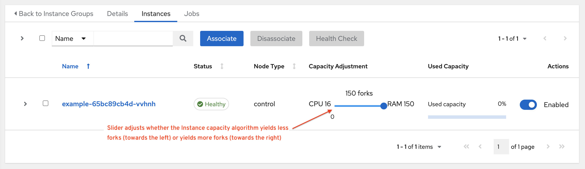

This section describes how to determine capacity for instance groups and its impact to your jobs. For container groups, see :ref:`ag_container_capacity` in the |ata|.

AWX capacity system determines how many jobs can run on an instance given the amount of resources available to the instance and the size of the jobs that are running (referred to as *Impact*). The algorithm used to determine this is based entirely on two things:

- How much memory is available to the system (``mem_capacity``)
- How much CPU is available to the system (``cpu_capacity``)

Capacity also impacts Instance Groups. Since Groups are made up of instances, likewise, instances can be assigned to multiple groups. This means that impact to one instance can potentially affect the overall capacity of other Groups.

Instance Groups (not instances themselves) can be assigned to be used by jobs at various levels (see :ref:`ag_clustering`). When the Task Manager is preparing its graph to determine which group a job will run on, it will commit the capacity of an Instance Group to a job that hasn’t or isn’t ready to start yet.

Finally, in smaller configurations, if only one instance is available for a job to run, the Task Manager will allow that job to run on the instance even if it pushes the instance over capacity. This guarantees that jobs themselves won't get stuck as a result of an under-provisioned system.

Therefore, Capacity and Impact is not a zero-sum system relative to jobs and instances/Instance Groups.

For information on sliced jobs and their impact to capacity, see :ref:`ug_job_slice_execution`.

Resource determination for capacity algorithm
~~~~~~~~~~~~~~~~~~~~~~~~~~~~~~~~~~~~~~~~~~~~~~~~

The capacity algorithms are defined in order to determine how many forks a system is capable of running simultaneously. This controls how many systems Ansible itself will communicate with simultaneously. Increasing the number of forks an AWX system is running will, in general, allow jobs to run faster by performing more work in parallel. The trade-off is that this will increase the load on the system, which could cause work to slow down overall.

AWX can operate in two modes when determining capacity. ``mem_capacity`` (the default) will allow you to over-commit CPU resources while protecting the system from running out of memory. If most of your work is not CPU-bound, then selecting this mode will maximize the number of forks.

Memory relative capacity
^^^^^^^^^^^^^^^^^^^^^^^^^^

``mem_capacity`` is calculated relative to the amount of memory needed per fork. Taking into account the overhead for internal components, this comes out to be about 100MB per fork. When considering the amount of memory available to Ansible jobs, the capacity algorithm will reserve 2GB of memory to account for the presence of other services. The algorithm formula for this is:

::

      (mem - 2048) / mem_per_fork

As an example:

::

      (4096 - 2048) / 100 == ~20

Therefore, a system with 4GB of memory would be capable of running 20 forks. The value ``mem_per_fork`` can be controlled by setting the settings value (or environment variable) ``SYSTEM_TASK_FORKS_MEM``, which defaults to 100.

CPU relative capacity
^^^^^^^^^^^^^^^^^^^^^^^

Often, Ansible workloads can be fairly CPU-bound. In these cases, sometimes reducing the simultaneous workload allows more tasks to run faster and reduces the average time-to-completion of those jobs.

Just as the ``mem_capacity`` algorithm uses the amount of memory need per fork, the ``cpu_capacity`` algorithm looks at the amount of CPU resources is needed per fork. The baseline value for this is 4 forks per core. The algorithm formula for this is:

::

      cpus * fork_per_cpu

For example, a 4-core system:

::

      4 * 4 == 16

The value ``fork_per_cpu`` can be controlled by setting the settings value (or environment variable) ``SYSTEM_TASK_FORKS_CPU`` which defaults to 4.

Capacity job impacts
~~~~~~~~~~~~~~~~~~~~~~~

When selecting the capacity, it's important to understand how each job type affects capacity.

It's helpful to understand what forks mean to Ansible: https://www.ansible.com/blog/ansible-performance-tuning (see the section on "Know Your Forks").

The default forks value for Ansible is 5. However, if AWX knows that you're running against fewer systems than that, then the actual concurrency value will be lower.

When a job is run, AWX will add 1 to the number of forks selected to compensate for the Ansible parent process. So if you are running a playbook against 5 systems with a forks value of 5, then the actual forks value from the perspective of Job Impact will be 6.

Impact of job types in AWX
^^^^^^^^^^^^^^^^^^^^^^^^^^^

Jobs and Ad-hoc jobs follow the above model, forks + 1. If you set a fork value on your job template, your job capacity value will be the minimum of the forks value supplied, and the number of hosts that you have, plus one. The plus one is to account for the parent Ansible process.

Instance capacity determines which jobs get assigned to any specific instance. Jobs and ad hoc commands use more capacity if they have a higher forks value.

Other job types have a fixed impact:

- Inventory Updates: 1
- Project Updates: 1
- System Jobs: 5

If you don’t set a forks value on your job template, your job will use Ansible’s default forks value of five. Even though Ansible defaults to five forks, it will use fewer if your job has fewer than five hosts. In general, setting a forks value higher than what the system is capable of could cause trouble by running out of memory or over-committing CPU. So, the job template fork values that you use should fit on the system. If you have playbooks using 1000 forks but none of your systems individually has that much capacity, then your systems are undersized and at risk of performance or resource issues.

Selecting the right capacity
^^^^^^^^^^^^^^^^^^^^^^^^^^^^^^^^

Selecting a capacity out of the CPU-bound or the memory-bound capacity limits is, in essence, selecting between the minimum or maximum number of forks. In the above examples, the CPU capacity would allow a maximum of 16 forks while the memory capacity would allow 20. For some systems, the disparity between these can be large and often times you may want to have a balance between these two.

The instance field ``capacity_adjustment`` allows you to select how much of one or the other you want to consider. It is represented as a value between 0.0 and 1.0. If set to a value of 1.0, then the largest value will be used. The above example involves memory capacity, so a value of 20 forks would be selected. If set to a value of 0.0 then the smallest value will be used. A value of 0.5 would be a 50/50 balance between the two algorithms which would be 18:

::

      16 + (20 - 16) * 0.5 == 18

To view or edit the capacity in the user interface, select the **Instances** tab of the Instance Group.

