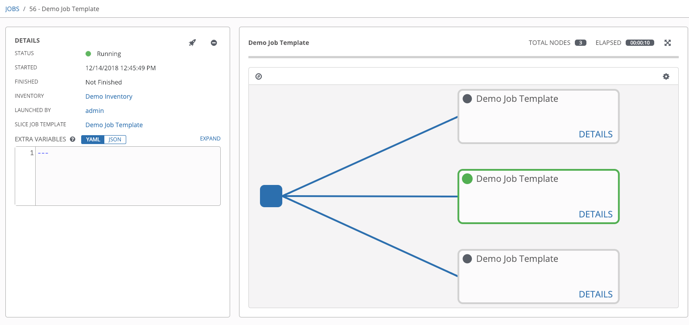

.. _ug_job_slice:

Job Slicing
===============

.. index::
   single: job slice
   single: job splitting
   pair: job types; slice
   pair: job types; splitting
   pair: job types; distributed

A :term:`sliced job` refers to the concept of a distributed job. Distributed jobs are used for running a job across a very large number of hosts, allowing you to run multiple ansible-playbooks, each on a subset of an inventory, that can be scheduled in parallel across a cluster. 

By default, Ansible runs jobs from a single control instance. For jobs that do not require cross-host orchestration, job slicing takes advantage of AWX's ability to distribute work to multiple nodes in a cluster. Job slicing works by adding a Job Template field ``job_slice_count``, which specifies the number of jobs into which to slice the Ansible run. When this number is greater than 1, AWX will generate a workflow from a job template instead of a job. The inventory will be distributed evenly amongst the slice jobs. The workflow job is then started, and proceeds as though it were a normal workflow. When launching a job, the API will return either a job resource (if ``job_slice_count = 1``) or a workflow job resource. The corresponding User Interface will redirect to the appropriate screen to display the status of the run.

Job slice considerations
--------------------------

Consider the following when setting up job slices:

- A sliced job creates a workflow job, and then that creates jobs.

- A job slice consists of a job template, an inventory, and a slice count.

- When executed, a sliced job splits each inventory into a number of "slice size" chunks. It then queues jobs of ansible-playbook runs on each chunk of the appropriate inventory. The inventory fed into ansible-playbook is a pared-down version of the original inventory that only contains the hosts in that particular slice. The completed sliced job that displays on the Jobs list are labeled accordingly, with the number of sliced jobs that have run:

.. image:: ../common/images/sliced-job-shown-jobs-list-view.png
    :alt: Sliced job shown in Jobs list view

- These sliced jobs follow normal scheduling behavior (number of forks, queuing due to capacity, assignation to instance groups based on inventory mapping).

.. note::

	.. include:: ../common/job-slicing-rule.rst

- Sliced job templates with prompts and/or extra variables behave the same as standard job templates, applying all variables and limits to the entire set of slice jobs in the resulting workflow job. However, when passing a limit to a Sliced Job, if the limit causes slices to have no hosts assigned, those slices will fail, causing the overall job to fail.

- A job slice job status of a distributed job is calculated in the same manner as workflow jobs; failure if there are any unhandled failures in its sub-jobs.

.. warning::

	Any job that intends to orchestrate across hosts (rather than just applying changes to individual hosts) should not be configured as a slice job. Any job that does, may fail, and AWX will not attempt to discover or account for playbooks that fail when run as slice jobs.

.. _ug_job_slice_execution:

Job slice execution behavior
--------------------------------

When jobs are sliced, they can run on any node and some may not run at the same time (insufficient capacity in the system, for example). When slice jobs are running, job details display the workflow and job slice(s) currently running, as well as a link to view their details individually.

By default, job templates are not normally configured to execute simultaneously (``allow_simultaneous`` must be checked in the API or **Enable Concurrent Jobs** in the UI). Slicing overrides this behavior and implies ``allow_simultaneous`` even if that setting is unchecked. See :ref:`ug_JobTemplates` for information on how to specify this, as well as the number of job slices on your job template configuration.

The :ref:`ug_JobTemplates` section provides additional detail on performing the following operations in the User Interface:

- Launch workflow jobs with a job template that has a slice number greater than one 
- Cancel the whole workflow or individual jobs after launching a slice job template
- Relaunch the whole workflow or individual jobs after slice jobs finish running
- View the details about the workflow and slice jobs after a launching a job template
- Search slice jobs specifically after you create them (see subsequent section, :ref:`ug_job_slice_search`)

.. _ug_job_slice_search:

Search job slices
-------------------

To make it easier to find slice jobs, use the Search functionality to apply a search filter to:

- job lists to show only slice jobs
- job lists to show only parent workflow jobs of job slices
- job templates lists to only show job templates that produce slice jobs

To show only slice jobs in job lists, as with most cases, you can filter either on the type (jobs here) or ``unified_jobs``:

::

	/api/v2/jobs/?job_slice_count__gt=1

To show only parent workflow jobs of job slices:

::

	/api/v2/workflow_jobs/?job_template__isnull=false

To show only job templates that produce slice jobs:

::

	/api/v2/job_templates/?job_slice_count__gt=1

