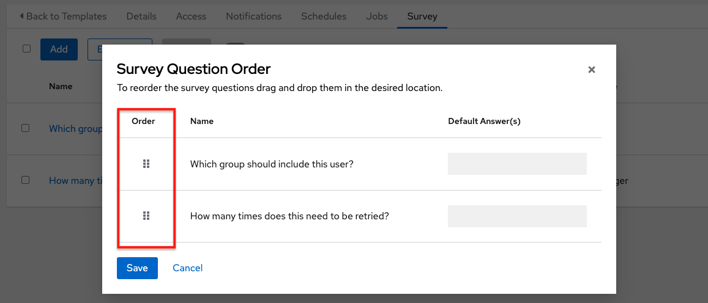
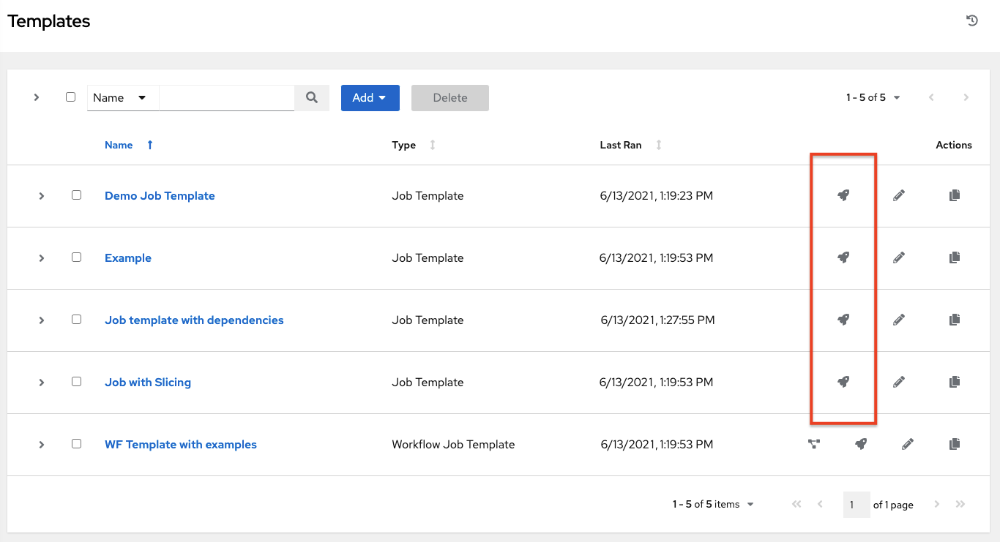
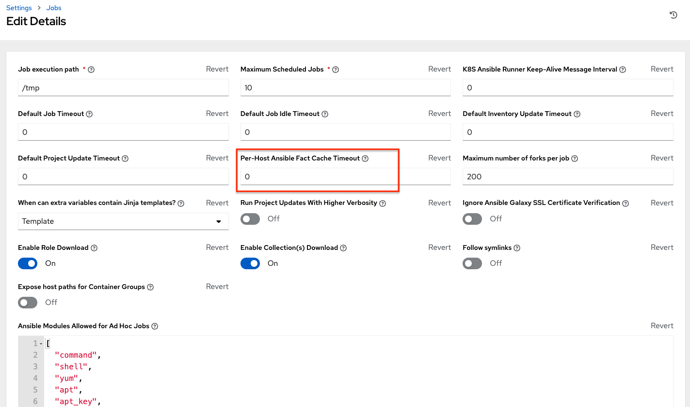
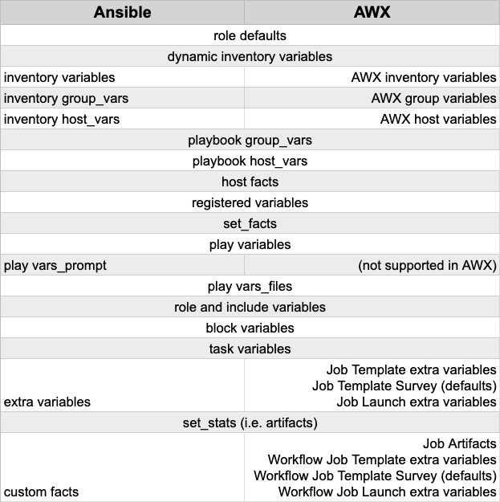

.. _ug_JobTemplates:

Job Templates
===============

.. index::
   single: job templates
   pair: job types; run
   pair: job types; check
   pair: job types; scan
   single: system tracking; scan job

A :term:`job template` is a definition and set of parameters for running an Ansible job. Job templates are useful to execute the same job many times. Job templates also encourage the reuse of Ansible playbook content and collaboration between teams.

The **Templates** menu opens a list of the job templates that are currently available. The default view is collapsed (Compact), showing the template name, template type, and the timestamp of last job that ran using that template. You can click **Expanded** (arrow next to each entry) to expand to view more information. This list is sorted alphabetically by name, but you can sort by other criteria, or search by various fields and attributes of a template. 

|Job templates - home with example job template|

From this screen, you can launch (|launch|), edit (|edit|), and copy (|copy|) a job template. To delete a job template, you must select one or more templates and click the **Delete** button. Before deleting a job template, be sure it is not used in a workflow job template.  

.. |edit| image:: ../common/images/edit-button.png
    :alt: Edit button

.. |delete| image:: ../common/images/delete-button.png
    :alt: Delete button

.. include:: ../common/work_items_deletion_warning.rst

.. note::

      Job templates can be used to build a workflow template. For templates that show the Workflow Visualizer (|wf-viz-icon|) icon next to them are workflow templates. Clicking it allows you to graphically build a workflow. Many parameters in a job template allow you to enable **Prompt on Launch** that can be modified at the workflow level, and do not affect the values assigned at the job template level. For instructions, see the :ref:`ug_wf_editor` section. 

Create a Job Template
-----------------------

To create a new job template:

1. Click the **Add** button then select **Job Template** from the menu list.

2. Enter the appropriate details into the following fields:

.. note::

    If a field has the **Prompt on launch** checkbox selected, launching the job will prompt you for the value for that field upon launch. Most prompted values will override any values set in the job template; exceptions are noted below.

.. list-table::
   :widths: 10 40 25
   :header-rows: 1

   * - Field
     - Options
     - Prompt on Launch
   * - **Name**
     - Enter a name for the job.
     - N/A
   * - **Description**
     - Enter an arbitrary description as appropriate (optional).
     - N/A
   * - **Job Type**
     - Choose a job type:
        * **Run**: Execute the playbook when launched, running Ansible tasks on the selected hosts.
        * **Check**: Perform a "dry run" of the playbook and report changes that would be made without actually making them. Tasks that do not support check mode will be skipped and will not report potential changes.
       
       More information on job types can be found in the `Playbook execution <https://docs.ansible.com/ansible/latest/playbook_guide/playbooks_intro.html#playbook-execution>`_ section of the Ansible documentation.

     - Yes
   * - **Inventory**
     - Choose the inventory to be used with this job template from the inventories available to the currently logged in user. A System Administrator must grant you or your team permissions to be able to use certain inventories in a job template.  
     - Yes. Inventory prompts will show up as its own step in a subsequent prompt window. 
   * - **Project**
     - Choose the project to be used with this job template from the projects available to the currently logged in user.
     - N/A 
   * - **SCM Branch**
     - This field is only present if you chose a project that allows branch override. Specify the overriding branch to use in your job run. If left blank, the specified SCM branch (or commit hash or tag) from the project is used. For more detail, see :ref:`job branch overriding <ug_job_branching>`.
     - Yes
   * - **Execution Environment**
     - Select the container image to be used to run this job. A project must be selected before you can select an |ee|.
     - Yes. |Ee| prompts will show up as its own step in a subsequent prompt window.
   * - **Playbook**
     - Choose the playbook to be launched with this job template from the available playbooks. This field automatically populates with the names of the playbooks found in the project base path for the selected project. Alternatively, you can enter the name of the playbook if it is not listed, such as the name of a file (like ``foo.yml``) you want to use to run with that playbook. If you enter a filename that is not valid, the template will display an error, or cause the job to fail.
     - N/A 
   * - **Credentials**
     - Click the |search| button to open a separate window. Choose the credential from the available options to be used with this job template. Use the drop-down menu list to filter by credential type if the list is extensive. Some credential types are not listed because they do not apply to certain job templates.
     - * If selected, upon launching a job template that has a default credential and supplying another credential will replace the default credential if it is the same type. Example of such a message:

       ::

        Job Template default credentials must be replaced
        with one of the same type. Please select a credential
        for the following types in order to proceed: Machine.

       * Alternatively, you can add more credentials as you see fit. 
       * Credential prompts will show up as its own step in a subsequent prompt window.
   * - **Labels**
     - * Optionally supply labels that describe this job template, such as "dev" or "test". Labels can be used to group and filter job templates and completed jobs in the display.
       * Labels are created when they are added to the Job Template. Labels are associated to a single Organization using the Project that is provided in the Job Template. Members of the Organization can create labels on a Job Template if they have edit permissions (such as admin role).
       * Once the Job Template is saved, the labels appear in the Job Templates overview in the *Expanded* view.
       * Click the (|x|) beside a label to remove it. When a label is removed, it is no longer associated with that particular Job or Job Template, but it will remain associated with any other jobs that reference it. 
       * Jobs inherit labels from the Job Template at the time of launch. If a label is deleted from a Job Template, it is also deleted from the Job.
     - * If selected, even if a default value is supplied, you will be prompted upon launch to supply additional labels if needed. 
       * You will not be able to delete existing labels - clicking (|x-circle|) only removes the newly added labels, not existing default labels.
   * - **Variables**
     - * Pass extra command line variables to the playbook. This is the "-e" or "--extra-vars" command line parameter for ansible-playbook that is documented in the Ansible documentation at `Passing Variables on the Command Line <https://docs.ansible.com/ansible/latest/reference_appendices/general_precedence.html>`_.
       * Provide key/value pairs using either YAML or JSON. These variables have a maximum value of precedence and overrides other variables specified elsewhere. An example value might be:

        ::

          git_branch: production
          release_version: 1.5
     - Yes. If you want to be able to specify ``extra_vars`` on a schedule, you must select **Prompt on Launch** for **Variables** on the job template, or a enable a survey on the job template, then those answered survey questions become ``extra_vars``.
   * - **Forks**
     - The number of parallel or simultaneous processes to use while executing the playbook. A value of zero uses the Ansible default setting, which is 5 parallel processes unless overridden in ``/etc/ansible/ansible.cfg``.
     - Yes
   * - **Limit**
     - A host pattern to further constrain the list of hosts managed or affected by the playbook. Multiple patterns can be separated by colons (``:``). As with core Ansible, ``a:b`` means "in group a or b", ``a:b:&c`` means "in a or b but must be in c", and ``a:!b`` means "in a, and definitely not in b". For more information and examples refer to `Patterns <https://docs.ansible.com/ansible/latest/inventory_guide/intro_patterns.html>`_ in the Ansible documentation.
     - Yes
   * - **Verbosity**
     - Control the level of output Ansible produces as the playbook executes. Choose the verbosity from Normal to various Verbose or Debug settings. This only appears in the "details" report view. Verbose logging includes the output of all commands. Debug logging is exceedingly verbose and includes information on SSH operations that can be useful in certain support instances. Most users do not need to see debug mode output.

       .. warning::

         Verbosity 5 causes AWX to block heavily when jobs are running, which could delay reporting that the job has finished (even though it has) and can cause the browser tab to lock up.
     - Yes
   * - **Job Slicing**
     - Specify the number of slices you want this job template to run. Each slice will run the same tasks against a portion of the inventory. For more information about job slices, see :ref:`ug_job_slice`.
     - Yes
   * - **Timeout**
     - Allows you to specify the length of time (in seconds) that the job may run before it is canceled. Some caveats for setting the timeout value:
        * There is a global timeout defined in the settings which defaults to 0, indicating no timeout. 
        * A negative timeout (<0) on a job template is a true "no timeout" on the job. 
        * A timeout of 0 on a job template defaults the job to the global timeout (which is no timeout by default).
        * A positive timeout sets the timeout for that job template.
     - Yes
   * - **Show Changes**
     - Allows you to see the changes made by Ansible tasks.
     - Yes
   * - **Instance Groups**
     - Choose :ref:`ag_instance_groups` to associate with this job template. If the list is extensive, use the |search| to narrow the options. Note, job template instance groups contribute to the job scheduling criteria, see :ref:`ag_instance_groups_job_runtime_behavior` and :ref:`ag_instance_groups_control_where_job_runs` for rules. A System Administrator must grant you or your team permissions to be able to use an instance group in a job template. Use of a container group requires admin rights. 
     - * Yes. If selected, you are providing the jobs preferred instance groups in order of preference. If the first group is out of capacity, subsequent groups in the list will be considered until one with capacity is available, at which point that will be selected to run the job. 
       * If you prompt for an instance group, what you enter replaces the normal instance group hierarchy and overrides all of the organizations' and inventories' instance groups.
       * Instance Groups prompts will show up as its own step in a subsequent prompt window. 
   * - **Job Tags**
     - Begin typing and selecting the **Create x** drop-down to specify which parts of the playbook should be executed. For more information and examples refer to `Tags <https://https://docs.ansible.com/ansible/latest/playbook_guide/playbooks_tags.html>`_ in the Ansible documentation.
     - Yes
   * - **Skip Tags**
     - Begin typing and selecting the **Create x** drop-down to specify certain tasks or parts of the playbook to skip. For more information and examples refer to `Tags <https://https://docs.ansible.com/ansible/latest/playbook_guide/playbooks_tags.html>`_ in the Ansible documentation.
     - Yes

.. |x-circle| image:: ../common/images/x-delete-button.png
    :alt: Delete button

3. **Options**: Specify options for launching this template, if necessary.
  
  - **Privilege Escalation**: If checked, you enable this playbook to run as an administrator. This is the equivalent of passing the ``--become`` option to the ``ansible-playbook`` command.
  - **Provisioning Callbacks**: If checked, you enable a host to call back to AWX via the REST API and invoke the launch of a job from this job template. Refer to :ref:`ug_provisioning_callbacks` for additional information.
  - **Enable Webhook**: Turns on the ability to interface with a predefined SCM system web service that is used to launch a job template. Currently supported SCM systems are GitHub and GitLab.

.. _ug_jt_enable_webhooks:

  If you enable webhooks, other fields display, prompting for additional information:

    .. image:: ../common/images/job-templates-options-webhooks.png
        :alt: Job templates - options - webhooks

    - **Webhook Service**: Select which service to listen for webhooks from
    - **Webhook URL**: Automatically populated with the URL for the webhook service to POST requests to.
    - **Webhook Key**: Generated shared secret to be used by the webhook service to sign payloads sent to AWX. This must be configured in the settings on the webhook service in order for AWX to accept webhooks from this service.  
    - **Webhook Credential**: Optionally, provide a GitHub or GitLab personal access token (PAT) as a credential to use to send status updates back to the webhook service. Before you can select it, the credential must exist. See :ref:`ug_credentials_cred_types` to create one.

    For additional information on setting up webhooks, see :ref:`ug_webhooks`.

  - **Concurrent Jobs**: If checked, you are allowing jobs in the queue to run simultaneously if not dependent on one another. Check this box if you want to run job slices simultaneously. Refer to :ref:`ug_job_concurrency` for additional information. 
  - **Enable Fact Storage**: When checked, AWX will store gathered facts for all hosts in an inventory related to the job running.
  - **Prevent Instance Group Fallback**: Check this option to allow only the instance groups listed in the **Instance Groups** field above to execute the job. If unchecked, all available instances in the execution pool will be used based on the hierarchy described in :ref:`ag_instance_groups_control_where_job_runs`.  Click the |help| icon for more information.

.. |help| image:: ../common/images/tooltips-icon.png
    :alt: Tooltip

|Job templates - create new job template|

4. When you have completed configuring the details of the job template, click **Save**. 

Saving the template does not exit the job template page but advances to the Job Template Details tab for viewing. After saving the template, you can click **Launch** to launch the job, or click **Edit** to add or change the attributes of the template, such as permissions, notifications, view completed jobs, and add a survey (if the job type is not a scan). You must first save the template prior to launching, otherwise, the **Launch** button remains grayed-out.

You can verify the template is saved when the newly created template appears on the Templates list view. 

Add Permissions
-----------------------

.. include:: ../common/permissions.rst

Work with Notifications
-------------------------

Clicking the **Notifications** tab allows you to review any notification integrations you have setup and their statuses, if they have ran. 

Use the toggles to enable or disable the notifications to use with your particular template. For more detail, see :ref:`ug_notifications_on_off`. 

If no notifications have been set up, click the **Add** button to create a new notification. Refer to :ref:`ug_notifications_types` for additional details on configuring various notification types and extended messaging.

View Completed Jobs
---------------------

The **Completed Jobs** tab provides the list of job templates that have ran. Click **Expanded** to view details of each job, including its status, ID, and name; type of job, time started and completed, who started the job; and which template, inventory, project, and credential were used. You can filter the list of completed jobs using any of these criteria.

Sliced jobs that display on this list are labeled accordingly, with the number of sliced jobs that have run:

.. image:: ../common/images/sliced-job-shown-jobs-list-view.png
    :alt: Sliced job shown in jobs list view

Scheduling
-----------

.. index::
   pair: job templates; scheduling

Access the schedules for a particular job template from the **Schedules** tab.

|Job Templates - schedule launch|

.. |Job Templates - schedule launch| image:: ../common/images/job-templates-schedules.png
    :alt: Job Templates - schedule launch

Schedule a Job Template
~~~~~~~~~~~~~~~~~~~~~~~~~

.. index::
   pair: job templates; scheduling
   single: scheduling; add new

To schedule a job template run, click the **Schedules** tab.

- If schedules are already set up; review, edit, or enable/disable your schedule preferences. 
- If schedules have not been set up, refer to :ref:`ug_scheduling` for more information.  

If **Prompt on Launch** was selected for the **Credentials** field, and you create or edit scheduling information for your job template, a **Prompt** button displays at the bottom of the Schedules form. You will not be able to remove the default machine credential in the Prompt dialog without replacing it with another machine credential before you can save it. Below is an example of such a message:

.. note::

  To able to set ``extra_vars`` on schedules, you must select **Prompt on Launch** for **Variables** on the job template, or a configure and enable a survey on the job template, then those answered survey questions become ``extra_vars``.

.. _ug_surveys:

Surveys
---------

.. index::
   pair: job templates; surveys

Job types of Run or Check will provide a way to set up surveys in the Job Template creation or editing screens. Surveys set extra variables for the playbook similar to 'Prompt for Extra Variables' does, but in a user-friendly question and answer way. Surveys also allow for validation of user input. Click the **Survey** tab to create a survey.

Use cases for surveys are numerous. An example might be if operations wanted to give developers a "push to stage" button they could run without advanced Ansible knowledge. When launched, this task could prompt for answers to questions such as, "What tag should we release?"

Many types of questions can be asked, including multiple-choice questions.

.. _ug_surveys_create:

Create a Survey
~~~~~~~~~~~~~~~~~~~

.. index::
   single: job templates; survey creation
   single: surveys; creation

To create a survey:

1. Click the **Survey** tab and click the **Add** button.

2. A survey can consist of any number of questions. For each question, enter the following information:

-  **Question**: The question to ask the user
-  **Description**: (optional) A description of what's being asked of the user.
-  **Answer Variable Name**: The Ansible variable name to store the user's response in. This is the variable to be used by the playbook. Variable names cannot contain spaces.
-  **Answer Type**: Choose from the following question types.

   -  *Text*: A single line of text. You can set the minimum and maximum length (in characters) for this answer.
   -  *Textarea*: A multi-line text field. You can set the minimum and maximum length (in characters) for this answer.
   -  *Password*: Responses are treated as sensitive information, much like an actual password is treated. You can set the minimum and maximum length (in characters) for this answer.
   -  *Multiple Choice (single select)*: A list of options, of which only one can be selected at a time. Enter the options, one per line, in the **Multiple Choice Options** box.
   -  *Multiple Choice (multiple select)*: A list of options, any number
      of which can be selected at a time. Enter the options, one per
      line, in the **Multiple Choice Options** box.
   -  *Integer*: An integer number. You can set the minimum and maximum length (in characters) for this answer.
   -  *Float*: A decimal number. You can set the minimum and maximum length (in characters) for this answer.

-  **Required**: Whether or not an answer to this question is required from the user.
-  **Minimum length** and **Maximum length**: Specify if a certain length in the answer is required.
-  **Default answer**: The default answer to the question. This value is pre-filled in the interface and is used if the answer is not provided by the user.

.. image:: ../common/images/job-template-create-survey.png
    :alt: Job templates - create survey

3. Once you have entered the question information, click **Save** to add the question.

The survey question displays in the Survey list. For any question, you can click |edit| to edit the question, or check the box next to each question and click **Delete** to delete the question, or use the toggle button at the top of the screen to enable or disable the survey prompt(s).

|job-template-completed-survey|

.. |job-template-completed-survey| image:: ../common/images/job-template-completed-survey.png
    :alt: Job templates - completed survey

If you have more than one survey question, use the **Edit Order** button to rearrange the order of the questions by clicking and dragging on the grid icon. 

4. To add more questions, click the **Add** button to add additional questions.

Optional Survey Questions
~~~~~~~~~~~~~~~~~~~~~~~~~~

.. index::
   single: job templates; survey optional questions
   single: surveys; optional questions

The **Required** setting on a survey question determines whether the answer is optional or not for the user interacting with it.

Behind the scenes, optional survey variables can be passed to the playbook in ``extra_vars``, even when they aren't filled in.

- If a non-text variable (input type) is marked as optional, and is not filled in, no survey ``extra_var`` is passed to the playbook.

- If a text input or text area input is marked as optional, is not filled in, and has a minimum ``length > 0``, no survey ``extra_var`` is passed to the playbook.

- If a text input or text area input is marked as optional, is not filled in, and has a minimum ``length === 0``, that survey ``extra_var`` is passed to the playbook, with the value set to an empty string ( "" ).

Launch a Job Template
--------------------------

.. index::
   pair: job templates; jobs, launching

A major benefit of AWX is the push-button deployment of Ansible playbooks. You can easily configure a template to store all parameters you would normally pass to the ansible-playbook on the command line--not just the playbooks, but the inventory, credentials, extra variables, and all options and settings you can specify on the command line.

Easier deployments drive consistency, by running your playbooks the same way each time, and allow you to delegate responsibilities--even users who aren’t Ansible experts can run playbooks written by others.

Launch a job template by any of the following ways:

- Access the job template list from the **Templates** menu on the left navigation bar or while in the Job Template Details view, scroll to the bottom to access the |launch| button from the list of templates.

- While in the Job Template Details view of the job template you want to launch, click **Launch**. 

.. |launch| image:: ../common/images/launch-button.png
    :alt: Launch button

A job may require additional information to run. The following data may be requested at launch:

- Credentials that were setup
- The option ``Prompt on Launch`` is selected for any parameter
- Passwords or passphrases that have been set to **Ask**
- A survey, if one has been configured for the job templates
- Extra variables, if requested by the job template 

.. note::

  If a job has user-provided values, then those are respected upon relaunch. If the user did not specify a value, then the job uses the default value from the job template. Jobs are not relaunched as-is. They are relaunched with the user prompts re-applied to the job template.

Below is an example job launch that prompts for Job Tags, and runs the example survey created in :ref:`ug_surveys`.

|job-launch-with-prompt-job-tags|

.. |job-launch-with-prompt-job-tags| image:: ../common/images/job-launch-with-prompt-at-launch-jobtags.png
    :alt: Job launch with prompt job tags

|job-launch-with-prompt-survey|

.. note::

  Providing values on one tab, and going back to a previous tab, and then continuing on to the next tab will result in having to re-provide values on the rest of the tabs. Make sure you fill in the tabs in the order the prompts appear to avoid this.

Along with any extra variables set in the job template and survey, AWX automatically adds the following variables to the job environment. Also note, ``awx_``* variables are defined by the system and cannot be overridden. Variables about the job context, like ``awx_job_template_name`` are not affected if they are set in ``extra_vars``.

- ``awx_job_id``: The Job ID for this job run
- ``awx_job_launch_type``: The description to indicate how the job was started:

  - **manual**: Job was started manually by a user.
  - **relaunch**: Job was started via relaunch.
  - **callback**: Job was started via host callback.
  - **scheduled**: Job was started from a schedule.
  - **dependency**: Job was started as a dependency of another job.
  - **workflow**: Job was started from a workflow job.
  - **sync**: Job was started from a project sync.
  - **scm**: Job was created as an Inventory SCM sync.

- ``awx_job_template_id``: The Job Template ID that this job run uses
- ``awx_job_template_name``: The Job Template name that this job uses
- ``awx_execution_node``: The Execution Node name that launched this job
- ``awx_project_revision``: The revision identifier for the source tree that this particular job uses (it is also the same as the job's field ``scm_revision``)
- ``awx_project_scm_branch``: The configured default project SCM branch for the project the job template uses
- ``awx_job_scm_branch`` If the SCM Branch is overwritten by the job, the value is shown here
- ``awx_user_email``: The user email of the AWX user that started this job. This is not available for callback or scheduled jobs.
- ``awx_user_first_name``: The user's first name of the AWX user that started this job. This is not available for callback or scheduled jobs.
- ``awx_user_id``: The user ID of the AWX user that started this job. This is not available for callback or scheduled jobs.
- ``awx_user_last_name``: The user's last name of the AWX user that started this job. This is not available for callback or scheduled jobs.
- ``awx_user_name``: The user name of the AWX user that started this job. This is not available for callback or scheduled jobs.
- ``awx_schedule_id``: If applicable, the ID of the schedule that launched this job
- ``awx_schedule_name``: If applicable, the name of the schedule that launched this job
- ``awx_workflow_job_id``: If applicable, the ID of the workflow job that launched this job
- ``awx_workflow_job_name``: If applicable, the name of the workflow job that launched this job. Note this is also the same as the workflow job template.
- ``awx_inventory_id``: If applicable, the ID of the inventory this job uses
- ``awx_inventory_name``: If applicable, the name of the inventory this job uses

For compatibility, all variables are also given an "awx" prefix, for example, ``awx_job_id``.

Upon launch, AWX automatically redirects the web browser to the Job Status page for this job under the **Jobs** tab.

.. note::

  You can re-launch the most recent job from the list view to re-run on all hosts or just failed hosts in the specified inventory. Refer to :ref:`ug_jobs` in the |atu| for more detail.

When slice jobs are running, job lists display the workflow and job slices, as well as a link to view their details individually.

.. image:: ../common/images/sliced-job-shown-jobs-list-view.png
    :alt: Sliced job shown in jobs list view

.. _ug_JobTemplates_bulk_api:

.. note::

  You may launch jobs in bulk using the newly added endpoint in the API, ``/api/v2/bulk/job_launch``. This endpoint accepts JSON and you can specify a list of unified job templates (such as job templates, project updates, etc) to launch. The user must have the appropriate permission to launch all the jobs. Either all jobs are launched, or an error is returned indicating why the operation was not able to complete. Use the **OPTIONS** request to return relevant schema. For more information, see the `Bulk endpoint <https://docs.ansible.com/automation-controller/latest/html/controllerapi/api_ref.html#/Bulk>`_ of the *Reference* section of the |atapi|.

Copy a Job Template
---------------------

If you choose to copy Job Template, it **does not** copy any associated schedule, notifications, or permissions. Schedules and notifications must be recreated by the user or admin creating the copy of the Job Template. The user copying the Job Template will be granted the admin permission, but no permissions are assigned (copied) to the Job Template.

1. Access the job template list from the **Templates** menu on the left navigation bar or while in the Job Template Details view, scroll to the bottom to access it from the list of templates.

|Job templates - home with example job template|

2. Click the |copy| button associated with the template you want to copy.

.. |copy| image:: ../common/images/copy-button.png
    :alt: Copy button

The new template with the name of the template from which you copied and a timestamp displays in the list of templates.

3. Click to open the new template and click **Edit**.

4. Replace the contents of the **Name** field with a new name, and provide or modify the entries in the other fields to complete this page. 

5. Click **Save** when done.

.. _ug_jobtemplates_scanjobs:

Fact Scan Playbooks
~~~~~~~~~~~~~~~~~~~~~

.. index:: 
   pair: system tracking; fact scan playbook
   pair: fact scan job; playbook

The scan job playbook, ``scan_facts.yml``, contains invocations of three ``fact scan modules`` - packages, services, and files, along with Ansible's standard fact gathering. The ``scan_facts.yml`` playbook file looks like the following:

.. code-block:: python

  - hosts: all
    vars:
      scan_use_checksum: false
      scan_use_recursive: false
    tasks:
      - scan_packages:
      - scan_services:
      - scan_files:
          paths: '{{ scan_file_paths }}'
          get_checksum: '{{ scan_use_checksum }}'
          recursive: '{{ scan_use_recursive }}'
        when: scan_file_paths is defined

The ``scan_files`` fact module is the only module that accepts parameters, passed via ``extra_vars`` on the scan job template.

.. code-block:: python
  
  scan_file_paths: '/tmp/'
  scan_use_checksum: true
  scan_use_recursive: true

- The ``scan_file_paths`` parameter may have multiple settings (such as ``/tmp/`` or ``/var/log``). 
- The ``scan_use_checksum`` and ``scan_use_recursive`` parameters may also be set to false or omitted. An omission is the same as a false setting. 

Scan job templates should enable ``become`` and use credentials for which ``become`` is a possibility. You can enable become by checking the **Enable Privilege Escalation** from the Options menu:

.. image:: ../common/images/job-templates-create-new-job-template-become.png
    :alt: Job template with Privilege Escalation checked from the Options field.

Supported OSes for ``scan_facts.yml``
~~~~~~~~~~~~~~~~~~~~~~~~~~~~~~~~~~~~~~~

If you use the ``scan_facts.yml`` playbook with use fact cache, ensure that your OS is supported:

- |rhel| 5, 6, & 7
- OEL 6 & 7
- SLES 11 & 12
- Debian 6, 7, 8
- Fedora 22, 23, 24
- Amazon Linux 2016.03
- Windows Server 2008 and later

Note that some of these operating systems may require initial configuration in order to be able to run python and/or have access to the python packages (such as ``python-apt``) that the scan modules depend on.

Pre-scan Setup
~~~~~~~~~~~~~~~~~~

The following are examples of playbooks that configure certain distributions so that scan jobs can be run against them.

**Bootstrap Fedora (23, 24)**

::

  ---

  - name: Get Fedora ready
   hosts: all
   sudo: yes
   gather_facts: no

   tasks:

   - name: install python-simplejson
     raw: sudo dnf -y update
     raw: sudo dnf -y install python-simplejson
     raw: sudo dnf -y install rpm-python

Custom Fact Scans
~~~~~~~~~~~~~~~~~~~

.. index:: 
   pair: system tracking; custom fact scans 
   pair: fact scan job; custom
   pair: custom fact scans; playbook

A playbook for a custom fact scan is similar to the example of the Fact Scan Playbook above. As an example, a playbook that only uses a custom ``scan_foo`` Ansible fact module would look like this:

*scan_custom.yml*: 

.. code-block:: python

  - hosts: all
    gather_facts: false
    tasks:
      - scan_foo:

*scan_foo.py*:

.. code-block:: python

  def main():
      module = AnsibleModule(
          argument_spec = dict())

      foo = [
        {
          "hello": "world"
        },
        {
          "foo": "bar"
        }
      ]
      results = dict(ansible_facts=dict(foo=foo))
      module.exit_json(**results)

  main()

To use a custom fact module, ensure that it lives in the ``/library/`` subdirectory of the Ansible project used in the scan job template. This fact scan module is very simple, returning a hard-coded set of facts:

.. code-block:: python

 [
    {
      "hello": "world"
    },
    {
      "foo": "bar"
    }
  ]

Refer to the `Creating an info or a facts module <https://docs.ansible.com/ansible/latest/dev_guide/developing_modules_general.html#creating-an-info-or-a-facts-module>`_ section of the Ansible documentation for more information.

.. _ug_fact_caching:

Fact Caching
----------------

.. index:: 
   pair: fact caching; playbook
   pair: facts; scan job templates

AWX can store and retrieve facts on a per-host basis through an Ansible Fact Cache plugin. This behavior is configurable on a per-job template basis. Fact caching is turned off by default but can be enabled to serve fact requests for all hosts in an inventory related to the job running. This allows you to use job templates with ``--limit`` while still having access to the entire inventory of host facts. A global timeout setting that the plugin enforces per-host, can be specified (in seconds) through the Jobs settings menu:

Upon launching a job that uses fact cache (``use_fact_cache=True``), AWX will store all ``ansible_facts`` associated with each host in the inventory associated with the job.  The Ansible Fact Cache plugin that ships with AWX will only be enabled on jobs with fact cache enabled (``use_fact_cache=True``).

When a job that has fact cache enabled (``use_fact_cache=True``) finishes running, AWX will restore all records for the hosts in the inventory.  Any records with update times *newer* than the currently stored facts per-host will be updated in the database.

New and changed facts will be logged via AWX's logging facility. Specifically, to the ``system_tracking`` namespace or logger. The logging payload will include the fields: 

  - ``host_name``
  - ``inventory_id``
  - ``ansible_facts`` 

where ``ansible_facts`` is a dictionary of all Ansible facts for ``host_name`` in the AWX inventory, ``inventory_id``.

.. note::

  If a hostname includes a forward slash (``/``), fact cache will not work for that host. If you have an inventory with 100 hosts and one host has a ``/`` in the name, 99 of those hosts will still collect facts.

Benefits of Fact Caching
~~~~~~~~~~~~~~~~~~~~~~~~~~

Fact caching saves a significant amount of time over running fact gathering. If you have a playbook in a job that runs against a thousand hosts and forks, you could easily spend 10 minutes gathering facts across all of those hosts. But if you run a job on a regular basis, the first run of it caches these facts and the next run will just pull them from the database. This cuts the runtime of jobs against large inventories, including Smart Inventories, by an enormous magnitude.

.. note:: 
  Do not modify the ``ansible.cfg`` file to apply fact caching. Custom fact caching could conflict with AWX's fact caching feature. It is recommended to use the fact caching module that comes with AWX. 

You can choose to use cached facts in your job by enabling it in the **Options** field of the Job Templates window.

.. image:: ../common/images/job-templates-options-use-factcache.png
    :alt: Job templates - options - use factcache

To clear facts, you need to run the Ansible ``clear_facts`` `meta task`_. Below is an example playbook that uses the Ansible ``clear_facts`` meta task.

.. _`meta task`: https://docs.ansible.com/ansible/latest/collections/ansible/builtin/meta_module.html#examples

::
  
  - hosts: all
    gather_facts: false
    tasks:
      - name: Clear gathered facts from all currently targeted hosts
        meta: clear_facts

You can find the API endpoint for fact caching at: 

.. code-block::
   
   http://<awx server name>/api/v2/hosts/x/ansible_facts

.. _ug_CloudCredentials:

Utilizing Cloud Credentials
------------------------------

.. index::
  pair: job templates; cloud credentials

Cloud Credentials can be used when syncing a respective cloud inventory. Cloud Credentials may also be associated with a Job Template and included in the runtime environment for use by a playbook. Cloud Credentials currently supported:

.. contents::
    :local:

OpenStack
~~~~~~~~~~~~

.. index::
    pair: cloud credentials; OpenStack

The sample playbook below invokes the ``nova_compute`` Ansible OpenStack cloud module and requires credentials to do anything meaningful, and specifically requires the following information: ``auth_url``, ``username``, ``password``, and ``project_name``. These fields are made available to the playbook via the environmental variable ``OS_CLIENT_CONFIG_FILE``, which points to a YAML file written by AWX based on the contents of the cloud credential. This sample playbook loads the YAML file into the Ansible variable space.

``OS_CLIENT_CONFIG_FILE`` example:

::

  clouds:
    devstack:
      auth:
        auth_url: http://devstack.yoursite.com:5000/v2.0/
        username: admin
        password: your_password_here
        project_name: demo

Playbook example:

::

  - hosts: all
    gather_facts: false
    vars:
      config_file: "{{ lookup('env', 'OS_CLIENT_CONFIG_FILE') }}"
      nova_tenant_name: demo
      nova_image_name: "cirros-0.3.2-x86_64-uec"
      nova_instance_name: autobot
      nova_instance_state: 'present'
      nova_flavor_name: m1.nano

      nova_group:
        group_name: antarctica
        instance_name: deceptacon
        instance_count: 3
    tasks:
      - debug: msg="{{ config_file }}"
      - stat: path="{{ config_file }}"
        register: st
      - include_vars: "{{ config_file }}"
        when: st.stat.exists and st.stat.isreg

      - name: "Print out clouds variable"
        debug: msg="{{ clouds|default('No clouds found') }}"

      - name: "Setting nova instance state to: {{ nova_instance_state }}"
        local_action:
          module: nova_compute
          login_username: "{{ clouds.devstack.auth.username }}"
          login_password: "{{ clouds.devstack.auth.password }}"

Amazon Web Services
~~~~~~~~~~~~~~~~~~~~

.. index::
    pair: cloud credentials; AWS

Amazon Web Services cloud credentials are exposed as the following environment variables during playbook execution (in the job template, choose the cloud credential needed for your setup):

- ``AWS_ACCESS_KEY_ID``
- ``AWS_SECRET_ACCESS_KEY``

All of the AWS modules will implicitly use these credentials when run via AWX without having to set the ``aws_access_key_id`` or ``aws_secret_access_key`` module options.

Google
~~~~~~~~

.. index::
    pair: cloud credentials; Google

Google cloud credentials are exposed as the following environment variables during playbook execution (in the job template, choose the cloud credential needed for your setup):

- ``GCE_EMAIL``
- ``GCE_PROJECT``
- ``GCE_CREDENTIALS_FILE_PATH``

All of the Google modules will implicitly use these credentials when run via AWX without having to set the ``service_account_email``, ``project_id``, or ``pem_file`` module options.

Azure
~~~~~~~

.. index::
    pair: cloud credentials; MS Azure

Azure cloud credentials are exposed as the following environment variables during playbook execution (in the job template, choose the cloud credential needed for your setup):

- ``AZURE_SUBSCRIPTION_ID``
- ``AZURE_CERT_PATH``

All of the Azure modules implicitly use these credentials when run via AWX without having to set the ``subscription_id`` or ``management_cert_path`` module options.

VMware
~~~~~~~~

.. index::
    pair: cloud credentials; VMware

VMware cloud credentials are exposed as the following environment variables during playbook execution (in the job template, choose the cloud credential needed for your setup):

- ``VMWARE_USER``
- ``VMWARE_PASSWORD``
- ``VMWARE_HOST``

The sample playbook below demonstrates usage of these credentials:

::

  - vsphere_guest:
      vcenter_hostname: "{{ lookup('env', 'VMWARE_HOST') }}"
      username: "{{ lookup('env', 'VMWARE_USER') }}"
      password: "{{ lookup('env', 'VMWARE_PASSWORD') }}"
      guest: newvm001
      from_template: yes
      template_src: linuxTemplate
      cluster: MainCluster
      resource_pool: "/Resources"
      vm_extra_config:
        folder: MyFolder

.. _ug_provisioning_callbacks:

Provisioning Callbacks
-----------------------

.. index::
   pair: job templates; provisioning callbacks

Provisioning callbacks are a feature of AWX that allow a host to initiate a playbook run against itself, rather than waiting for a user to launch a job to manage the host from the AWX UI. Please note that provisioning callbacks are *only* used to run playbooks on the calling host. Provisioning callbacks are meant for cloud bursting (i.e. new instances with a need for client to server communication for configuration (such as transmitting an authorization key)), not to run a job against another host. This provides for automatically configuring a system after it has been provisioned by another system (such as AWS auto-scaling, or a OS provisioning system like kickstart or preseed) or for launching a job programmatically without invoking the AWX API directly. The Job Template launched only runs against the host requesting the provisioning.

Frequently this would be accessed via a firstboot type script, or from cron.

To enable callbacks, check the *Provisioning Callbacks* checkbox in the Job Template. This displays the **Provisioning Callback URL** for this job template.

.. note::

    If you intend to use AWX's provisioning callback feature with a dynamic inventory, Update on Launch should be set for the inventory group used in the Job Template.

.. image:: ../common/images/provisioning-callbacks-config.png
    :alt: Provisioning callbacks config

Callbacks also require a Host Config Key, to ensure that foreign hosts with the URL cannot request configuration. Please provide a custom value for Host Config Key. The host key may be reused across multiple hosts to apply this job template against multiple hosts. Should you wish to control what hosts are able to request configuration, the key may be changed at any time.

To callback manually via REST, look at the callback URL in the UI, which is of the form:

::

    https://<AWX_SERVER_NAME>/api/v2/job_templates/7/callback/

The '7' in this sample URL is the job template ID in AWX.

The request from the host must be a POST. Here is an example using curl (all on a single line):

.. code-block:: bash

   curl -k -f -i -H 'Content-Type:application/json' -XPOST -d '{"host_config_key": "redhat"}' \ 
                    https://<AWX_SERVER_NAME>/api/v2/job_templates/7/callback/

The requesting host must be defined in your inventory for the callback to succeed. If AWX fails to locate the host either by name or IP address in one of your defined inventories, the request is denied. When running a Job Template in this way, the host initiating the playbook run against itself must be in the inventory. If the host is missing from the inventory, the Job Template will fail with a "No Hosts Matched" type error message.

.. note::
    If your host is not in inventory and ``Update on Launch`` is set for the inventory group, AWX attempts to update cloud based inventory source before running the callback.

Successful requests result in an entry on the Jobs tab, where the results and history can be viewed.

While the callback can be accessed via REST, the suggested method of using the callback is to use one of the example scripts that ships with AWX - ``/usr/share/awx/request_awx_configuration.sh`` (Linux/UNIX) or ``/usr/share/awx/request_awx_configuration.ps1`` (Windows). Usage is described in the source code of the file by passing the ``-h`` flag, as shown below:

::

  ./request_awx_configuration.sh -h
  Usage: ./request_awx_configuration.sh <options>

  Request server configuration from AWX.

  OPTIONS:
   -h      Show this message
   -s      AWX server (e.g. https://ac.example.com) (required)
   -k      Allow insecure SSL connections and transfers
   -c      Host config key (required)
   -t      Job template ID (required)
   -e      Extra variables

This script has some intelligence, it knows how to retry commands and is therefore a more robust way to use callbacks than a simple curl request. As written, the script retries once per minute for up to ten minutes.

.. note::

  Please note that this is an example script. You should edit this script if you need more dynamic behavior when detecting failure scenarios, as any non-200 error code may not be a transient error requiring retry.

Most likely you will use callbacks with dynamic inventory in AWX, such as pulling cloud inventory from one of the supported cloud providers. In these cases, along with setting *Update On Launch*, be sure to configure an inventory cache timeout for the inventory source, to avoid hammering of your Cloud's API endpoints. Since the ``request_awx_configuration.sh`` script polls once per minute for up to ten minutes, a suggested cache invalidation time for inventory (configured on the inventory source itself) would be one or two minutes.

While we recommend against running the ``request_awx_configuration.sh`` script from a cron job, a suggested cron interval would be perhaps every 30 minutes. Repeated configuration can be easily handled by scheduling in AWX, so the primary use of callbacks by most users is to enable a base image that is bootstrapped into the latest configuration upon coming online. To do so, running at first boot is a better practice. First boot scripts are just simple init scripts that typically self-delete, so you would set up an init script that called a copy of the ``request_awx_configuration.sh`` script and make that into an autoscaling image.

Passing Extra Variables to Provisioning Callbacks
~~~~~~~~~~~~~~~~~~~~~~~~~~~~~~~~~~~~~~~~~~~~~~~~~~~~

.. index::
   pair: provisioning callbacks; extra variables
   pair: callbacks; extra variables

Just as you can pass ``extra_vars`` in a regular Job Template, you can also pass them to provisioning callbacks. To pass ``extra_vars``, the data sent must be part of the body of the POST request as application/json (as the content type). Use the following JSON format as an example when adding your own ``extra_vars`` to be passed:

::

  '{"extra_vars": {"variable1":"value1","variable2":"value2",...}}'

You can also pass extra variables to the Job Template call using ``curl``, such as is shown in the following example::

.. code-block:: bash

   root@localhost:~$ curl -f -H 'Content-Type: application/json' -XPOST \
                     -d '{"host_config_key": "redhat", "extra_vars": "{\"foo\": \"bar\"}"}' \
                     https://<AWX_SERVER_NAME>/api/v2/job_templates/7/callback

For more information, refer to :ref:`Launching Jobs with Curl<launch_jobs_curl>`.

.. _ug_jobtemplates_extravars:

Extra Variables
-------------------

.. index::
   pair: job templates; survey extra variables
   pair: surveys; extra variables

.. note::

    ``extra_vars`` passed to the job launch API are only honored if one of the following is true:

    - They correspond to variables in an enabled survey
    - ``ask_variables_on_launch`` is set to True

When you pass survey variables, they are passed as extra variables (``extra_vars``) within AWX. This can be tricky, as passing extra variables to a job template (as you would do with a survey) can override other variables being passed from the inventory and project.

For example, say that you have a defined variable for an inventory for ``debug = true``. It is entirely possible that this variable, ``debug = true``, can be overridden in a job template survey.

To ensure that the variables you need to pass are not overridden, ensure they are included by redefining them in the survey. Keep in mind that extra variables can be defined at the inventory, group, and host levels. 

If specifying the ``ALLOW_JINJA_IN_EXTRA_VARS`` parameter, refer to the :ref:`AWX Tips and Tricks <ag_tips_jinja_extravars>` section of the |ata| to configure it in the Jobs Settings screen of the AWX UI.

.. index::
   pair: job templates; job variables
   single: job templates, overview
   single: job templates, hierarchy
   single: variable precedence
   single: extra_vars

.. note::

  The Job Template extra variables dictionary is merged with the Survey variables. 

Here are some simplified examples of extra_vars in YAML and JSON formats:

The configuration in YAML format:

::

  launch_to_orbit: true
  satellites:
    - sputnik
    - explorer
    - satcom

The configuration in JSON format: 

::

  {
    "launch_to_orbit": true,
    "satellites": ["sputnik", "explorer", "satcom"]
  }

The following table notes the behavior (hierarchy) of variable precedence in AWX as it compares to variable precedence in Ansible.

**AWX Variable Precedence Hierarchy (last listed wins)**

Relaunching Job Templates
~~~~~~~~~~~~~~~~~~~~~~~~~~~

.. index::
   pair: job templates; relaunch

Instead of manually relaunching a job, a relaunch is denoted by setting ``launch_type`` to ``relaunch``. The relaunch behavior deviates from the launch behavior in that it **does not** inherit ``extra_vars``.

Job relaunching does not go through the inherit logic. It uses the same ``extra_vars`` that were calculated for the job being relaunched.

For example, say that you launch a Job Template with no ``extra_vars`` which results in the creation of a Job called **j1**. Next, say that you edit the Job Template and add in some ``extra_vars`` (such as adding ``"{ "hello": "world" }"``). 

Relaunching **j1** results in the creation of **j2**, but because there is no inherit logic and **j1** had no ``extra_vars``, **j2** will not have any ``extra_vars``.

To continue upon this example, if you launched the Job Template with the ``extra_vars`` you added after the creation of **j1**, the relaunch job created (**j3**) will include the ``extra_vars``. And relaunching **j3** results in the creation of **j4**, which would also include ``extra_vars``.
