.. _ug_jobs:

Jobs
=====

.. index::
   single: jobs

A :term:`job` is an instance of AWX launching an Ansible playbook against an inventory of hosts.

The **Jobs** link displays a list of jobs and their statuses--shown as completed successfully or failed, or as an active (running) job. 
The default view is collapsed (**Compact**) with the job name, status, job type, and start/finish times, but you can expand to see more information. You can sort this list by various criteria, and perform a search to filter the jobs of interest.

|Jobs - home with example job|

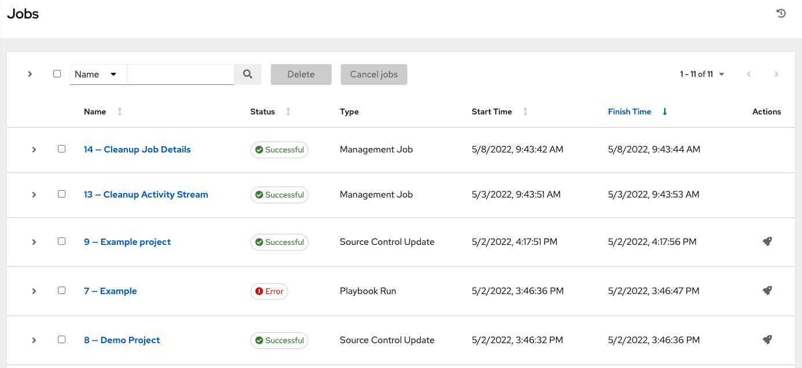
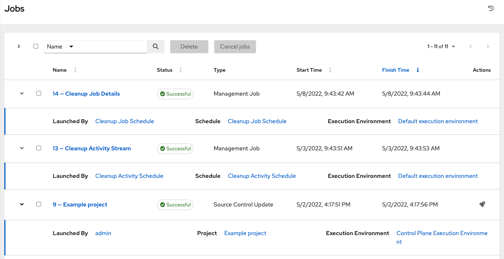

Actions you can take from this screen include viewing the details and standard output of a particular job, relaunching (|launch|) jobs, or removing selected jobs.The relaunch operation only applies to relaunches of playbook runs and does not apply to project/inventory updates, system jobs, workflow jobs, etc.

.. _ug_job_results:

.. index::
   single: jobs; results
   single: job results

When a job relaunches, you are directed the Jobs Output screen as the job runs. Clicking on any type of job also takes you to the Job Output View for that job, where you can filter jobs by various criteria:

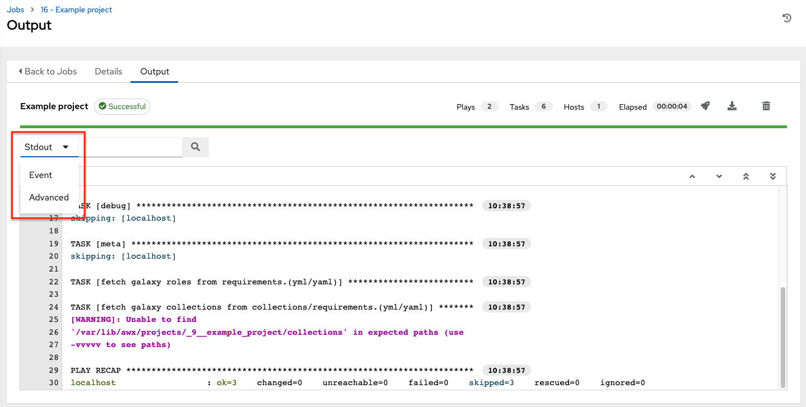

- The **Stdout** option is the default display that shows the job processes and output
- The **Event** option allows you to filter by the event(s) of interest, such as errors, host failures, host retries, items skipped, etc. You can include as many events in the filter as necessary.

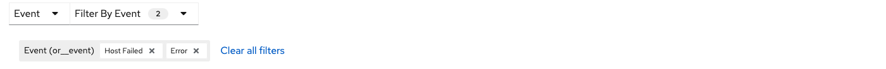

- The **Advanced** option is a refined search that allows you a combination of including or excluding criteria, searching by key, or by lookup type. For details about using Search, refer to the :ref:`ug_search` chapter.

Inventory Sync Jobs
----------------------

.. index::
   pair: job results; inventory sync

.. to reproduce: create a custom script and use it when adding a custom inventory source for an inventory.

When an inventory sync is executed, the full results automatically display in the Output tab. This shows the same information you would see if you ran it through the Ansible command line, and can be useful for debugging. The ``ANSIBLE_DISPLAY_ARGS_TO_STDOUT`` is set to ``False`` by default for all playbook runs. This matches Ansible's default behavior. This does not display task arguments in task headers in the Job Detail interface to avoid leaking certain sensitive module parameters to stdout.  If you wish to restore the prior behavior (despite the security implications), you can set ``ANSIBLE_DISPLAY_ARGS_TO_STDOUT`` to ``True`` via the ``AWX_TASK_ENV`` configuration setting. For more details, refer to the `ANSIBLE_DISPLAY_ARGS_TO_STDOUT`_.

   .. _`ANSIBLE_DISPLAY_ARGS_TO_STDOUT`: https://docs.ansible.com/ansible/latest/reference_appendices/config.html#envvar-ANSIBLE_DISPLAY_ARGS_TO_STDOUT

The icons at the top right corner of the Output tab allow you to relaunch (|launch|), download (|download|) the job output, or delete (|delete|) the job.

.. |launch| image:: ../common/images/launch-button.png
            :alt: Launch Action Button
.. |delete| image:: ../common/images/delete-button.png
            :alt: Delete Action Button

|job details example of inventory sync|

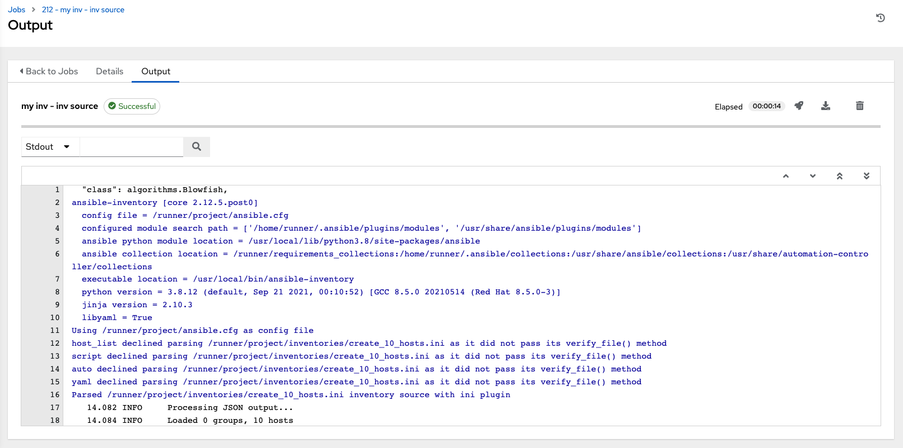

.. note:: An inventory update can be performed while a related job is running. In cases where you have a big project (around 10 GB), disk space on ``/tmp`` may be an issue.

Inventory sync details
~~~~~~~~~~~~~~~~~~~~~~~

Access the **Details** tab to provide details about the job execution.

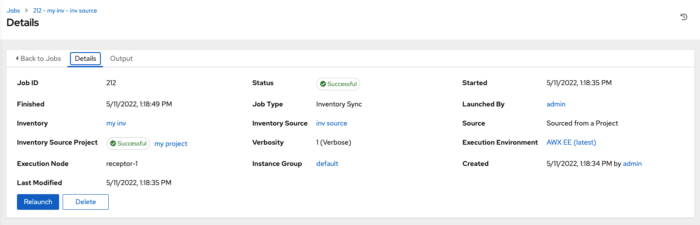

Notable details of the job executed are:

-  **Status**: Can be any of the following:

      -  **Pending** - The inventory sync has been created, but not queued or started yet. Any job, not just inventory source syncs, will stay in pending until it’s actually ready to be run by the system.  Reasons for inventory source syncs not being ready include dependencies that are currently running (all dependencies must be completed before the next step can execute), or there is not enough capacity to run in the locations it is configured to.
      -  **Waiting** - The inventory sync is in the queue waiting to be executed.
      -  **Running** - The inventory sync is currently in progress.
      -  **Successful** - The inventory sync job succeeded.
      -  **Failed** - The inventory sync job failed.

-  **Inventory**: The name of the associated inventory group.

-  **Source**: The type of cloud inventory.

-  **Inventory Source Project**: The project used as the source of this inventory sync job.

-  **Execution Environment**: The |ee| used.

-  **Execution node**: The node used to execute the job.

-  **Instance Group**: The name of the instance group used with this job (AWX is the default instance group).

By clicking on these items, where appropriate, you can view the corresponding job templates, projects, and other objects.

SCM Inventory Jobs
--------------------

.. index::
   pair: job results; SCM inventory

When an inventory sourced from an SCM is executed, the full results automatically display in the Output tab. This shows the same information you would see if you ran it through the Ansible command line, and can be useful for debugging. The icons at the top right corner of the Output tab allow you to relaunch (|launch|), download (|download|) the job output, or delete (|delete|) the job.

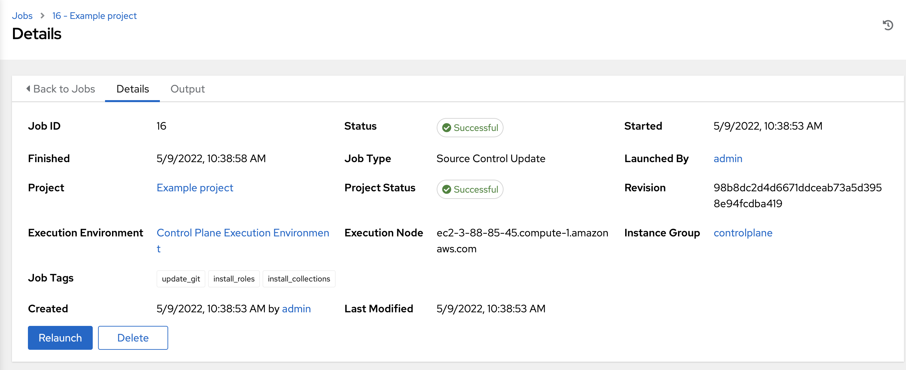

SCM inventory details
~~~~~~~~~~~~~~~~~~~~~~

Access the **Details** tab to provide details about the job execution and its associated project.

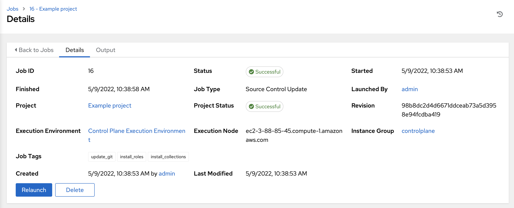

Notable details of the job executed are:

-  **Status**: Can be any of the following:

      -  **Pending** - The SCM job has been created, but not queued or started yet. Any job, not just SCM jobs, will stay in pending until it’s actually ready to be run by the system. Reasons for SCM jobs not being ready include dependencies that are currently running (all dependencies must be completed before the next step can execute), or there is not enough capacity to run in the locations it is configured to.
      -  **Waiting** - The SCM job is in the queue waiting to be executed.
      -  **Running** - The SCM job is currently in progress.
      -  **Successful** - The last SCM job succeeded.
      -  **Failed** - The last SCM job failed.

-  **Job Type**: SCM jobs display Source Control Update.

-  **Project**: The name of the project.

-  **Project Status**: Indicates whether the associated project was successfully updated.

-  **Revision**: Indicates the revision number of the sourced project that was used in this job.

-  **Execution Environment**: Specifies the |ee| used to run this job.

-  **Execution Node**: Indicates the node on which the job ran.

-  **Instance Group**: Indicates the instance group on which the job ran, if specified.

-  **Job Tags**: Tags show the various job operations executed.

By clicking on these items, where appropriate, you can view the corresponding job templates, projects, and other objects.

Playbook Run Jobs
-------------------

.. index::
   pair: jobs results; playbook run

When a playbook is executed, the full results automatically display in the Output tab. This shows the same information you would see if you ran it through the Ansible command line, and can be useful for debugging. 

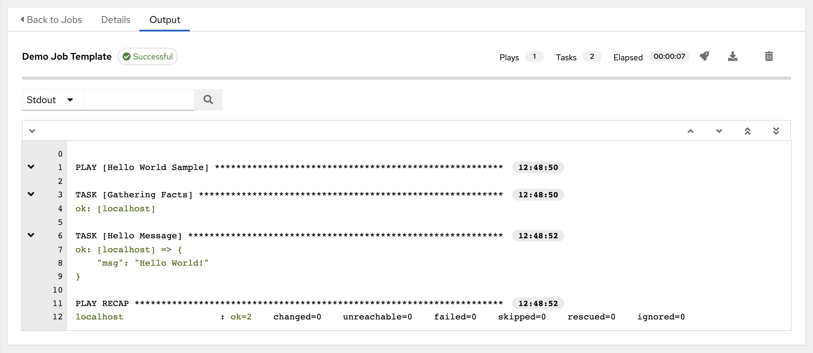

The events summary captures a tally of events that were run as part of this playbook:

- the number of times this playbook has ran in the **Plays** field

- the number of tasks associated with this playbook in the **Tasks** field

- the number of hosts associated with this playbook in the **Hosts** field

- the amount of time it took to complete the playbook run in the **Elapsed** field

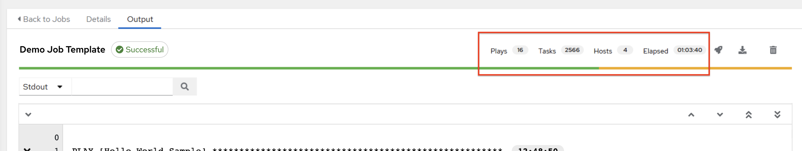

The icons next to the events summary allow you to relaunch (|launch|), download (|download|) the job output, or delete (|delete|) the job. 

The host status bar runs across the top of the Output view. Hover over a section of the host status bar and the number of hosts associated with that particular status displays.

|Job - All Host Events|

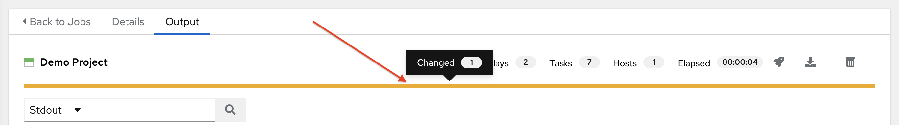

The output for a Playbook job is also accessible after launching a job from the **Jobs** tab of its Job Templates page.

Clicking on the various line item tasks in the output, you can view its host details.

Search
~~~~~~~

Use Search to look up specific events, hostnames, and their statuses. To filter only certain hosts with a particular status, specify one of the following valid statuses:

- **OK**: the playbook task returned "Ok".
- **Changed**: the playbook task actually executed. Since Ansible tasks should be written to be idempotent, tasks may exit successfully without executing anything on the host. In these cases, the task would return Ok, but not Changed.
- **Failed**: the task failed. Further playbook execution was stopped for this host.
- **Unreachable**: the host was unreachable from the network or had another fatal error associated with it.
- **Skipped**: the playbook task was skipped because no change was necessary for the host to reach the target state.
- **Rescued**: introduced in Ansible 2.8, this shows the tasks that failed and then executes a rescue section. 
- **Ignored**: introduced in Ansible 2.8, this shows the tasks that failed and have ``ignore_errors: yes`` configured.

These statuses also display at bottom of each Stdout pane, in a group of "stats" called the Host Summary fields.

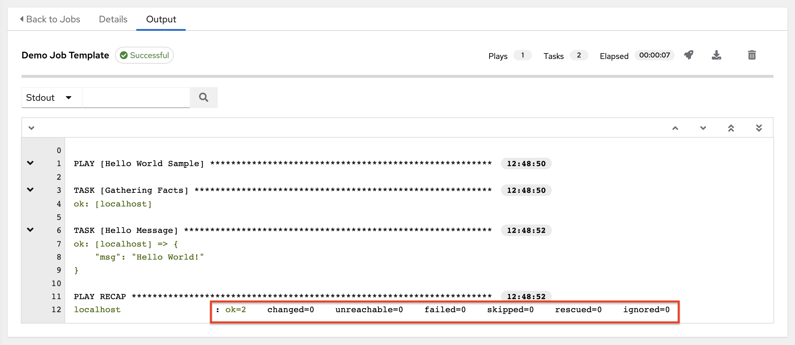

The example below shows a search with only unreachable hosts.

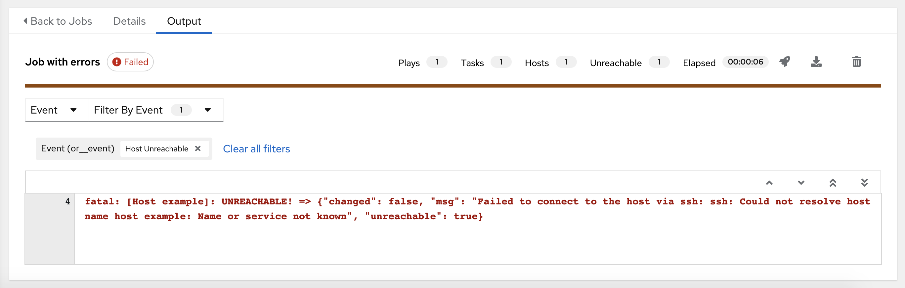

For more details about using the Search, refer to the :ref:`ug_search` chapter.

The standard output view displays all the events that occur on a particular job. By default, all rows are expanded so that all the details are displayed. Use the collapse-all button (|collapse-all|) to switch to a view that only contains the headers for plays and tasks. Click the (|expand-all|) button to view all lines of the standard output.

Alternatively, you can display all the details of a specific play or task by clicking on the arrow icons next to them. Click an arrow from sideways to downward to expand the lines associated with that play or task. Click the arrow back to the sideways position to collapse and hide the lines.

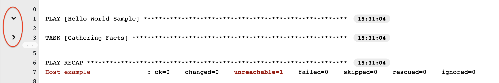

Things to note when viewing details in the expand/collapse mode:

- Each displayed line that is not collapsed has a corresponding line number and start time.

- An expand/collapse icon is at the start of any play or task after the play or task has completed.

- If querying for a particular play or task, it will appear collapsed at the end of its completed process.

- In some cases, an error message will appear, stating that the output may be too large to display. This occurs when there are more than 4000 events. Use the search and filter for specific events to bypass the error.

Click on a line of an event from the **Standard Out** pane and a **Host Events** dialog displays in a separate window. This window shows the host that was affected by that particular event.

.. note:: Upgrading to the latest versions of AWX involves progressively migrating all historical playbook output and events. This migration process is gradual, and happens automatically in the background after installation is complete. Installations with very large amounts of historical job output (tens, or hundreds of GB of output) may notice missing job output until migration is complete. Most recent data will show up at the top of the output, followed by older events. Migrating jobs with a large amount of events may take longer than jobs with a smaller amount.

Host Details
~~~~~~~~~~~~~~

.. index::
   single: jobs; host events

The **Host Details** dialog shows information about the host affected by the selected event and its associated play and task:

- the **Host**
- the **Status**
- the type of run in the **Play** field
- the type of **Task**
- if applicable, the Ansible **Module** for the task, and any *arguments* for that module

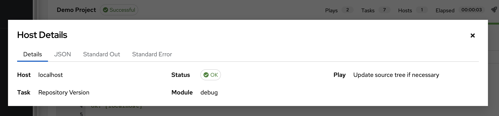

To view the results in JSON format, click on the **JSON** tab. To view the output of the task, click the **Standard Out**. To view errors from the output, click **Standard Error**.

Playbook run details
~~~~~~~~~~~~~~~~~~~~~~

Access the **Details** tab to provide details about the job execution. 

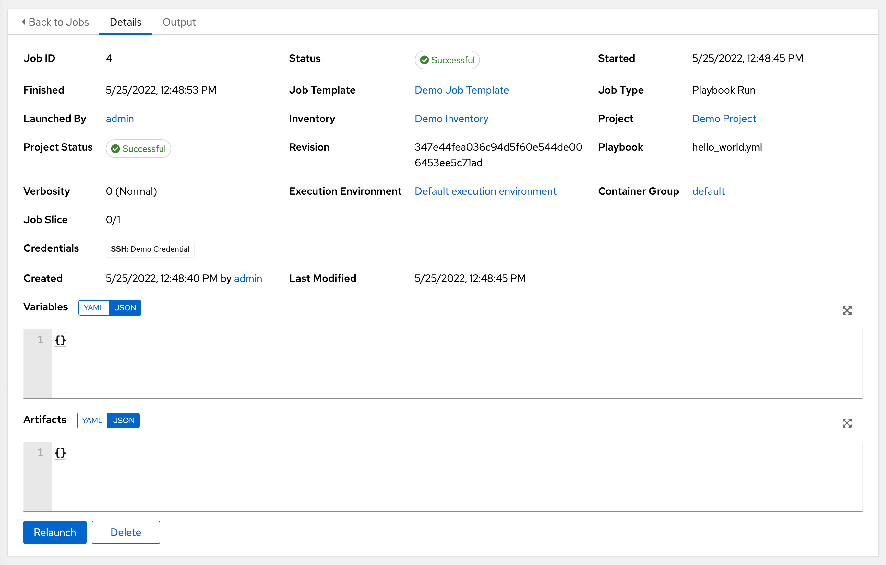

Notable details of the job executed are:

-  **Status**: Can be any of the following:

      -  **Pending** - The playbook run has been created, but not queued or started yet. Any job, not just playbook runs, will stay in pending until it is actually ready to be run by the system. Reasons for playbook runs not being ready include dependencies that are currently running (all dependencies must be completed before the next step can execute), or there is not enough capacity to run in the locations it is configured to.
      -  **Waiting** - The playbook run is in the queue waiting to be executed.
      -  **Running** - The playbook run is currently in progress.
      -  **Successful** - The last playbook run succeeded.
      -  **Failed** - The last playbook run failed.

-  **Job Template**: The name of the job template from which this job was launched.

-  **Inventory**: The inventory selected to run this job against.

-  **Project**: The name of the project associated with the launched job.

-  **Project Status**: The status of the project associated with the launched job.

-  **Playbook**: The playbook used to launch this job.

-  **Execution Environment**: The name of the |ee| used in this job.

-  **Container Group**: The name of the container group used in this job.

-  **Credentials**: The credential(s) used in this job.

-  **Extra Variables**: Any extra variables passed when creating the job template are displayed here.

By clicking on these items, where appropriate, you can view the corresponding job templates, projects, and other objects.

.. _ug_job_concurrency:

AWX Capacity Determination and Job Impact
-------------------------------------------

.. index::
   pair: jobs; capacity
   pair: jobs; forks

.. include:: job_capacity.rst

Job branch overriding
----------------------

.. index::
   pair: job branch; overriding

.. include:: job_branching.rst
