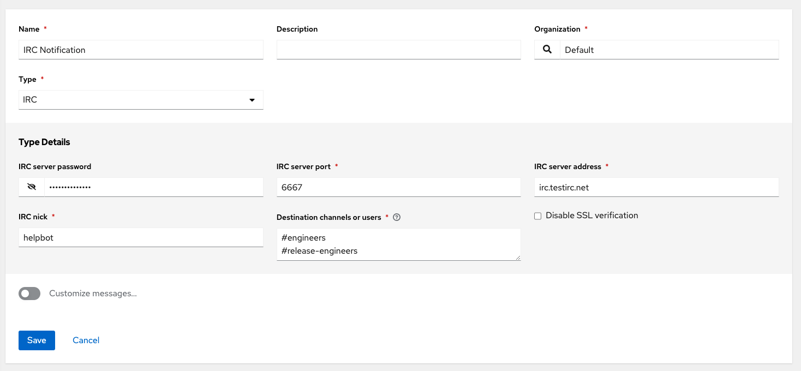

.. _ug_notifications:

Notifications
***************

.. index:: 
   pair: jobs; notifications
   pair: notifications; inventory sources
   pair: notifications; groups 
   pair: notifications; template

A :term:`Notification Template` is an instance of a :term:`Notification` type (Email, Slack, Webhook, etc.) with a name, description, and a defined configuration.

For example:

- A username, password, server, and recipients are needed for an Email notification template
- The token and a list of channels are needed for a Slack notification template
- The URL and Headers are needed for a Webhook notification template

A Notification is a manifestation of the notification template; for example, when a job fails, a notification is sent using the configuration defined by the notification template.

At a high level, the typical flow for the notification system works as follows:

- A user creates a notification template to the REST API at the ``/api/v2/notification_templates`` endpoint (either through the API or through the UI).
- A user assigns the notification template to any of the various objects that support it (all variants of job templates as well as organizations and projects) and at the appropriate trigger level for which they want the notification (started, success, or error). For example a user may wish to assign a particular notification template to trigger when Job Template 1 fails. In which case, they will associate the notification template with the job template at ``/api/v2/job_templates/n/notification_templates_error`` API endpoint.
- You can set notifications on job start, not just job end. Users and teams are also able to define their own notifications that can be attached to arbitrary jobs.

Notification Hierarchy
=============================

.. index:: 
   pair: notifications; hierarchy

Notification templates assigned at certain levels will inherit templates defined on parent objects as such:

- Job Templates will use notification templates defined on it as well as inheriting notification templates from the Project used by the Job Template and from the Organization that it is listed under (via the Project).
- Project Updates will use notification templates defined on the project and will inherit notification templates from the Organization associated with it
- Inventory Updates will use notification templates defined on the Organization that it is listed under
- Ad-hoc commands will use notification templates defined on the Organization that the inventory is associated with

Workflow
==========

.. index:: 
   pair: notifications; template workflow

When a job succeeds or fails, the error or success handler will pull a list of relevant notification templates using the procedure defined above. It will then create a Notification object for each one containing relevant details about the job and then sends it to the destination (email addresses, slack channel(s), sms numbers, etc). These Notification objects are available as related resources on job types (jobs, inventory updates, project updates), and also at ``/api/v2/notifications``. You may also see what notifications have been sent from a notification templates by examining its related resources.

If a notification fails, it will not impact the job associated to it or cause it to fail. The status of the notification can be viewed at its detail endpoint (``/api/v2/notifications/<n>``).

.. _ug_notifications_create:

Create a Notification Template
===============================

.. index:: 
   pair: notifications; create template
   pair: template; notifications

To create a Notification Template:

1. Click **Notifications** from the left navigation bar.

2. Click the **Add** button.

.. image:: ../common/images/notifications-template-add-new.png

3. Enter the name of the notification and a description in their respective fields, and specify the organization (required) it belongs to.

4. Choose a type of notification from the **Type** drop-down menu. Refer to the subsequent sections for additional information. 

5. Once all required information is complete, click **Save** to add the notification. 

.. _ug_notifications_types:

Notification Types
====================

.. index:: 
   pair: notifications; types
   triple: notifications; types; Email
   triple: notifications; types; Grafana
   triple: notifications; types; IRC
   triple: notifications; types; Mattermost
   triple: notifications; types; pagerduty
   triple: notifications; types; Rocket.Chat
   triple: notifications; types; Slack
   triple: notifications; types; Twilio
   triple: notifications; types; Webhook

Notification types supported with AWX: 

.. contents::
    :local:

Each of these have their own configuration and behavioral semantics and testing them may need to be approached in different ways. Additionally, you can customize each type of notification down to a specific detail, or a set of criteria to trigger a notification. See :ref:`ug_custom_notifications` for more detail on configuring custom notifications. The following sections will give as much detail as possible on each type of notification.

Email
-------

The email notification type supports a wide variety of SMTP servers and has support for TLS/SSL connections.

You must provide the following details to setup an email notification:

- Host
- Recipient list
- Sender email
- Port
- Timeout (in seconds): allows you to specify up to 120 seconds, the length of time AWX may attempt connecting to the email server before giving up.

.. image:: ../common/images/notification-template-email.png

Grafana
------------

Grafana is a fairly straightforward integration. First, create an API Key in the `Grafana system`_ (this is the token that is given to AWX). 

.. _`Grafana system`: http://docs.grafana.org/tutorials/api_org_token_howto/

You must provide the following details to setup a Grafana notification:

- Grafana URL: The URL of the Grafana API service, generally ``http://yourcompany.grafana.com``.
- Grafana API Key: The user must first create an API Key in the Grafana system (this is the token that is given to AWX).

The other options of note are:

- ID of the Dashboard: When you created an API Key for the Grafana account, you can set up a dashboard with its own unique ID. 
- ID of the Panel: If you added panels and graphs to your Grafana interface, you can specify its ID here. 
- Tags for the Annotation: Enter keywords that help identify the type(s) of events(s) of the notification you are configuring.
- Disable SSL Verification: SSL verification is on by default, but you can choose to turn off verification the authenticity of the target's certificate. Environments that use internal or private CA's should select this option to disable verification.

.. image:: ../common/images/notification-template-grafana.png

IRC
-----

The IRC notification takes the form of an IRC bot that will connect, deliver its messages to channel(s) or individual user(s), and then disconnect. The notification bot also supports SSL authentication. The bot does not currently support Nickserv identification. If a channel or user does not exist or is not on-line then the Notification will not fail; the failure scenario is reserved specifically for connectivity.

Connectivity information is straightforward:

- IRC Server Password (optional): IRC servers can require a password to connect. If the server does not require one, leave blank
- IRC Server Port: The IRC server Port
- IRC Server Address: The host name or address of the IRC server
- IRC Nick: The bot's nickname once it connects to the server
- Destination Channels or Users: A list of users and/or channels to which to send the notification.
- SSL Connection (optional): Should the bot use SSL when connecting

Mattermost
------------

The Mattermost notification type provides a simple interface to Mattermost's messaging and collaboration workspace. The parameters that can be specified are:

- Target URL (required): The full URL that will be POSTed to
- Username
- Channel
- Icon URL: specifies the icon to display for this notification
- Disable SSL Verification: Turns off verification of the authenticity of the target's certificate. Environments that use internal or private CA's should select this option to disable verification.

PagerDuty
------------

PagerDuty is a fairly straightforward integration. First, create an API Key in the `PagerDuty system`_ (this is the token that is given to AWX) and then create a "Service" which provides an "Integration Key" that will also be given to AWX. The other required options are:

.. _`PagerDuty system`: https://support.pagerduty.com/docs/generating-api-keys

- API Token: The user must first create an API Key in the PagerDuty system (this is the token that is given to AWX).
- PagerDuty Subdomain: When you sign up for the PagerDuty account, you receive a unique subdomain to communicate with. For instance, if you signed up as "testuser", the web dashboard will be at ``testuser.pagerduty.com`` and you will give the API ``testuser`` as the subdomain (not the full domain).
- API Service/Integration Key 
- Client Identifier: This will be sent along with the alert content to the pagerduty service to help identify the service that is using the api key/service. This is helpful if multiple integrations are using the same API key and service.

Rocket.Chat
-------------

The Rocket.Chat notification type provides an interface to Rocket.Chat's collaboration and communication platform. The parameters that can be specified are:

- Target URL (required): The full URL that will be POSTed to
- Username
- Icon URL: specifies the icon to display for this notification
- Disable SSL Verification: Turns off verification of the authenticity of the target's certificate. Environments that use internal or private CA's should select this option to disable verification.

Slack
-----

Slack, a collaborative team communication and messaging tool, is pretty easy to configure.

You must supply the following to setup Slack notifications:

- A Slack app (refer to the `Basic App Setup <https://api.slack.com/authentication/basics>`_ page of the Slack documentation for information on how to create one)

- A token (refer to `Enabling Interactions with Bots <https://api.slack.com/bot-users>`_ and specific details on bot tokens on the `Token Types <https://api.slack.com/authentication/token-types#bot>`_ documentation page)

Once you have a bot/app set up, you must navigate to "Your Apps", click on the newly-created app and then go to **Add features and functionality**, which allows you to configure incoming webhooks, bots, and permissions; as well as **Install your app to your workspace**. 

You must also invite the notification bot to join the channel(s) in question in Slack. Note that private messages are not supported.

.. image:: ../common/images/notification-template-slack.png

Twilio
--------

Twilio service is an Voice and SMS automation service. Once you are signed in, you must create a phone number from which the message will be sent. You can then define a "Messaging Service" under Programmable SMS and associate the number you created before with it.

Note that you may need to verify this number or some other information before you are allowed to use it to send to any numbers. The Messaging Service does not need a status callback URL nor does it need the ability to Process inbound messages.

Under your individual (or sub) account settings, you will have API credentials. Twilio uses two credentials to determine which account an API request is coming from. The “Account SID”, which acts as a username, and the “Auth Token” which acts as a password.

To setup Twilio, provide the following details:

- Account Token
- Source Phone Number (this is the number associated with the messaging service above and must be given in the form of "+15556667777")
- Destination SMS number (this will be the list of numbers to receive the SMS and should be the 10-digit phone number)
- Account SID 

.. image:: ../common/images/notification-template-twilio.png

Webhook
---------

The webhook notification type provides a simple interface to sending POSTs to a predefined web service. AWX will POST to this address using application/json content type with the data payload containing all relevant details in json format. Some web service APIs expect HTTP requests to be in a certain format with certain fields. You can configure more of the webhook notification in the following ways:

- configure the HTTP method (using **POST** or **PUT**)
- body of the outgoing request
- configure authentication (using basic auth)

The parameters for configuring webhooks are:

-  Username
-  Basic Auth Password
-  Target URL (required): The full URL to which the webhook notification will be PUT or POSTed.
-  Disable SSL Verification: SSL verification is on by default, but you can choose to turn off verification of the authenticity of the target’s certificate. Environments that use internal or private CA’s should select this option to disable verification.
-  HTTP Headers (required): Headers in JSON form where the keys and values are strings. 
   For example, ``{"Authentication": "988881adc9fc3655077dc2d4d757d480b5ea0e11", "MessageType": "Test"}``
-  HTTP Method (required). Select the method for your webhook:
   
   - POST: Creates a new resource. Also acts as a catch-all for operations that do not fit into the other categories. It is likely you need to POST unless you know your webhook service expects a PUT.
   - PUT: Updates a specific resource (by an identifier) or a collection of resources. PUT can also be used to create a specific resource if the resource identifier is known beforehand.

.. image:: ../common/images/notification-template-webhook.png

Webhook payloads
^^^^^^^^^^^^^^^^^

AWX sends by default the following data at the webhook endpoint: 

::

   job id
   name
   url
   created_by
   started
   finished
   status
   traceback
   inventory
   project
   playbook
   credential
   limit
   extra_vars
   hosts
   http method

An example of a ``started`` notifications via webhook message as it is returned by AWX:

::

   {"id": 38, "name": "Demo Job Template", "url": "https://host/#/jobs/playbook/38", "created_by": "bianca", "started":
   "2020-07-28T19:57:07.888193+00:00", "finished": null, "status": "running", "traceback": "", "inventory": "Demo Inventory", 
   "project": "Demo Project", "playbook": "hello_world.yml", "credential": "Demo Credential", "limit": "", "extra_vars": "{}", 
   "hosts": {}}POST / HTTP/1.1

AWX returns by default the following data at the webhook endpoint for a ``success``/``fail`` status: 

::

   job id
   name
   url
   created_by
   started
   finished
   status
   traceback
   inventory
   project
   playbook
   credential
   limit
   extra_vars
   hosts

An example of a ``success``/``fail`` notifications via webhook message as it is returned by AWX:

::

   {"id": 46, "name": "AWX-Collection-tests-awx_job_wait-long_running-XVFBGRSAvUUIrYKn", "url": "https://host/#/jobs/playbook/46",
   "created_by": "bianca", "started": "2020-07-28T20:43:36.966686+00:00", "finished": "2020-07-28T20:43:44.936072+00:00", "status": "failed",
   "traceback": "", "inventory": "Demo Inventory", "project": "AWX-Collection-tests-awx_job_wait-long_running-JJSlglnwtsRJyQmw", "playbook":
   "fail.yml", "credential": null, "limit": "", "extra_vars": "{\"sleep_interval\": 300}", "hosts": {"localhost": {"failed": true, "changed": 0,
   "dark": 0, "failures": 1, "ok": 1, "processed": 1, "skipped": 0, "rescued": 0, "ignored": 0}}}

.. _ug_custom_notifications:

Create custom notifications
=============================

You can :ref:`customize the text content <ir_notifications_reference>` of each of the :ref:`ug_notifications_types` by enabling the **Customize Messages** portion at the bottom of the notifications form using the toggle button. 

You can provide a custom message for various job events: 

- Start
- Success
- Error 
- Workflow approved
- Workflow denied
- Workflow running
- Workflow timed out

The message forms vary depending on the type of notification you are configuring. For example, messages for email and PagerDuty notifications have the appearance of a typical email form with a subject and body, in which case, AWX displays the fields as **Message** and **Message Body**. Other notification types only expect a **Message** for each type of event:

The **Message** fields are pre-populated with a template containing a top-level variable, ``job`` coupled with an attribute, such as ``id`` or ``name``, for example. Templates are enclosed in curly braces and may draw from a fixed set of fields provided by AWX, as shown in the pre-populated **Messages** fields. 

This pre-populated field suggests commonly displayed messages to a recipient who is notified of an event. You can, however, customize these messages with different criteria by adding your own attribute(s) for the job as needed. Custom notification messages are rendered using Jinja - the same templating engine used by Ansible playbooks. 

Messages and message bodies have different types of content:

- messages will always just be strings (one-liners only; new lines are not allowed)

- message bodies will be either a dictionary or block of text:

   - the message body for *Webhooks* and *PagerDuty* uses dictionary definitions. The default message body for these is ``{{ job_metadata }}``, you can either leave that as is or provide your own dictionary

   - the message body for email uses a block of text or a multi-line string. The default message body is:

   .. code-block:: html

      {{ job_friendly_name }} #{{ job.id }} had status {{ job.status }}, view details at {{ url }} {{ job_metadata }}

   You can tweak this text (leaving ``{{ job_metadata }}`` in, or drop ``{{ job_metadata }}`` altogether). Since the body is a block of text, it can really be any string you want.

   ``{{ job_metadata }}`` gets rendered as a dictionary containing fields that describe the job being executed. In all cases, ``{{ job_metadata }}`` will include the following fields:

   - ``id``
   - ``name``
   - ``url``
   - ``created_by``
   - ``started``
   - ``finished``
   - ``status``
   - ``traceback``

   .. note::

      At the present time, you cannot query individual fields within ``{{ job_metadata }}``. When using ``{{ job_metadata }}`` in a notification template, all data
      will be returned.

   The resulting dictionary will look something like this:

   ::

      {"id": 18,
       "name": "Project - Space Procedures",
       "url": "https://host/#/jobs/project/18",
       "created_by": "admin",
       "started": "2019-10-26T00:20:45.139356+00:00",
       "finished": "2019-10-26T00:20:55.769713+00:00",
       "status": "successful",
       "traceback": ""
      }

   If ``{{ job_metadata }}`` is rendered in a job, it will include the following additional fields:

   - ``inventory``
   - ``project``
   - ``playbook``
   - ``credential``
   - ``limit``
   - ``extra_vars``
   - ``hosts``
   
   |

   The resulting dictionary will look something like:

   ::

      {"id": 12,
       "name": "JobTemplate - Launch Rockets",
       "url": "https://host/#/jobs/playbook/12",
       "created_by": "admin",
       "started": "2019-10-26T00:02:07.943774+00:00",
       "finished": null,
       "status": "running",
       "traceback": "",
       "inventory": "Inventory - Fleet",
       "project": "Project - Space Procedures",
       "playbook": "launch.yml",
       "credential": "Credential - Mission Control",
       "limit": "",
       "extra_vars": "{}",
       "hosts": {}
      }

   If ``{{ job_metadata }}`` is rendered in a workflow job, it will include the following additional field:

   - ``body`` (this will enumerate all the nodes in the workflow job and includes a description of the job associated with each node)

   |

   The resulting dictionary will look something like this:

   ::

      {"id": 14,
       "name": "Workflow Job Template - Launch Mars Mission",
       "url": "https://host/#/workflows/14",
       "created_by": "admin",
       "started": "2019-10-26T00:11:04.554468+00:00",
       "finished": "2019-10-26T00:11:24.249899+00:00",
       "status": "successful",
       "traceback": "",
       "body": "Workflow job summary:

               node #1 spawns job #15, \"Assemble Fleet JT\", which finished with status successful.
               node #2 spawns job #16, \"Mission Start approval node\", which finished with status successful.\n
               node #3 spawns job #17, \"Deploy Fleet\", which finished with status successful."
      }

For more detail, refer to `Using variables with Jinja2`_.

.. _`Using variables with Jinja2`: https://docs.ansible.com/ansible/latest/user_guide/playbooks_variables.html#using-variables-with-jinja2

AWX requires valid syntax in order to retrieve the correct data to display the messages. For a list of supported attributes and the proper syntax construction, refer to the :ref:`ir_notifications_reference` section of this guide.

If you create a notification template that uses invalid syntax or references unusable fields, an error message displays indicating the nature of the error. If you delete a notification’s custom message, the default message is shown in its place.

.. note::

   If you save the notifications template without editing the custom message (or edit and revert back to the default values), the **Details** screen assumes the defaults and will not display the custom message tables. If you edit and save any of the values, the entire table displays in the **Details** screen.

   .. image:: ../common/images/notifications-with-without-messages.png

.. _ug_notifications_on_off:

Enable and Disable Notifications
==================================

You can select which notifications to notify you when a specific job starts, in addition to notifying you on success or failure at the end of the job run. Some behaviors to keep in mind:

- if a workflow template (WFJT) has notification on start enabled, and a job template (JT) within that workflow also has notification on start enabled, you will receive notifications for both
- you can enable notifications to run on many JTs within a WFJT
- you can enable notifications to run on a sliced job template (SJT) start and each slice will generate a notification
- when you enable a notification to run on job start, and that notification gets deleted, the JT continues to run, but will result in an error message

You can enable notifications on job start, job success, and job failure, or any combination thereof, from the **Notifications** tab of the following resources: 

- Job Template
- Workflow Template
- Projects (shown in the example below)
- Inventory Source 
- Organizations

.. image:: ../common/images/projects-notifications-example-list.png

For workflow templates that have approval nodes, in addition to *Start*, *Success*, and *Failure*, you can enable or disable certain approval-related events: 

Refer to :ref:`ug_wf_approval_nodes` for additional detail on working with these types of nodes.

Configure the ``host`` hostname for notifications 
========================================================

.. index:: 
   pair: notifications; hostname configuration

In the :ref:`System Settings <configure_awx_system>`, you can replace the default value in the **Base URL of the service** field with your preferred hostname to change the notification hostname.     

Refreshing your license also changes the notification hostname. New installations of AWX should not have to set the hostname for notifications.

Reset the ``AWX_URL_BASE``
------------------------------

.. index:: 
   pair: notifications; troubleshooting AWX_URL_BASE
   pair: notifications; resetting the AWX_URL_BASE

The primary way that AWX determines how the base URL (``AWX_URL_BASE``) is defined is by looking at an incoming request and setting the server address based on that incoming request. 

AWX takes settings values from the database first. If no settings values are found, it falls back to using the values from the settings files.  If a user posts a license by navigating to the AWX host's IP adddress, the posted license is written to the settings entry in the database.

To change the ``AWX_URL_BASE`` if the wrong address has been picked up, navigate to **Miscellaneous System settings** from the Settings menu using the DNS entry you wish to appear in notifications, and re-add your license. 

Notifications API
====================

.. index:: 
   pair: notifications; API endpoints

Use the ``started``, ``success``, or ``error`` endpoints:

::

   /api/v2/organizations/N/notification_templates_started/
   /api/v2/organizations/N/notification_templates_success/
   /api/v2/organizations/N/notification_templates_error/

Additionally, the ``../../../N/notification_templates_started`` endpoints have **GET** and **POST** actions for:

- Organizations
- Projects
- Inventory Sources
- Job Templates
- System Job Templates
- Workflow Job Templates
