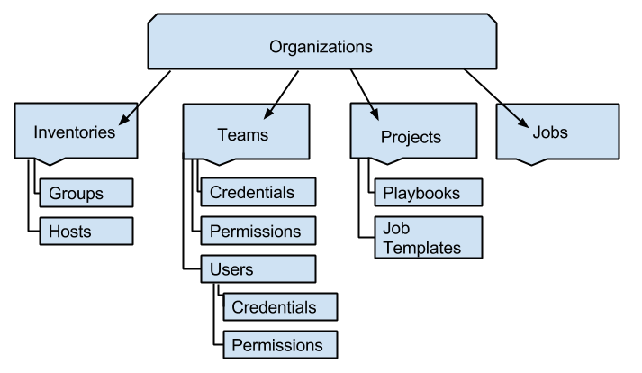
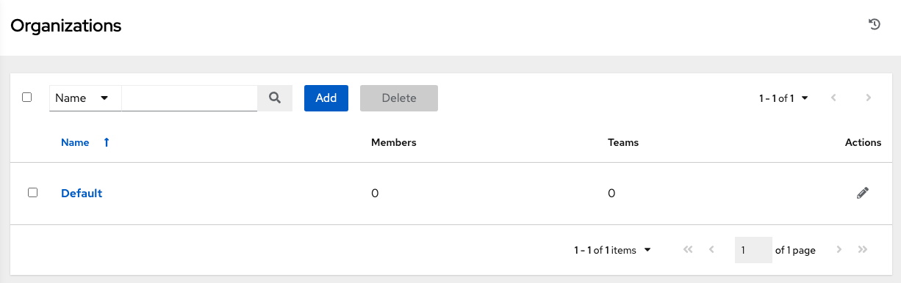
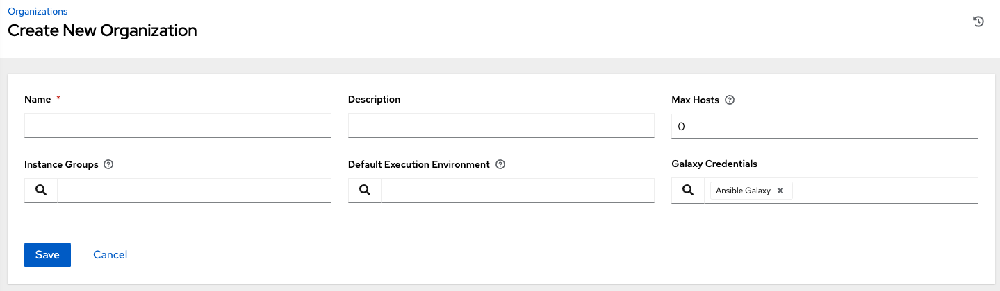
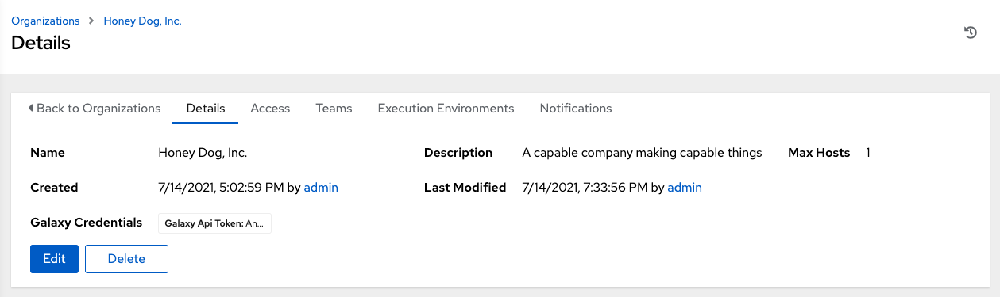
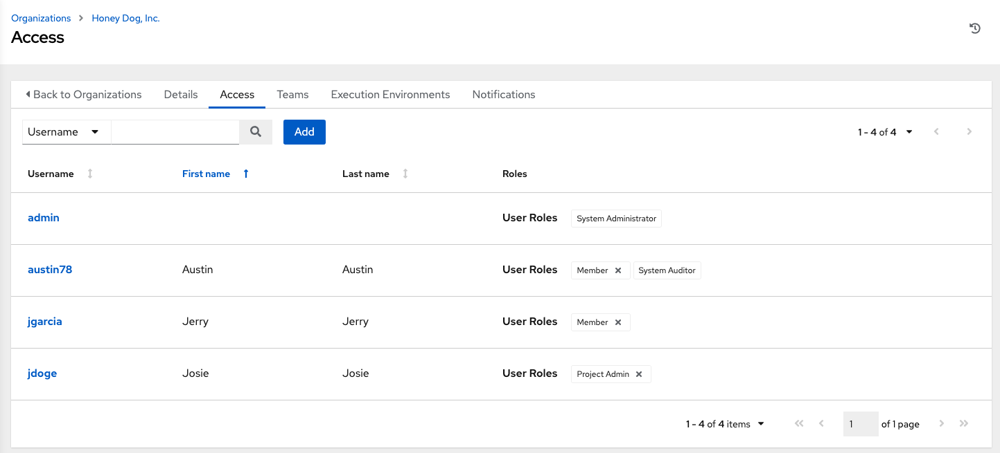
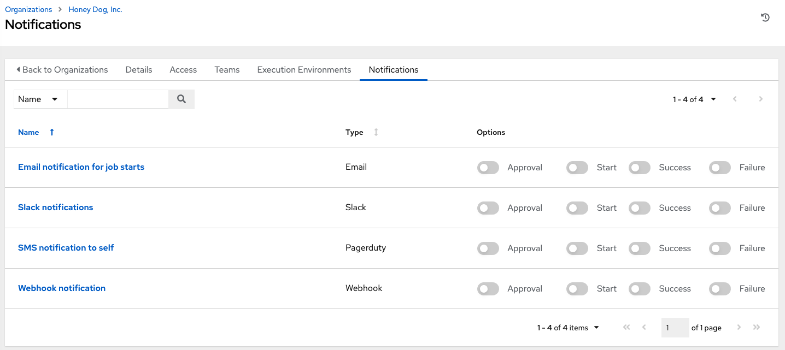
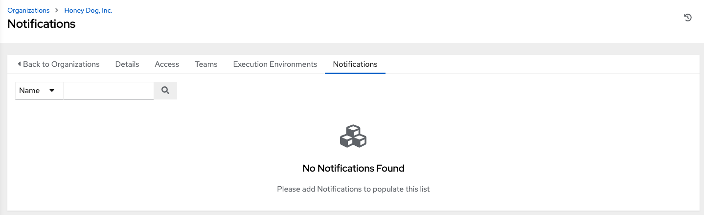

.. _ug_organizations:

Organizations
===============

.. index::
   single: organizations

An :term:`Organization` is a logical collection of **Users**, **Teams**, **Projects**, and **Inventories**, and is the highest level in the AWX object hierarchy.

|awx hierarchy|

Access the Organizations page by clicking **Organizations** from the left navigation bar. The Organizations page displays all of the existing organizations for your installation. Organizations can be searched by **Name** or **Description**. Modify and remove organizations using the **Edit** and **Delete** buttons.

.. note::
	A default organization is automatically created. 

|Organizations - home showing example organization|

From this list view, you can edit the details of an organization (|edit button|) from the **Actions** menu.

.. _ug_organizations_create:

Creating a New Organization
------------------------------

1. You can create a new organization by clicking the **Add** button.

|Organizations - new organization form|

2. An organization has several attributes that may be configured:

- Enter the **Name** for your organization (required).
- Enter a **Description** for the organization.
- Enter **Instance Groups** on which to run this organization. 
- Enter the name of the execution environment or search for an existing **Execution Environment** on which to run this organization. See :ref:`ug_execution_environments` for more information.
- If used, enter the **Galaxy Credentials** or search from a list of existing ones.

3. Click **Save** to finish creating the organization.

Once created, AWX displays the Organization details, and allows for the managing access and execution environments for the organization.

|Organizations - show record for example organization|

From the **Details** tab, you can edit or delete the organization. 

.. include:: ../common/work_items_deletion_warning.rst

Work with Access
------------------

.. index::
   pair: organizations; users
   pair: organizations; access
   pair; organizations; teams

Clicking on **Access** (beside **Details** when viewing your organization), displays all the Users associated with this Organization and their roles. 

|Organizations - show users for example organization|

As you can manage the user membership for this Organization here, you can manage user membership on a per-user basis from the Users page by clicking **Users** from the left navigation bar. Organizations have a unique set of roles not described here. You can assign specific users certain levels of permissions within your organization, or allow them to act as an admin for a particular resource. Refer to :ref:`rbac-ug` for more information. 

Clicking on a user brings up that user's details, allowing you to review, grant, edit, and remove associated permissions for that user. For more information, refer to :ref:`ug_users`.

Add a User or Team
^^^^^^^^^^^^^^^^^^^^^^

In order to add a user or team to an organization, the user or team must already be created. See :ref:`ug_users_create` and :ref:`ug_team_create` for additional detail. To add existing users or team to the Organization:

.. include:: ../common/permissions.rst

.. note::

  A user or team with roles associated will retain them even after they have been reassigned to another organization.

Work with Notifications
--------------------------------

.. index::
   pair: organizations; notifications

Clicking the **Notifications** tab allows you to review any notification integrations you have setup. 

Use the toggles to enable or disable the notifications to use with your particular organization. For more detail, see :ref:`ug_notifications_on_off`. 

If no notifications have been set up, you must create them from the **Notifications** option on the left navigation bar.

Refer to :ref:`ug_notifications_types` for additional details on configuring various notification types.

