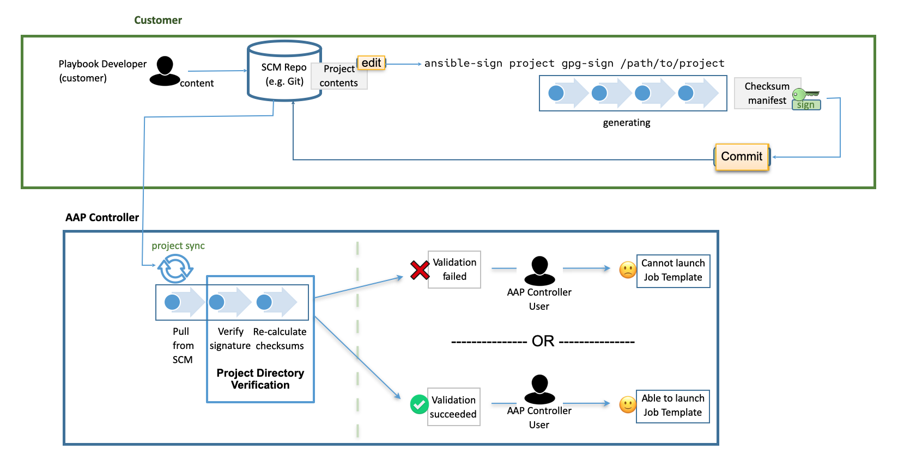
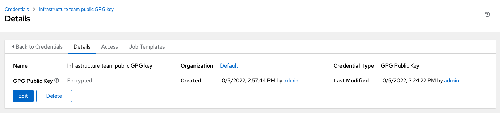
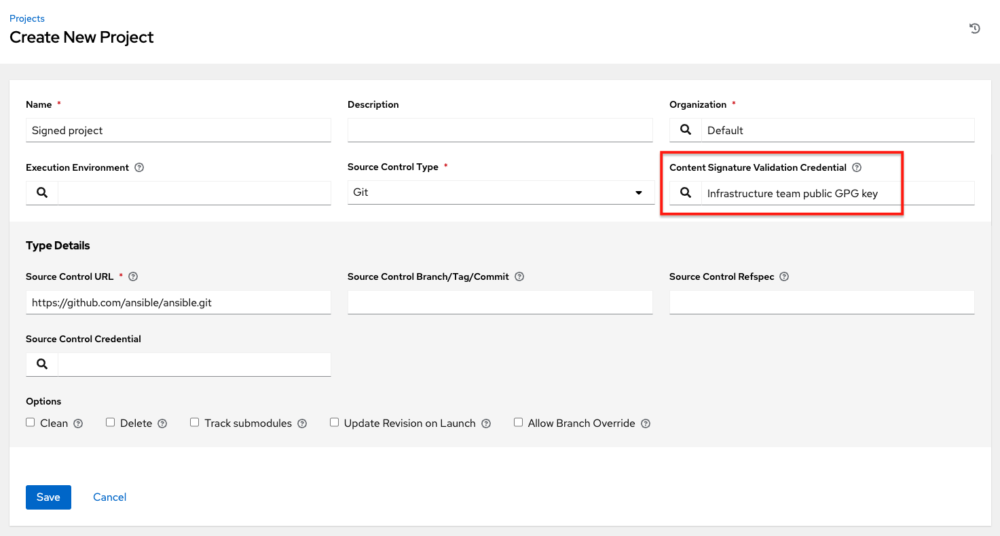

.. _ug_content_signing:

Project Signing and Verification
==================================

.. index::
   single: project validation
   pair: project; validation
   pair: project; signing
   
Project signing and verification provides the ability to sign files in your project directory and then verify whether or not that content has changed in any way, or files have been added or removed from the project unexpectedly. To accomplish this, a private key for signing and a matching public key for verifying are needed. 

For project maintainers, the supported way to perform content signing is to use a utility called, ``ansible-sign``, through the command-line interface (CLI) that comes with it.

The CLI aims to make it easy to use cryptographic technology like GNU Privacy Guard (GPG) to validate that specified files within a project have not been tampered with in any way. Currently, GPG is the only supported means of signing and validation.

AWX is used to verify the signed content. After a matching public key has been associated with the signed project, AWX will verify that the files included during signing have not changed, and that files have been added or removed unexpectedly. If the signature is not valid or a file has changed, the project will fail to update, and no jobs making use of the project will be able to launch. Verification status of the project ensures that only secure, untampered content is run in jobs.

Assuming that the repository has already been configured for signing and verification (see below), the usual workflow for altering the project becomes the following:

1. User has a project repository set up already and wants to make a change to a file.
2. User makes the change, runs ``ansible-sign project gpg-sign /path/to/project``,  which updates a checksum manifest and signs it.
3. User commits the change and the updated checksum manifest and the signature to the repository.
4. When the user syncs the project, AWX (already configured, in this scenario) pulls in the new changes, checks that the public key associated with the project in AWX matches the private key that the checksum manifest was signed with (this prevents tampering with the checksum manifest itself), then re-calculates checksums of each file in the manifest to ensure that the checksum matches (and thus that no file has changed). It also looks to ensure that all files are accounted for: They must have been either included in, or excluded from, the ``MANIFEST.in`` file discussed below; if files have been added or removed unexpectedly, verification will fail.

Prerequisites
--------------

- A valid GPG public/private keypair is required for signing content. Refer to `How to create GPG keypairs`_ for details.

.. _`How to create GPG keypairs`: https://www.redhat.com/sysadmin/creating-gpg-keypairs 

	Visit the `GnuPG documentation <https://www.gnupg.org/documentation/index.html>`_ for more information regarding GPG keys.

	You can verify that you have a valid GPG keypair and in your default GnuPG keyring, with the following command:

	:: 

		$ gpg --list-secret-keys

	If the above command produces no output, or one line of output that states, ``trustdb was created``, then you do not have a secret key in your default keyring. In this case, refer to `How to create GPG keypairs`_ to learn how to create a new keypair before proceeding. If it produces output other than that, you have a valid secret key and are ready to move on to using ``ansible-sign``.

Add a GPG key to AWX
----------------------

In order to use the GPG key for content singing and validation in AWX, you must add it running the following command in the CLI:

::

	$ gpg --list-keys
	$ gpg --export --armour <key fingerprint> > my_public_key.asc

1. In the AWX user interface, click **Credentials** from the left side navigation menu then click the **Add** button.

2. Provide the new credential a meaningful name (for example, “Infrastructure team public GPG key”)

3. In the Credential Type field, select **GPG Public Key**.

4. Click **Browse** to locate and select the public key file (e.g., ``my_public_key.asc``)

5. Click **Save** when done.

This credential can now be selected in :ref:`projects <ug_projects_add>`, and content verification will automatically take place on future project syncs.

.. note::

  Use the project cache SCM timeout to control how often you want AWX to re-validate the signed content. When a project is configured to update on launch (of any job template configured to use that project), you can enable the cache timeout setting, which tells it to update after N seconds have passed since the last update. If validation is running too frequently, you can slow down how often project updates occur by specifying the time in the **Cache Timeout** field of the Option Details pane of the project.

  .. image:: ../common/images/project-update-launch-cache-timeout.png

Access the ``ansible-sign`` CLI utility
-----------------------------------------

The ``ansible-sign`` utility provide options for the user to sign and verify whether the project is signed. 

1. Run the following command to install ``ansible-sign``:

::

	$ dnf install ansible-sign

2. Verify that ``ansible-sign`` was successfully installed:

::

	$ ansible-sign --version

Output similar to the following displays (possibly with a different version number):

::

	ansible-sign 0.1

This indicates you have successfully installed ``ansible-sign``.

Signing your project
--------------------

As the name suggests, signing a project involves an Ansible project directory. Refer to the `Ansible documentation <https://docs.ansible.com/ansible/latest/user_guide/sample_setup.html>`_ for more sophisticated examples of project directory structures. 

The following sample project has a very simple structure. An inventory file, and two small playbooks under a playbooks directory:

::

	$ cd sample-project/
	$ tree -a .
	.
	├── inventory
	└── playbooks
	    └── get_uptime.yml
	    └── hello.yml

    	1 directory, 3 files

.. note::

	The commands used in this section assume that your working directory is the root of your project. As a rule, ``ansible-sign project`` commands always take the project root directory as their last argument, and therefore, we use ``.`` to indicate the current working directory.

The way that ``ansible-sign`` protects content from tampering is by taking checksums (SHA256) of all of the secured files in the project, compiling those into a checksum manifest file, and then finally signing that manifest file.

The first step toward signing content is to create a file that tells ``ansible-sign`` which files to protect. This file should be called ``MANIFEST.in`` and reside in the project root directory.

Internally, ``ansible-sign`` makes use of the ``distlib.manifest`` module of Python’s distlib library, and thus ``MANIFEST.in`` must follow the syntax that this library specifies. See the `Python Packaging User Guide <https://packaging.python.org/en/latest/guides/using-manifest-in/#manifest-in-commands>`_ for an explanation of the ``MANIFEST.in`` file directives.

In the sample project, included are two directives, resulting in a ``MANIFEST.in`` file that looks like this:

::

	include inventory
	recursive-include playbooks *.yml

With this file in place, generate your checksum manifest file and sign it. Both of these steps are achieved in a single ``ansible-sign`` command:

::

	$ ansible-sign project gpg-sign .
	[OK   ] GPG signing successful!
	[NOTE ] Checksum manifest: ./.ansible-sign/sha256sum.txt
	[NOTE ] GPG summary: signature created

Now the project has been signed.

Notice that the ``gpg-sign`` subcommand resides under the ``project`` subcommand. For signing project content, every command will start with ``ansible-sign project``. As noted above, as a rule, every ``ansible-sign project`` command takes the project root directory as its final argument.

As mentioned earlier, ``ansible-sign`` by default makes use of your default keyring and looks for the first available secret key that it can find, to sign your project. You can specify a specific secret key to use with the ``--fingerprint`` option, or even a completely independent GPG home directory with the ``--gnupg-home`` option.

.. note::

	If you are using a desktop environment, GnuPG will automatically prompt you for your secret key’s passphrase. If this functionality does not work, or you are working without a desktop environment (e.g., via SSH), you can use the ``-p/--prompt-passphrase`` flag after ``gpg-sign`` in the above command, which will cause ``ansible-sign`` to prompt for the password instead.

Upon viewing the structure of the project directory, notice that a new ``.ansible-sign`` directory was created. This directory contains the checksum manifest and a detached GPG signature for it.

::

	$ tree -a .
	.
	├── .ansible-sign
	│   ├── sha256sum.txt
	│   └── sha256sum.txt.sig
	├── inventory
	├── MANIFEST.in
	└── playbooks
	    ├── get_uptime.yml
	    └── hello.yml

Verifying your project
----------------------

If you want to verify that a signed Ansible project has not been altered, you can use ``ansible-sign`` to check whether the signature is valid and that the checksums of the files match what the checksum manifest says they should be. In particular, the ``ansible-sign project gpg-verify`` command can be used to automatically verify both of these conditions.

::

	$ ansible-sign project gpg-verify .
	[OK   ] GPG signature verification succeeded.
	[OK   ] Checksum validation succeeded.

.. note::

	By default, ``ansible-sign`` makes use of your default GPG keyring to look for a matching public key. You can specify a keyring file with the ``--keyring`` option, or a different GPG home with the ``--gnugpg-home`` option.

If verification fails for any reason, information will be displayed to help you debug the cause. More verbosity can be enabled by passing the global ``--debug`` flag, immediately after ``ansible-sign`` in your commands.

.. note::

	When a GPG credential is used in a project, content verification will automatically take place on future project syncs.

Automate signing
-----------------

In environments with highly-trusted CI environments (e.g., OpenShift, Jenkins, etc.), it is possible to automate the signing process. For example, you could store your GPG private key in a CI platform of choice as a secret, and import that into GnuPG in the CI environment. You could then run through the signing workflow above within the normal CI workflow/container/environment.

When signing a project using GPG, the environment variable ``ANSIBLE_SIGN_GPG_PASSPHRASE`` can be set to the passphrase of the signing key. This can be injected (and masked/secured) in a CI pipeline.

Depending on the scenario at hand, ``ansible-sign`` will return with a different exit-code, during both signing and verification. This can also be useful in the context of CI and automation, as a CI environment can act differently based on the failure (for example, sending alerts for some errors but silently failing for others).

These are the exit codes used in ``ansible-sign`` currently, which can be considered stable:

.. list-table::
   :widths: 10 25 40
   :header-rows: 1

   * - Exit code
     - Approximate meaning
     - Example scenarios
   * - 0
     - Success
     - * Signing was successful
       * Verification was successful
   * - 1
     - General failure
     - * The checksum manifest file contained a syntax error during verification
       * The signature file did not exist during verification
       * ``MANIFEST.in`` did not exist during signing
   * - 2
     - Checksum verification failure
     - * The checksum hashes calculated during verification differed from what
         was in the signed checksum manifest (e.g., a project file was changed but the signing process was not re-completed)
   * - 3
     - Signature verification failure
     - * The signer's public key was not in the user's GPG keyring
       * The wrong GnuPG home directory or keyring file was specified
       * The signed checksum manifest file was modified in some way
   * - 4
     - Signing process failure
     - * The signer's private key was not found in the GPG keyring
       * The wrong GnuPG home directory or keyring file was specified

