.. _ug_projects:

Projects
===========

.. index::
   single: projects

A :term:`Project` is a logical collection of Ansible playbooks.

You can manage playbooks and playbook directories by either placing them manually under the Project Base Path on your server, or by placing your playbooks into a source code management (SCM) system supported by AWX, including Git, Subversion, and Red Hat Insights. To create a Red Hat Insights project, refer to :ref:`insights`.

.. note::

    By default, the Project Base Path is ``/var/lib/awx/projects``, but this may have been modified by the administrator. It is configured in ``/etc/awx/conf.d/custom.py``. Use caution when editing this file, as incorrect settings can disable your installation.

The Projects page displays the list of the projects that are currently available. The default view is collapsed (**Compact**) with project name and its status, but you can use the arrow next to each entry to expand for more information.

|Projects - home with example project|

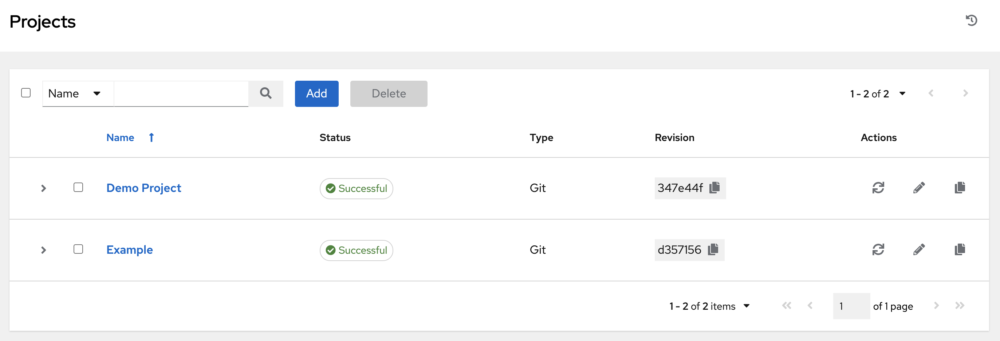

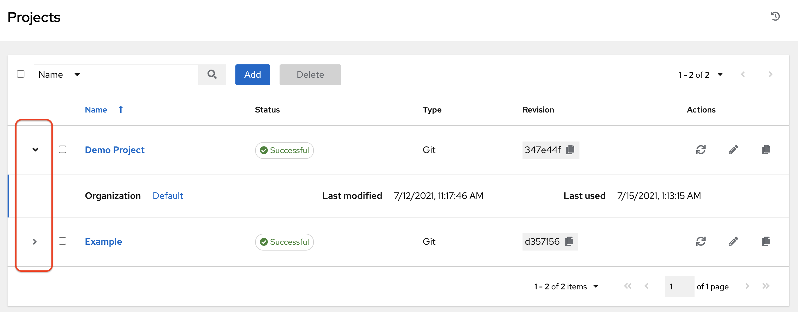

For each project listed, you can get the latest SCM revision (|refresh|), edit the project (|edit|), or copy the project attributes (|copy|), using the respective icons next to each project. Projects are allowed to be updated while a related job is running.  In cases where you have a big project (around 10 GB), disk space on ``/tmp`` may be an issue.

.. |edit-icon| image:: ../common/images/edit-button.png
   :alt: edit button

.. |copy| image:: ../common/images/copy-button.png
   :alt: copy button

.. |edit| image:: ../common/images/edit-button.png
   :alt: edit button

**Status** indicates the state of the project and may be one of the following (note that you can also filter your view by specific status types):

-  **Pending** - The source control update has been created, but not queued or started yet. Any job (not just source control updates) will stay in pending until it's actually ready to be run by the system. Reasons for it not being ready because it has dependencies that are currently running so it has to wait until they are done, or there is not enough capacity to run in the locations it is configured to.
-  **Waiting** - The source control update is in the queue waiting to be executed.
-  **Running** - The source control update is currently in progress.
-  **Successful** - The last source control update for this project succeeded.
-  **Failed** - The last source control update for this project failed.
-  **Error** - The last source control update job failed to run at all. (To be deprecated.)
-  **Canceled** - The last source control update for the project was canceled.
-  **Never updated** - The project is configured for source control, but has never been updated.
-  **OK** - The project is not configured for source control, and is correctly in place. (To be deprecated.)
-  **Missing** - Projects are absent from the project base path of ``/var/lib/awx/projects`` (applicable for manual or source control managed projects).

.. - Cancel: Cancel a scheduled update from source control (only available when scheduling a source control update)

.. note::

  Projects of credential type Manual cannot update or schedule source control-based actions without being reconfigured as an SCM type credential.

.. include:: ../common/work_items_deletion_warning.rst

.. _ug_projects_add:

Add a new project
--------------------

.. index::
   pair: projects; add new

To create a new project:

1. Click the **Add** button, which launches the **Create Project** window.

|Projects - create new project|

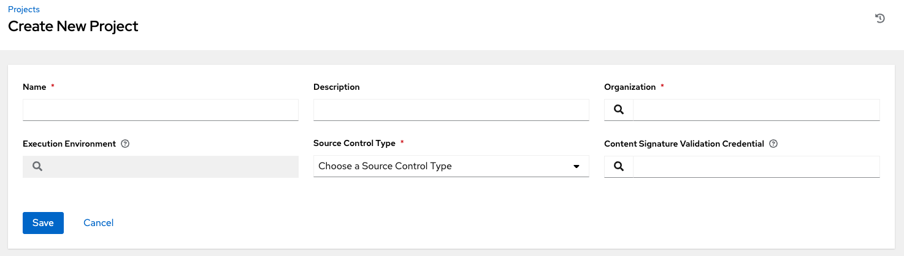

2. Enter the appropriate details into the following required fields:

-  **Name**
-  **Description** (optional)
-  **Organization** - A project must have at least one organization. Pick one organization now to create the project, and then after the project is created you can add additional organizations.
-  **Execution Environment** (optional) - Enter the name of the execution environment or search from a list of existing ones to run this project. See :ref:`upgrade_venv` in the |atumg| for more information.
-  **Source Control Type** - Select from the drop-down menu list an SCM type associated with this project. The options in the subsequent section become available depend on the type you choose. Refer to :ref:`ug_manual` or :ref:`ug_projects_scm_types` in the subsequent sections for more detail.
-  **Content Signature Validation Credential** - Use this optional field to enable content verification. Specify the GPG key to use for validating content signature during project sync. If the content has been tampered with, the job will not run. See :ref:`ug_content_signing` for more detail.

3. Click **Save** when done.

The following describes ways projects are sourced in AWX:

.. contents::
    :local:

.. _ug_manual:

Manage playbooks manually
~~~~~~~~~~~~~~~~~~~~~~~~~~~

.. index::
   pair: projects; playbooks
   single: playbooks; manage manually

-  Create one or more directories to store playbooks under the Project Base Path (for example, /var/lib/awx/projects/).
-  Create or copy playbook files into the playbook directory.
-  Ensure that the playbook directory and files are owned by the same UNIX user and group that the AWX service runs as.
-  Ensure that the permissions are appropriate for the playbook directories and files.

If adding a manual project, each project path inside of the project root folder can only be assigned to one project. If you receive the following message, ensure that you have not already assigned the project path to an existing project:

    ``All of the project paths have been assigned to existing projects, or there are no directories found in the base path.``
    ``You will need to add a project path before creating a new project.``

If you have trouble adding a project path, check the permissions and SELinux context settings for the project directory and files.

.. warning::
  If you have not added any Ansible playbook directories to the base project path, you will receive the following message:

  |Projects - create new warning|

  Correct this issue by creating the appropriate playbook directories and checking out playbooks from your SCM or otherwise copying playbooks into the appropriate playbook directories.

  .. |Projects - create new warning| image:: ../common/images/projects-create-manual-warning.png
     :alt: Create New Project form showing warning associated with selecting Source Control Credential Type of Manual

.. _ug_projects_scm_types:

Manage playbooks using source control
~~~~~~~~~~~~~~~~~~~~~~~~~~~~~~~~~~~~~~~

.. index::
   pair: projects; playbooks
   pair: Git; source control
   pair: SCM; types
   single: SCM types
   pair: Subversion; source control
   single: playbooks; source control

.. contents::
    :local:

SCM Types - Git and Subversion
^^^^^^^^^^^^^^^^^^^^^^^^^^^^^^^^^^^^^^^^^^

To configure playbooks to use source control, in the Project **Details** tab:

1. Select the appropriate option (Git or Subversion) from the **SCM Type** drop-down menu list.

  |Projects - create SCM project|

  .. |Projects - create SCM project| image:: ../common/images/projects-create-scm-project.png
     :alt: Create New Project form for Git Source Control Credential Type.

2. Enter the appropriate details into the following fields:

  -  **SCM URL** - See an example in the tooltip |tooltip|.

  .. |tooltip| image:: ../common/images/tooltips-icon.png
     :alt: tooltips icon

  -  **SCM Branch/Tag/Commit** - Optionally enter the SCM branch, tags, commit hashes, arbitrary refs, or revision number (if applicable) from the source control (Git or Subversion) to checkout. Some commit hashes and refs may not be available unless you also provide a custom refspec in the next field. If left blank, the default is HEAD which is the last checked out Branch/Tag/Commit for this project.
  -  **SCM Refspec** - This field is an option specific to git source control and only advanced users familiar and comfortable with git should specify which references to download from the remote repository. For more detail, see :ref:`job branch overriding <ug_job_branching>`.

  -  **Source Control Credential** - If authentication is required, select the appropriate source control credential

3. In the **SCM Update Options**, optionally select the launch behavior, if applicable.

  -  **Clean** - Removes any local modifications prior to performing an update.
  -  **Delete** - Deletes the local repository in its entirety prior to performing an update. Depending on the size of the repository this may significantly increase the amount of time required to complete an update.
  -  **Track submodules** - Tracks the latest commit. See more details in the tooltip |tooltip|.
  -  **Update Revision on Launch** - Updates the revision of the project to the current revision in the remote source control, as well as cache the roles directory from :ref:`Galaxy <ug_galaxy>` or :ref:`Collections <ug_collections>`. AWX ensures that the local revision matches and that the roles and collections are up-to-date with the last update. Also, to avoid job overflows if jobs are spawned faster than the project can sync, selecting this allows you to configure a Cache Timeout to cache prior project syncs for a certain number of seconds.
  -  **Allow Branch Override** - Allows a job template or an inventory source that uses this project to launch with a specified SCM branch or revision other than that of the project's. For more detail, see :ref:`job branch overriding <ug_job_branching>`.

    .. image:: ../common/images/projects-create-scm-project-branch-override-checked.png
       :alt: create scm project branch override checked

4. Click **Save** to save your project.

  .. tip::
    Using a GitHub link offers an easy way to use a playbook. To help get you started, use the ``helloworld.yml`` file available at: https://github.com/ansible/tower-example.git

    This link offers a very similar playbook to the one created manually in the instructions found in the :ref:`qs_start`. Using it will not alter or harm your system in anyway.

SCM Type - Red Hat Insights
^^^^^^^^^^^^^^^^^^^^^^^^^^^^

.. index::
   pair: projects; playbooks
   pair: Insights; source control
   single: playbooks; source control

To configure playbooks to use Red Hat Insights, in the Project **Details** tab:

1. Select **Red Hat Insights** from the **SCM Type** drop-down menu list.

2. Red Hat Insights requires a credential for authentication. Select from the **Credential** field the appropriate credential for use with Insights.

3. In the **SCM Update Options**, optionally select the launch behavior, if applicable.

  -  **Clean** - Removes any local modifications prior to performing an update.
  -  **Delete** - Deletes the local repository in its entirety prior to performing an update. Depending on the size of the repository this may significantly increase the amount of time required to complete an update.
  -  **Update Revision on Launch** - Updates the revision of the project to the current revision in the remote source control, as well as cache the roles directory from :ref:`Galaxy <ug_galaxy>` or :ref:`Collections <ug_collections>`. AWX ensures that the local revision matches and that the roles and collections are up-to-date with the last update. Also, to avoid job overflows if jobs are spawned faster than the project can sync, selecting this allows you to configure a Cache Timeout to cache prior project syncs for a certain number of seconds.

  .. image:: ../common/images/projects-create-scm-insights.png
     :alt: Create New Project form for Red Hat Insights Source Control Credential Type.

3. Click **Save** to save your project.

SCM Type - Remote Archive
^^^^^^^^^^^^^^^^^^^^^^^^^^

.. index::
   pair: projects; playbooks
   pair: remote archive; source control
   single: playbooks; source control

Playbooks using a remote archive allow projects to be provided based on a build process that produces a versioned artifact, or release, containing all the requirements for that project in a single archive.

To configure playbooks to use a remote archive, in the Project **Details** tab:

1. Select **Remote Archive** from the **SCM Type** drop-down menu list.

2. Enter the appropriate details into the following fields:

  -  **SCM URL** - requires a URL to a remote archive, such as a *GitHub Release* or a build artifact stored in *Artifactory* and unpacks it into the project path for use
  -  **SCM Credential** - If authentication is required, select the appropriate SCM credential

3. In the **SCM Update Options**, optionally select the launch behavior, if applicable.

  -  **Clean** - Removes any local modifications prior to performing an update.
  -  **Delete** - Deletes the local repository in its entirety prior to performing an update. Depending on the size of the repository this may significantly increase the amount of time required to complete an update.
  -  **Update Revision on Launch** - Not recommended, as this option updates the revision of the project to the current revision in the remote source control, as well as cache the roles directory from :ref:`Galaxy <ug_galaxy>` or :ref:`Collections <ug_collections>`.
  -  **Allow Branch Override** - Not recommended, as this option allows a job template that uses this project to launch with a specified SCM branch or revision other than that of the project's.

  .. image:: ../common/images/projects-create-scm-rm-archive.png
     :alt: Create New Project form for Remote Archive Source Control Credential Type.

.. note::
  Since this SCM type is intended to support the concept of unchanging artifacts, it is advisable to disable Galaxy integration (for roles, at minimum).

4. Click **Save** to save your project.

Updating projects from source control
----------------------------------------

.. index::
   pair: projects; source control update

1. Update an existing SCM-based project by selecting the project and clicking the |refresh| button.

  .. note::

   Please note that immediately after adding a project setup to use source control, a "Sync" starts that fetches the project details from the configured source control.

|projects - list all|

2. Click on project's status under the **Status** column to get further details about the update process.

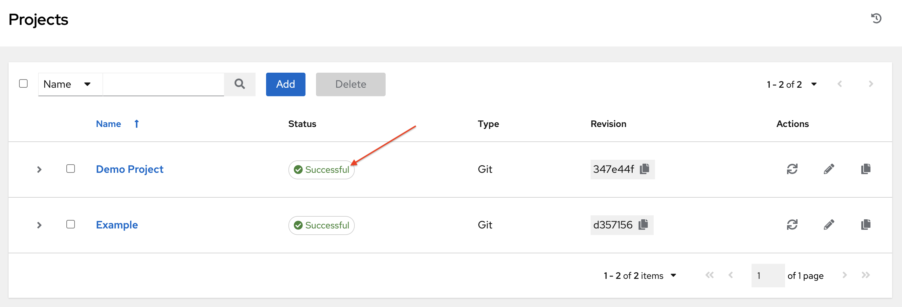

|Project - update status|

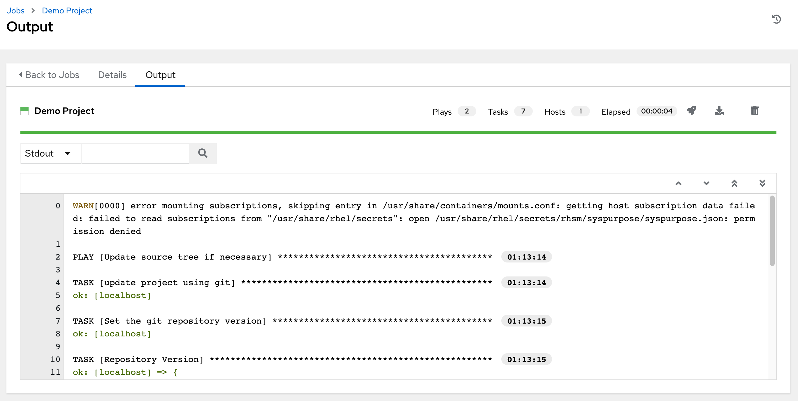

Work with Permissions
------------------------
.. index::
   pair: projects; permissions

The set of permissions assigned to this project (role-based access controls) that provide the ability to read, modify, and administer projects, inventories, job templates, and other AWX elements are Privileges.

You can access the project permissions via the **Access** tab next to the **Details** tab. This screen displays a list of users that currently have permissions to this project. The list may be sorted and searched by **Username**, **First Name**, or **Last Name**.

|Projects - permissions list for example project|

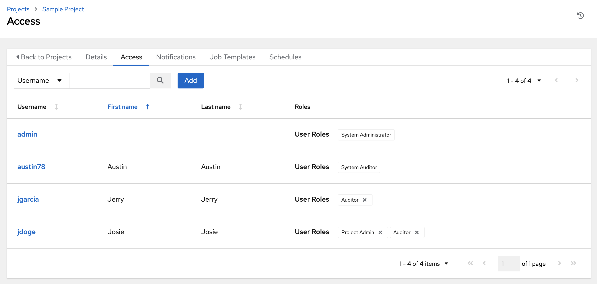

Add Permissions
~~~~~~~~~~~~~~~~~~~

.. include:: ../common/permissions.rst

Work with Notifications
------------------------

Clicking the **Notifications** tab allows you to review any notification integrations you have setup.

.. image:: ../common/images/projects-notifications-example-list.png
   :alt: List of notifications configured for this project.

Use the toggles to enable or disable the notifications to use with your particular project. For more detail, see :ref:`ug_notifications_on_off`.

If no notifications have been set up, you can configure them from the  **Notifications** link from the left navigation bar to create a new notification.

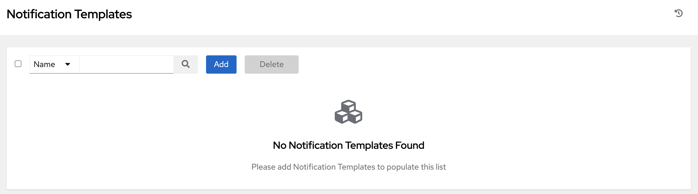

Refer to :ref:`ug_notifications_types` for additional details on configuring various notification types.

Work with Job Templates
---------------------------

Clicking on **Job Templates** allows you to add and review any job templates or workflow templates associated with this project.

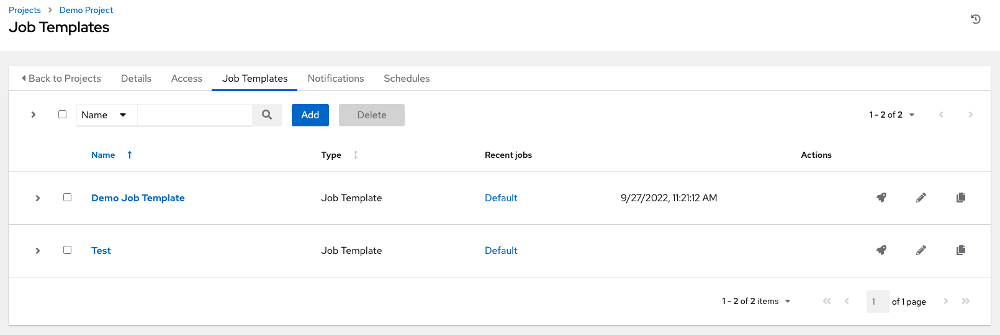

Click on the recent jobs that ran using that template to see its details and other useful information. You can sort this list by various criteria, and perform a search to filter the templates of interest.

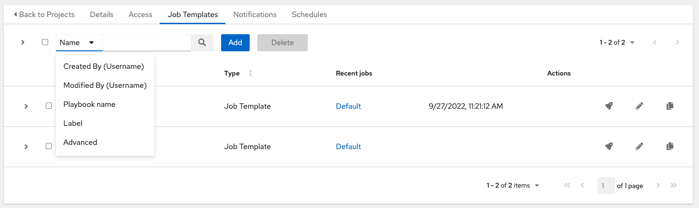

From this view, you can also launch (|launch|),  edit (|edit|), or copy (|copy|) the template configuration.

.. |launch| image:: ../common/images/launch-button.png
   :alt: launch button

Work with Schedules
----------------------

.. index::
   pair: projects; scheduling

Clicking on **Schedules** allows you to review any schedules set up for this project.

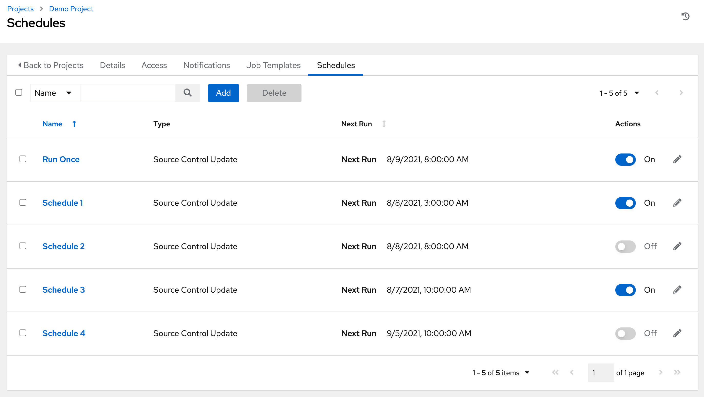

Schedule a Project
~~~~~~~~~~~~~~~~~~~~

To schedule a project run, click the **Schedules** tab.

- If schedules are already set up; review, edit, or enable/disable your schedule preferences.
- If schedules have not been set up, refer to :ref:`ug_scheduling` for more information.

.. _ug_galaxy:

Ansible Galaxy Support
-----------------------

.. index::
   single: Ansible Galaxy
   single: Galaxy support

At the end of a Project update, AWX searches for a file called ``requirements.yml`` in the ``roles`` directory, located at ``<project-top-level-directory>/roles/requirements.yml``. If this file is found, the following command automatically runs:

::

    ansible-galaxy role install -r roles/requirements.yml -p <project-specific cache location>/requirements_roles -vvv

This file allows you to reference Galaxy roles or roles within other repositories which can be checked out in conjunction with your own project. The addition of this Ansible Galaxy support eliminates the need to create git submodules for achieving this result. Given that SCM projects (along with roles/collections) are pulled into and executed from a private job environment, a <private job directory> specific to the project within ``/tmp`` is created by default. However, you can specify another **Job Execution Path** based on your environment in the Jobs Settings tab of the Settings window:

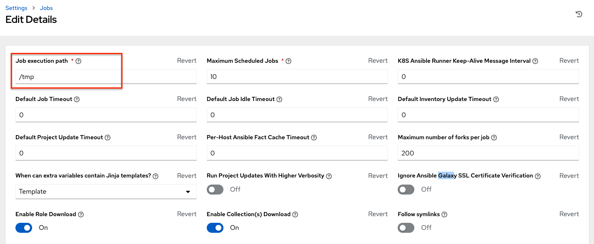

The cache directory is a subdirectory inside the global projects folder. The content may be copied from the cache location to ``<job private directory>/requirements_roles`` location.

By default, AWX has a system-wide setting that allows roles to be dynamically downloaded from the ``roles/requirements.yml`` file for SCM projects. You may turn off this setting in the **Jobs settings** screen of the Settings menu by switching the **Enable Role Download** toggle button to **OFF**.

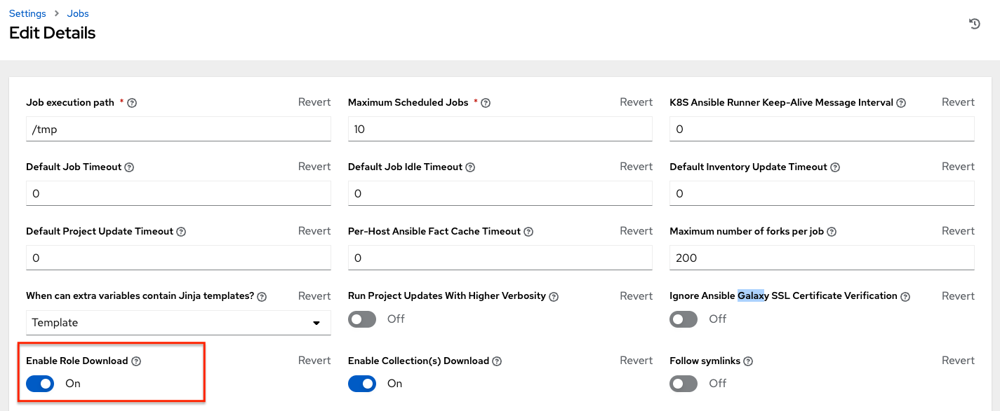

Whenever a project sync runs, AWX determines if the project source and any roles from Galaxy and/or Collections are out of date with the project. Project updates will download the roles inside the update.

If jobs need to pick up a change made to an upstream role, updating the project will ensure this happens. A change to the role means that a new commit was pushed to the *provision-role* source control. To make this change take effect in a job, you do not need to push a new commit to the *playbooks* repo, but you **do need** to update the project, which downloads roles to a local cache. For instance, say you have two git repositories in source control. The first one is *playbooks* and the project in AWX points to this URL. The second one is *provision-role* and it is referenced by the ``roles/requirements.yml`` file inside of the *playbooks* git repo.

.. this section is used in collections support section below

In short, jobs would download the most recent roles before every job run. Roles and collections are locally cached for performance reasons, and you will need to select **Update Revision on Launch** in the project SCM Update Options to ensure that the upstream role is re-downloaded before each job run:

|update-on-launch|

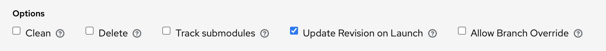

.. end reused section

The update happens much earlier in the process than the sync, so this surfaces errors and details faster and in a more logic place.

For more information and examples on the syntax of the ``requirements.yml`` file, refer to the `role requirements section`_ in the Ansible documentation.

.. _role requirements section: https://docs.ansible.com/ansible/latest/galaxy/user_guide.html#installing-multiple-roles-from-a-file

.. this section is used in common/isolationt_variables section too

If there are any directories that should specifically be exposed, you can specify those in the Jobs section of the Settings screen in the **Paths to Expose to Isolated Jobs** or by updating the following entry in the settings file:

``AWX_ISOLATION_SHOW_PATHS = ['/list/of/', '/paths']``

  .. note::
    The primary file you may want to add to ``AWX_ISOLATION_SHOW_PATHS`` is ``/var/lib/awx/.ssh``, if your playbooks need to use keys or settings defined there.

If you made changes in the settings file, be sure to restart services with the ``awx-service restart`` command after your changes have been saved.

.. end reused section

In the User Interface, you can configure these settings in the Jobs settings window.

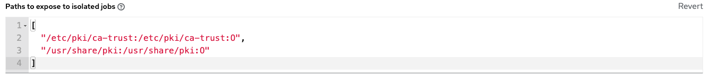

.. _ug_collections:

Collections Support
---------------------

.. index::
   single: Ansible collections
   single: collections support

AWX supports project-specific `Ansible collections <https://docs.ansible.com/ansible/latest/collections_guide/index.html>`_ in job runs. If you specify a collections requirements file in the SCM at ``collections/requirements.yml``, AWX will install collections in that file in the implicit project sync before a job run.

By default, AWX has a system-wide setting that allows collections to be dynamically downloaded from the ``collections/requirements.yml`` file for SCM projects. You may turn off this setting in the **Jobs settings** tab of the Settings menu by switching the **Enable Collections Download** toggle button to **OFF**.

  .. image:: ../common/images/configure-awx-jobs-download-collections.png
     :alt: Job Settings page showing where to enable collection(s) download.

Roles and collections are locally cached for performance reasons, and you will need to select **Update Revision on Launch** in the project SCM Update Options to ensure this:

|update-on-launch|

.. _ug_collections_usage:

Using Collections via Hub
~~~~~~~~~~~~~~~~~~~~~~~~~

Before AWX can use |ah| as the default source for collections content, you need to create an API token in the |ah| UI so that it could be specified in AWX. You may connect to a private |ah| or a public |ah| collection, the only difference is which URL you specify.

1. Navigate to https://cloud.redhat.com/ansible/automation-hub/token and click **Load token**.

2. Click the copy icon to copy the API token to the clipboard.

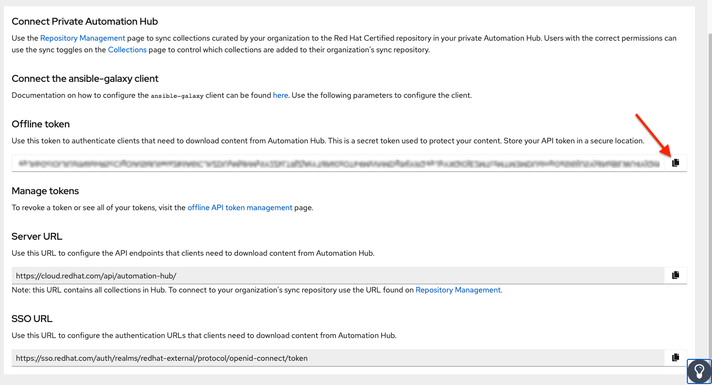

3. To use the public |ah|, create an |ah| credential using the copied token and pointing to the URLs shown in the **Server URL** and **SSO URL** fields of the token page:

  - **Galaxy Server URL** = ``https://cloud.redhat.com/api/automation-hub/``

  - **AUTH SEVER URL** = ``https://sso.redhat.com/auth/realms/redhat-external/protocol/openid-connect/token``

4. To use a private |ah|, create an |ah| credential using a token retrieved from the Repo Management dashboard of your local |ah| and pointing to the published repo URL as shown:

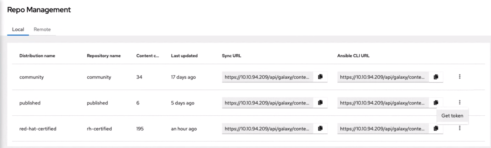
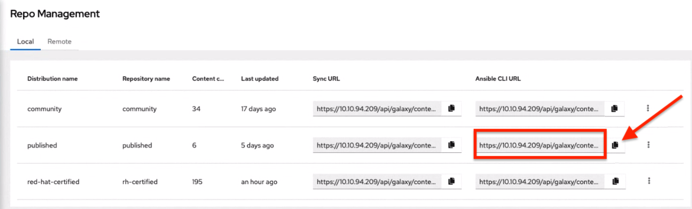

You can create different repos with different namespaces/collections in them. But for each repo in |ah| you need to create a different |ah| credential. Copy the **Ansible CLI URL** from the |ah| UI in the format of ``https://$<hub_url>/api/galaxy/content/<repo you want to pull from>`` into the **Galaxy Server URL** field of the *Create Credential* form:

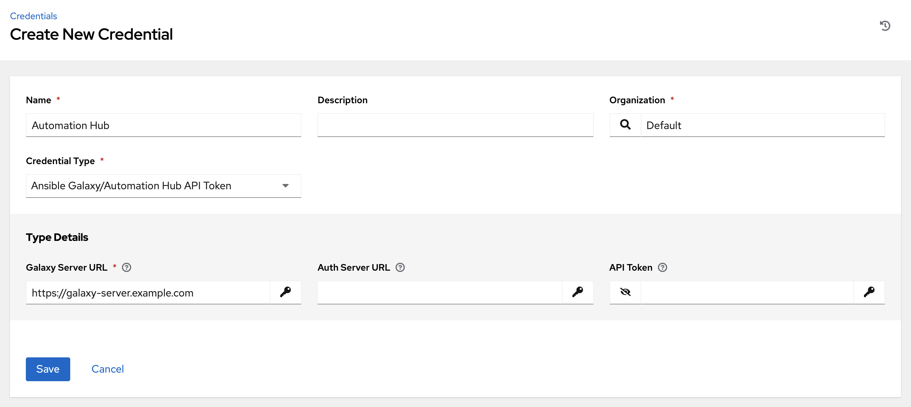

5. Navigate to the organization for which you want to be able to sync content from |ah| and add the new |ah| credential to the organization. This step allows you to associate each organization with the |ah| credential (i.e. repo) that you want to be able to use content from.

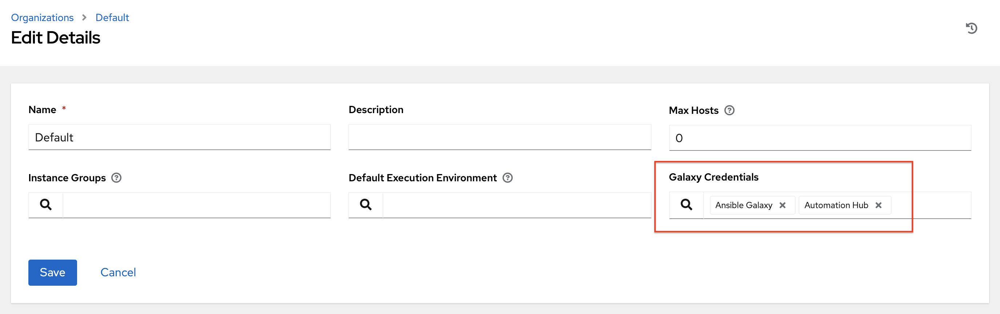

.. note::

  Suppose you have two repos:

  - *Prod*: ``Namespace 1`` and ``Namespace 2``, each with collection ``A`` and ``B`` so: ``namespace1.collectionA:v2.0.0`` and ``namespace2.collectionB:v2.0.0``

  - *Stage*: ``Namespace 1`` with only collection ``A`` so: ``namespace1.collectionA:v1.5.0`` on |ah|, you will have a repo URL for *Prod* and *Stage*.

  You can create an |ah| credential for each one. Then you can assign different levels of access to different organizations. For example, you can create a Developers organization has access to both repos, while an Operations organization just has access to the |ah| **Prod** repo only.

6. If the |ah| has self-signed certificates, click the toggle to enable the setting **Ignore Ansible Galaxy SSL Certificate Verification**. For **public Automation Hub**, which uses a signed certificate, click the toggle to disable it instead. Note this is a global setting:

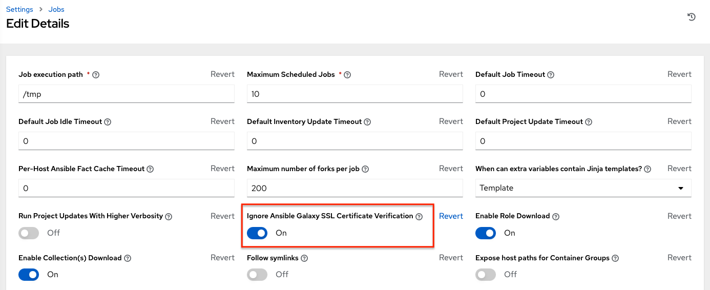

7. Create a project, where the source repository specifies the necessary collections in a requirements file located in the ``collections/requirements.yml`` file. Refer to the syntax described in the corresponding `Ansible documentation <https://docs.ansible.com/ansible/latest/user_guide/collections_using.html#install-multiple-collections-with-a-requirements-file>`_.

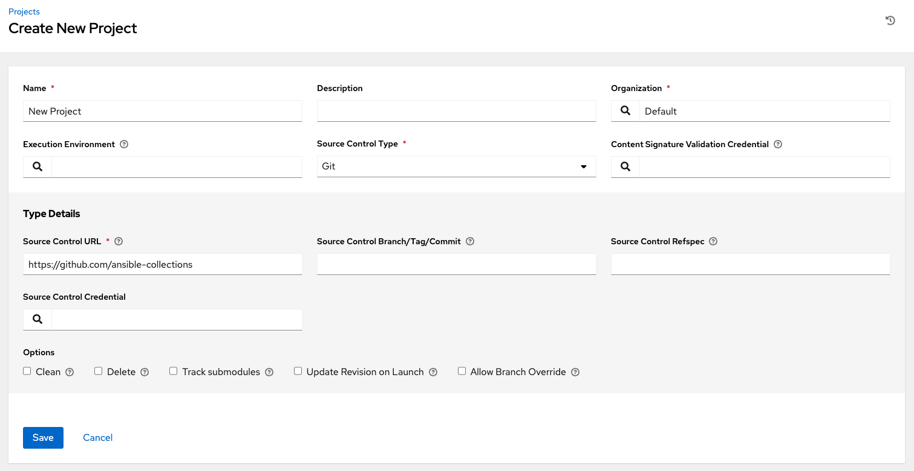

8. In the Projects list view, click |update| to run an update against this project. AWX fetches the Galaxy collections from the ``collections/requirements.yml`` file and report it as changed; and the collections will now be installed for any job template using this project.

.. note::

  If updates are needed from Galaxy or Collections, a sync is performed that downloads the required roles, consuming that much more space in your /tmp file. In cases where you have a big project (around 10 GB), disk space on ``/tmp`` may be an issue.

For more information on collections, refer to `Using Collections <https://docs.ansible.com/ansible/latest/user_guide/collections_using.html>`_.
