.. _rbac-ug:

Role-Based Access Controls
==========================

.. index::
   single: role-based access controls
   pair: security; RBAC

Role-Based Access Controls (RBAC) are built into AWX and allow administrators to delegate access to server inventories, organizations, and more. Administrators can also centralize the management of various credentials, allowing end users to leverage a needed secret without ever exposing that secret to the end user. RBAC controls allow AWX to help you increase security and streamline management.

This chapter has two parts: the latest RBAC model (:ref:`rbac-dab-ug`) and the :ref:`existing RBAC <rbac-legacy-ug>` implementation.

.. _rbac-dab-ug:

DAB RBAC
---------

.. index::
   single: DAB
   single: roles   
   pair: DAB; RBAC

This section describes the latest changes to RBAC, involving use of the ``django-ansible-base`` (DAB) library, to enhance existing roles, and allow creation of custom roles. However, the internals of the system in the backend have changes implemented, but they are not reflected yet in the AWX UI. The change to the backend maintains a compatibility layer so the “old” roles in the API still exists temporarily, until a fully-functional compatible UI replaces the existing roles. 

New functionality, specifically custom roles, are possible through direct API clients or the API browser, but the presentation in the AWX UI might not reflect the changes made in the API.

The new DAB version of RBAC allows creation of custom roles which can be done via the ``/api/v2/role_definitions/`` endpoint. Then these can only be assigned using the new endpoints, ``/api/v2/role_user_assignments/`` and ``/api/v2/role_team_assignments/``.

If you do not want to allow custom roles, you can change the setting ``ANSIBLE_BASE_ALLOW_CUSTOM_ROLES`` to ``False``. This is still a file-based setting for now.

New “add” permissions are a major highlight of this change. You could create a custom organization role that allows users to create all (or some) types of resources, and apply it to a particular organization. So instead of allowing a user to edit all projects, they can create a new project, and after creating it, they will automatically get admin role just for the objects they created.

Resource access for teams
~~~~~~~~~~~~~~~~~~~~~~~~~~

This section provides a reference for managing team roles within individual resources as shown in the new UI and the corresponding API calls.

Access the resource's **Team Access** tab to manage the team roles.

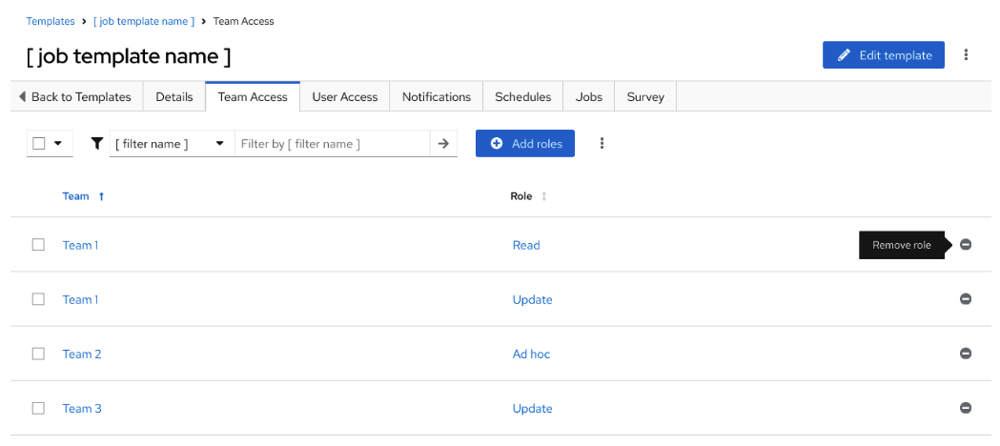

To obtain a list of team role assignments from the API: 

::

   GET /api/v2/role_team_assignments/?object_id=<template_id>&content_type__model=jobtemplate

The columns are arranged so that the team name appears in the first column. The role name is under ``summary_fields.role_definition.name``

To revoke a role assignment for a team in the API: 

::

   DELETE /api/v2/role_team_assignments/<role_id_from_list_API_above>/

Add roles
^^^^^^^^^^

Clicking the **Add roles** button from the **Team Access** tab opens the **Add roles** wizard, where you can select the teams to which you want to add roles.

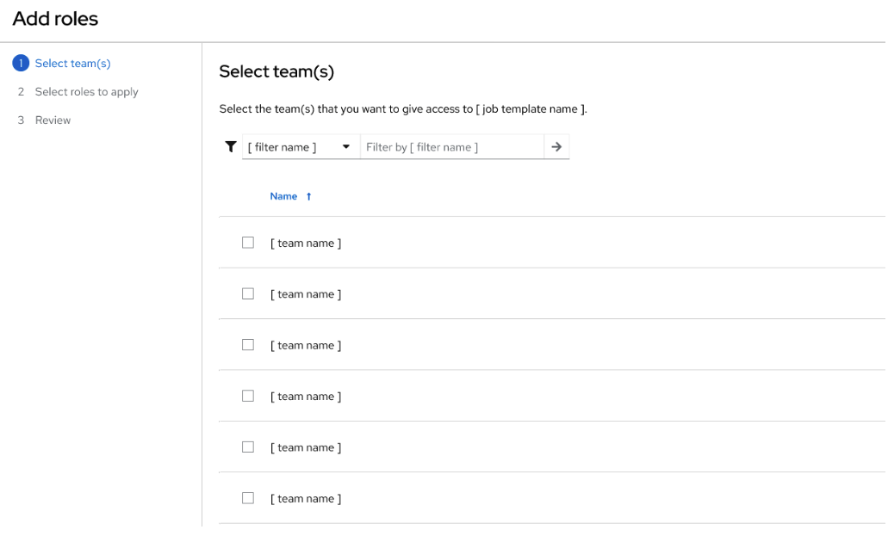

To list the teams from the service endpoint:

::

   GET /api/v2/teams

The next step of the wizard in the controller UI is to apply roles to the selected team(s).

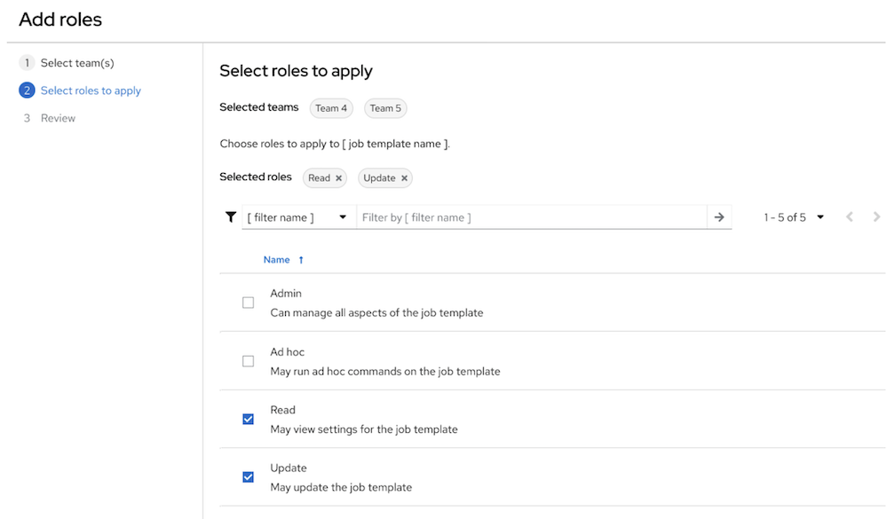

To list available role definitions for the selected resource type in the API, issue the following, but replace ``content_type`` below to match the resource type:

::

   GET /api/v2/role_definitions/?content_type__model=jobtemplate

Finally, review your selections and click **Save** to save your changes.

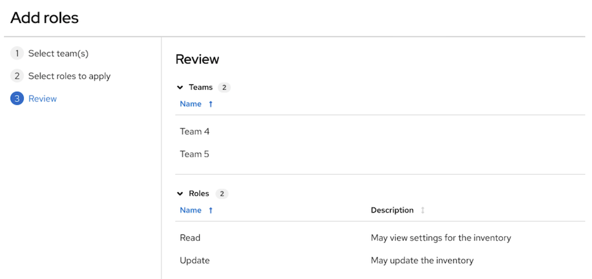

To assign roles to selected teams in the API, you must assign a single role to individual teams separately by referencing the team ID and resource ID from the controller associated with the ``object_id``.

Make a POST request to this resource (``jobtemplate.id`` in this example):

::

   POST /api/v2/role_team_assignments/

The following shows an example of the payload sent for the POST request made above:

::

   {"team": 25, "role_definition": 4, "object_id": "10"}

When changes are successfully applied via the UI, a message displays to confirm the changes:

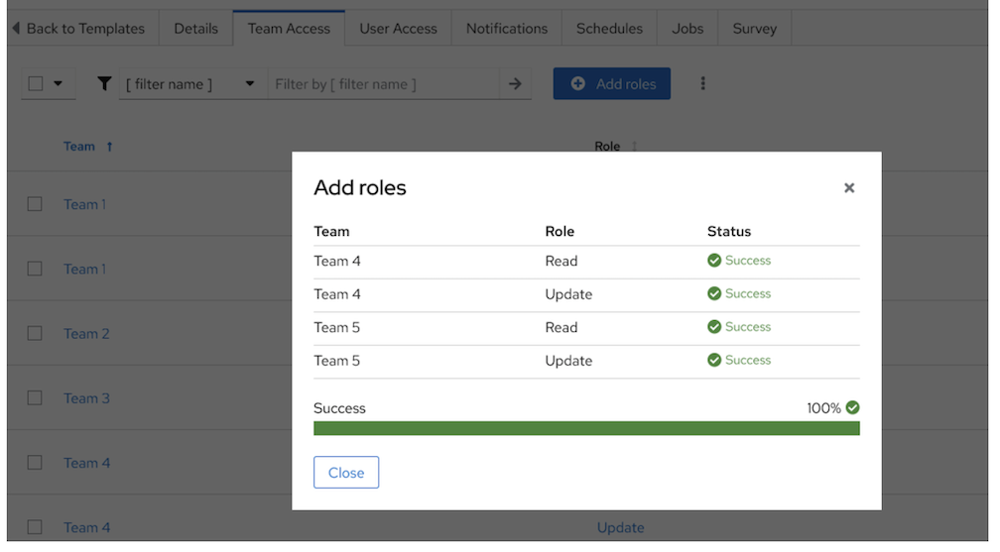

Resource access for users
~~~~~~~~~~~~~~~~~~~~~~~~~~

This section provides a reference for managing user roles within individual resources as shown in the new UI and the corresponding API calls.

Access the resource's **User Access** tab to manage the user roles.

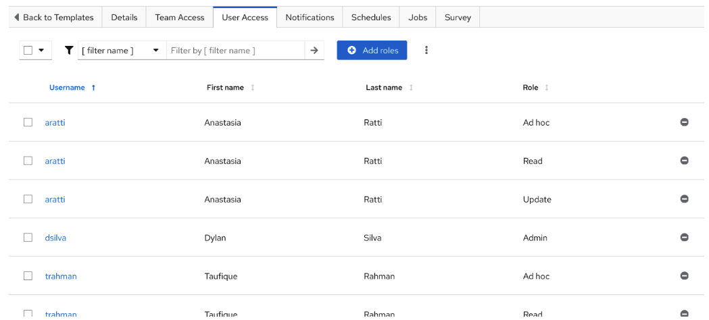

To obtain a list of user role assignments from the API: 

::

   GET /api/v2/role_user_assignments/?object_id=<template_id>&content_type__model=jobtemplate

The columns are arranged so that the user name appears in the first column. The role name is under ``summary_fields.role_definition.name``

To revoke a role assignment for a user in the API: 

::

   DELETE /api/v2/role_user_assignments/<role_id_from_list_API_above>/

Add roles
^^^^^^^^^^

Clicking the **Add roles** button from the **User Access** tab opens the **Add roles** wizard, where you can select the users to which you want to add roles.

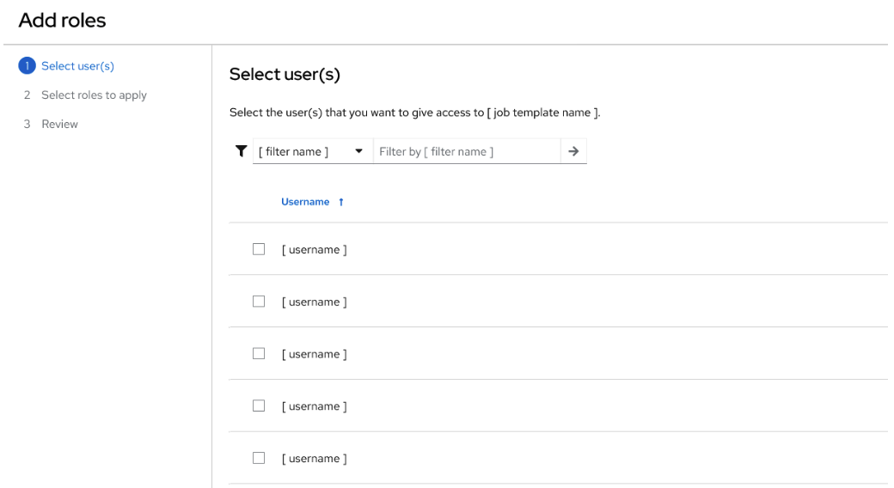

To list the teams from the service endpoint:

::

   GET /api/v2/users

The next step of the wizard in the controller UI is to apply roles to the selected team(s).

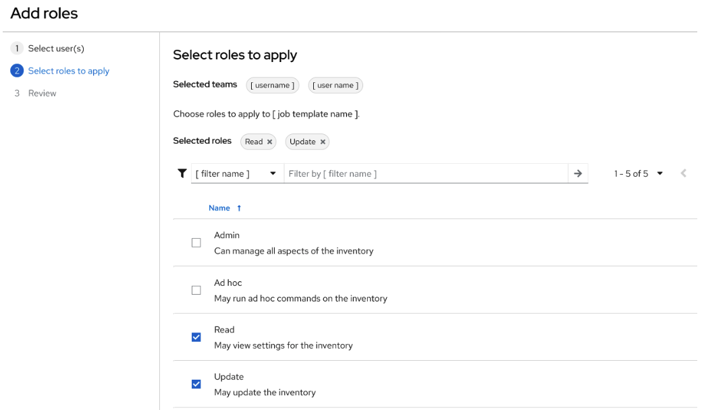

To list available role definitions for the selected resource type in the API, issue the following, but replace ``content_type`` below to match the resource type:

::

   GET /api/v2/role_definitions/?content_type__model=jobtemplate

Finally, review your selections and click **Save** to save your changes.

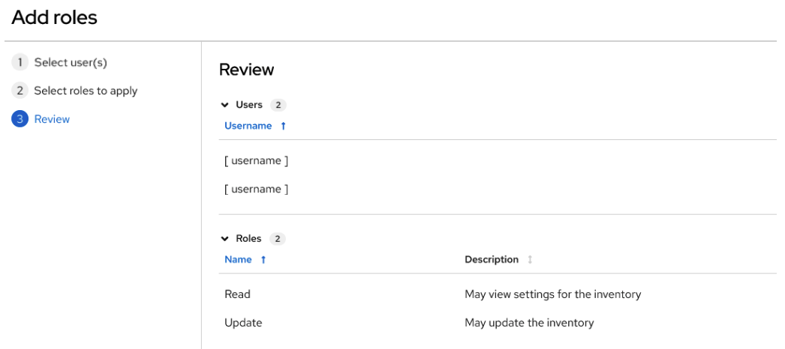

To assign roles to selected users in the API, you must assign a single role to individual users separately by referencing the user ID and resource ID from the controller associated with the ``object_id``.

Make a POST request to this resource (``jobtemplate.id`` in this example):

::

   POST /api/v2/role_user_assignments/

The following shows an example of the payload sent for the POST request made above:

::

   {"user": 25, "role_definition": 4, "object_id": "10"}

When changes are successfully applied via the UI, a message displays to confirm the changes:

Custom roles
~~~~~~~~~~~~~
.. index::
   single: DAB
   single: custom roles   
   pair: custom; roles

In the DAB RBAC model, Superusers have the ability to create, modify, and delete custom roles.

To create a custom role, click the **Create role** button from the **Roles** resource in the UI, and provide the details of the new role:

- **Name**: Required
- **Description**: Enter an arbitrary description as appropriate (optional)
- **Resource Type**: Required. Select the resource type from the drop-down menu (only one resource type per role allowed). This is equivalent to ``content_type`` in ``OPTIONS /api/v2/role_definitions`` for choices.
- Select permissions based on the selected of resource type. (Alan will provide an endpoint containing dictionary for available permissions based on content type (The UI can use this to maintain static readable translatable texts on the client side) TBD)

Modifying a custom role only allows you to change the permissions but does not not allow changes to the content type.

To delete a custom role:

::

   DELETE /api/v2/role_definitions/:id

.. _rbac-legacy-ug:

Legacy RBAC model
------------------

.. index::
   single: roles   
   pair: legacy; RBAC

As in the name, RBAC is role-based, and roles contain a list of permissions. This is a domain-centric concept, where organization-level roles can grant you a permission (like ``update_project``) to everything in that domain, including all projects in that organizations.

There are a few main concepts that you should become familiar with regarding AWX's RBAC design--roles, resources, and users. Users can be members of a role, which gives them certain access to any resources associated with that role, or any resources associated with "descendant" roles.

A role is essentially a list of permissions. Users are granted access to these capabilities and AWX's resources through the roles to which they are assigned or through roles inherited through the role hierarchy.

Roles associate a group of capabilities with a group of users. All capabilities are derived from membership within a role. Users receive capabilities only through the roles to which they are assigned or through roles they inherit through the role hierarchy. All members of a role have all capabilities granted to that role. Within an organization, roles are relatively stable, while users and capabilities are both numerous and may change rapidly. Users can have many roles.

Role Hierarchy and Access Inheritance
~~~~~~~~~~~~~~~~~~~~~~~~~~~~~~~~~~~~~~

Imagine that you have an organization named "SomeCompany" and want to allow two people, "Josie" and "Carter", access to manage all the settings associated with that organization. You should make both people members of the organization's ``admin_role``.

|user-role-relationship|

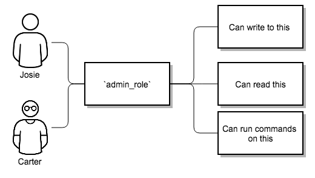

Often, you will have many Roles in a system and you will want some roles to include all of the capabilities of other roles. For example, you may want a System Administrator to have access to everything that an Organization Administrator has access to, who has everything that a Project Administrator has access to, and so on. 

This concept is referred to as the 'Role Hierarchy':

- Parent roles get all capabilities bestowed on any child roles
- Members of roles automatically get all capabilities for the role they are a member of, as well as any child roles.

The Role Hierarchy is represented by allowing Roles to have "Parent Roles". Any capability that a Role has is implicitly granted to any parent roles (or parents of those parents, and so on).

|rbac-role-hierarchy|

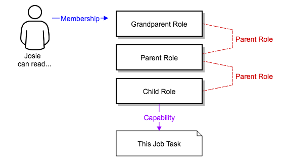

Often, you will have many Roles in a system and you will want some roles to include all of the capabilities of other roles. For example, you may want a System Administrator to have access to everything that an Organization Administrator has access to, who has everything that a Project Administrator has access to, and so on. We refer to this concept as the 'Role Hierarchy' and it is represented by allowing Roles to have "Parent Roles". Any capability that a Role has is implicitly granted to any parent roles (or parents of those parents, and so on). Of course Roles can have more than one parent, and capabilities are implicitly granted to all parents.

|rbac-heirarchy-morecomplex|

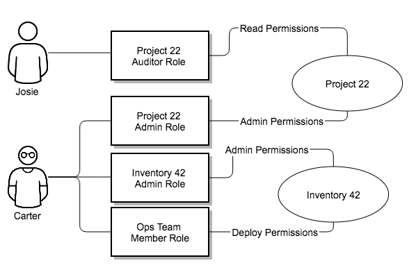

RBAC controls also give you the capability to explicitly permit User and Teams of Users to run playbooks against certain sets of hosts. Users and teams are restricted to just the sets of playbooks and hosts to which they are granted capabilities. And, with AWX, you can create or import as many Users and Teams as you require--create users and teams manually or import them from Active Directory.

RBACs are easiest to think of in terms of who or what can see, change, or delete an "object" for which a specific capability is being determined.

Applying RBAC
~~~~~~~~~~~~~~~~~

The following sections cover how to apply AWX's RBAC system in your environment.

Editing Users
^^^^^^^^^^^^^^^

When editing a user, a AWX system administrator may specify the user as being either a *System Administrator* (also referred to as the Superuser) or a *System Auditor*.

- System administrators implicitly inherit all capabilities for all objects (read/write/execute) within the AWX environment.
- System Auditors implicitly inherit the read-only capability for all objects within the AWX environment.

Editing Organizations
^^^^^^^^^^^^^^^^^^^^^^^^

When editing an organization, system administrators may specify the following roles:

- One or more users as organization administrators
- One or more users as organization auditors
- And one or more users (or teams) as organization members

Users/teams that are members of an organization can view their organization administrator. 

Users who are organization administrators implicitly inherit all capabilities for all objects within that AWX organization. 

Users who are organization auditors implicitly inherit the read-only capability for all objects within that AWX organization.

Editing Projects in an Organization
^^^^^^^^^^^^^^^^^^^^^^^^^^^^^^^^^^^^ 

When editing a project in an organization for which they are the administrator, system administrators and organization administrators may specify:

- One or more users/teams that are project administrators
- One or more users/teams that are project members
- And one or more users/teams that may update the project from SCM, from among the users/teams that are members of that organization. 

Users who are members of a project can view their project administrators.

Project administrators implicitly inherit the capability to update the project from SCM.

Administrators can also specify one or more users/teams (from those that are members of that project) that can use that project in a job template.

Creating Inventories and Credentials within an Organization
^^^^^^^^^^^^^^^^^^^^^^^^^^^^^^^^^^^^^^^^^^^^^^^^^^^^^^^^^^^^^

All access that is granted to use, read, or write credentials is handled through roles, which use AWX's RBAC system to grant ownership, auditor, or usage roles.

System administrators and organization administrators may create inventories and credentials within organizations under their administrative capabilities. 

Whether editing an inventory or a credential, System administrators and organization administrators may specify one or more users/teams (from those that are members of that organization) to be granted the usage capability for that inventory or credential.

System administrators and organization administrators may specify one or more users/teams (from those that are members of that organization) that have the capabilities to update (dynamic or manually) an inventory.  Administrators can also execute ad hoc commands for an inventory.

Editing Job Templates
^^^^^^^^^^^^^^^^^^^^^^

System administrators, organization administrators, and project administrators, within a project under their administrative capabilities, may create and modify new job templates for that project. 

When editing a job template, administrators (AWX, organization, and project) can select among the inventory and credentials in the organization for which they have usage capabilities or they may leave those fields blank so that they will be selected at runtime. 

Additionally, they may specify one or more users/teams (from those that are members of that project) that have execution capabilities for that job template. The execution capability is valid regardless of any explicit capabilities the user/team may have been granted against the inventory or credential specified in the job template.

User View
^^^^^^^^^^^^^

A user can:

- See any organization or project for which they are a member
- Create their own credential objects which only belong to them  
- See and execute any job template for which they have been granted execution capabilities

If a job template that a user has been granted execution capabilities on does not specify an inventory or credential, the user will be prompted at run-time to select among the inventory and credentials in the organization they own or have been granted usage capabilities.

Users that are job template administrators can make changes to job templates; however, to change to the inventory, project, playbook, credentials, or instance groups used in the job template, the user must also have the "Use" role for the project and inventory currently being used or being set.

.. _rbac-ug-roles:

Roles
~~~~~~~~~~~~~

All access that is granted to use, read, or write credentials is handled through roles, and roles are defined for a resource. 

Built-in roles
^^^^^^^^^^^^^^

The following table lists the RBAC system roles and a brief description of the how that role is defined with regard to privileges in AWX.

+-----------------------------------------------------------------------+------------------------------------------------------------------------------------------+
| System Role                                                           | What it can do                                                                           |
+=======================================================================+==========================================================================================+
| System Administrator - System wide singleton                          | Manages all aspects of the system                                                        |
+-----------------------------------------------------------------------+------------------------------------------------------------------------------------------+
| System Auditor - System wide singleton                                | Views all aspects of the system                                                          |
+-----------------------------------------------------------------------+------------------------------------------------------------------------------------------+
| Ad Hoc Role - Inventory                                               | Runs ad hoc commands on an Inventory                                                     |
+-----------------------------------------------------------------------+------------------------------------------------------------------------------------------+
| Admin Role - Organizations, Teams, Inventory, Projects, Job Templates | Manages all aspects of a defined Organization, Team, Inventory, Project, or Job Template |
+-----------------------------------------------------------------------+------------------------------------------------------------------------------------------+
| Auditor Role - All                                                    | Views all aspects of a defined Organization, Team, Inventory, Project, or Job Template   |
+-----------------------------------------------------------------------+------------------------------------------------------------------------------------------+
| Execute Role - Job Templates                                          | Runs assigned Job Template                                                               |
+-----------------------------------------------------------------------+------------------------------------------------------------------------------------------+
| Member Role - Organization, Team                                      | User is a member of a defined Organization or Team                                       |
+-----------------------------------------------------------------------+------------------------------------------------------------------------------------------+
| Read Role - Organizations, Teams, Inventory, Projects, Job Templates  | Views all aspects of a defined Organization, Team, Inventory, Project, or Job Template   |
+-----------------------------------------------------------------------+------------------------------------------------------------------------------------------+
| Update Role - Project                                                 | Updates the Project from the configured source control management system                 |
+-----------------------------------------------------------------------+------------------------------------------------------------------------------------------+
| Update Role - Inventory                                               | Updates the Inventory using the cloud source update system                               |
+-----------------------------------------------------------------------+------------------------------------------------------------------------------------------+
| Owner Role - Credential                                               | Owns and manages all aspects of this Credential                                          |
+-----------------------------------------------------------------------+------------------------------------------------------------------------------------------+
| Use Role - Credential, Inventory, Project, IGs, CGs                   | Uses the Credential, Inventory, Project, IGs, or CGs in a Job Template                   |
+-----------------------------------------------------------------------+------------------------------------------------------------------------------------------+

A Singleton Role is a special role that grants system-wide permissions. AWX currently provides two built-in Singleton Roles but the ability to create or customize a Singleton Role is not supported at this time.

Common Team Roles - "Personas"
^^^^^^^^^^^^^^^^^^^^^^^^^^^^^^^^

Support personnel typically works on ensuring that AWX is available and manages it a way to balance supportability and ease-of-use for users. Often, support will assign “Organization Owner/Admin” to users in order to allow them to create a new Organization and add members from their team the respective access needed. This minimizes supporting individuals and focuses more on maintaining uptime of the service and assisting users who are using AWX.

Below are some common roles managed by the AWX Organization:

+-----------------------+------------------------+-----------------------------------------------------------------------------------------------------------+
| | System Role         | | Common User          | | Description                                                                                             |
| | (for Organizations) | | Roles                |                                                                                                           |
+-----------------------+------------------------+-----------------------------------------------------------------------------------------------------------+
| | Owner               | | Team Lead -          | | This user has the ability to control access for other users in their organization.                      |
|                       | | Technical Lead       | | They can add/remove and grant users specific access to projects, inventories, and job templates.        |
|                       |                        | | This user also has the ability to create/remove/modify any aspect of an organization’s projects,        |
|                       |                        | | templates, inventories, teams, and credentials.                                                         |
+-----------------------+------------------------+-----------------------------------------------------------------------------------------------------------+
| | Auditor             | | Security Engineer -  | | This account can view all aspects of the organization in read-only mode.                                |
|                       | | Project Manager      | | This may be good for a user who checks in and maintains compliance.                                     |
|                       |                        | | This might also be a good role for a service account who manages or                                     |
|                       |                        | | ships job data from AWX to some other data  collector.                                                  |
+-----------------------+------------------------+-----------------------------------------------------------------------------------------------------------+
| | Member -            | | All other users      | | These users by default as an organization member do not receive any access to any aspect                |
| | Team                |                        | | of the organization. In order to grant them access the respective organization owner needs              |
|                       |                        | | to add them to their respective team and grant them Admin, Execute, Use, Update, Ad-hoc                 |
|                       |                        | | permissions to each component of the organization’s projects, inventories, and job templates.           |
+-----------------------+------------------------+-----------------------------------------------------------------------------------------------------------+
| | Member -            | | Power users -        | | Organization Owners can provide “admin” through the team interface, over any component                  |
| | Team “Owner”        | | Lead Developer       | | of their organization including projects, inventories, and job templates. These users are able          |
|                       |                        | | to modify and utilize the respective component given access.                                            |
+-----------------------+------------------------+-----------------------------------------------------------------------------------------------------------+
| | Member -            | | Developers -         | | This will be the most common and allows the organization member the ability to execute                  |
| | Team “Execute”      | | Engineers            | | job templates and read permission to the specific components. This is permission applies to templates.  |
+-----------------------+------------------------+-----------------------------------------------------------------------------------------------------------+
| | Member -            | | Developers -         | | This permission applies to an organization’s credentials, inventories, and projects.                    |
| | Team “Use”          | | Engineers            | | This permission allows the ability for a user to use the respective component within their job template.|
+-----------------------+------------------------+-----------------------------------------------------------------------------------------------------------+
| | Member -            | | Developers -         | | This permission applies to projects. Allows the user to be able to run an SCM update on a project.      |
| | Team “Update”       | | Engineers            |                                                                                                           |
+-----------------------+------------------------+-----------------------------------------------------------------------------------------------------------+

Function of roles: editing and creating
------------------------------------------

Organization “resource roles” functionality are specific to a certain resource type - such as workflows. Being a member of such a role usually provides two types of permissions, in the case of workflows, where a user is given a "workflow admin role" for the organization "Default":

- this user can create new workflows in the organization "Default"
- user can edit all workflows in the "Default" organization

One exception is job templates, where having the role is irrelevant of creation permission (more details on its own section).

Independence of resource roles and organization membership roles
~~~~~~~~~~~~~~~~~~~~~~~~~~~~~~~~~~~~~~~~~~~~~~~~~~~~~~~~~~~~~~~~~~

Resource-specific organization roles are independent of the organization roles of admin and member. Having the "workflow admin role" for the "Default" organization will not allow a user to view all users in the organization, but having a "member" role in the "Default" organization will. The two types of roles are delegated independently of each other.

Necessary permissions to edit job templates
^^^^^^^^^^^^^^^^^^^^^^^^^^^^^^^^^^^^^^^^^^^^^

Users can edit fields not impacting job runs (non-sensitive fields) with a Job Template admin role alone. However, to edit fields that impact job runs in a job template, a user needs the following:

- **admin** role to the job template and container groups
- **use** role to related project
- **use** role to related inventory
- **use** role to related instance groups

An "organization job template admin" role was introduced, but having this role isn't sufficient by itself to edit a job template within the organization if the user does not have use role to the project / inventory / instance group or an admin role to the container group that a job template uses.

In order to delegate *full* job template control (within an organization) to a user or team, you will need grant the team or user all 3 organization-level roles:

- job template admin
- project admin
- inventory admin

This will ensure that the user (or all users who are members of the team with these roles) have full access to modify job templates in the organization. If a job template uses an inventory or project from another organization, the user with these organization roles may still not have permission to modify that job template. For clarity of managing permissions, it is best-practice to not mix projects / inventories from different organizations.

RBAC permissions
^^^^^^^^^^^^^^^^^^^

Each role should have a content object, for instance, the org admin role has a content object of the org. To delegate a role, you need admin permission to the content object, with some exceptions that would result in you being able to reset a user's password.

**Parent** is the organization.

**Allow** is what this new permission will explicitly allow.

**Scope** is the parent resource that this new role will be created on. Example: ``Organization.project_create_role``.

An assumption is being made that the creator of the resource should be given the admin role for that resource. If there are any instances where resource creation does not also imply resource administration, they will be explicitly called out.

Here are the rules associated with each admin type: 

**Project Admin**

- Allow: Create, read, update, delete any project
- Scope: Organization
- User Interface: *Project Add Screen - Organizations* 

**Inventory Admin**

- Parent: Org admin
- Allow: Create, read, update, delete any inventory
- Scope: Organization
- User Interface: *Inventory Add Screen - Organizations*

.. note::

	As it is with the **Use** role, if you give a user Project Admin and Inventory Admin, it allows them to create Job Templates (not workflows) for your organization.

**Credential Admin**

- Parent: Org admin
- Allow: Create, read, update, delete shared credentials
- Scope: Organization
- User Interface: *Credential Add Screen - Organizations*

**Notification Admin**

- Parent: Org admin
- Allow: Assignment of notifications
- Scope: Organization

**Workflow Admin**

- Parent: Org admin
- Allow: Create a workflow
- Scope: Organization

**Org Execute**

- Parent: Org admin
- Allow: Executing JTs and WFJTs
- Scope: Organization

The following is a sample scenario showing an organization with its roles and which resource(s) each have access to:

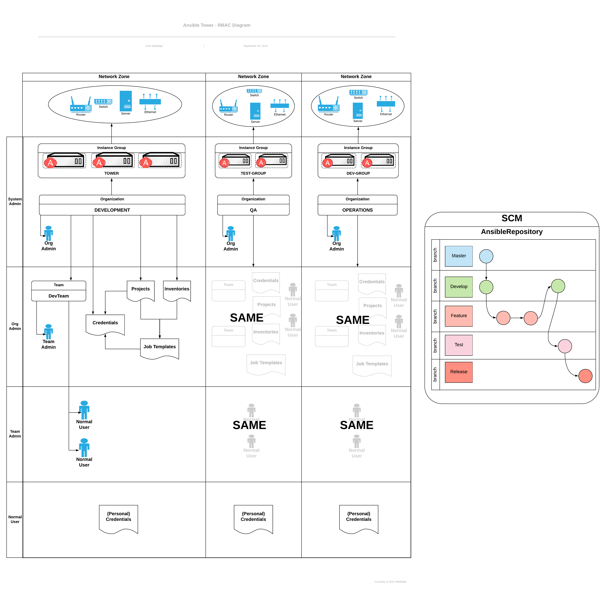