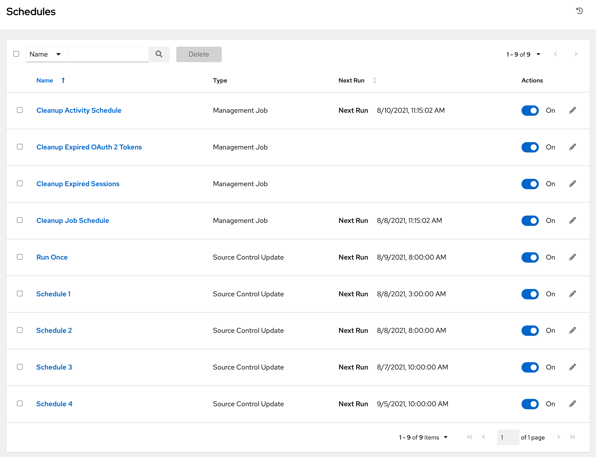
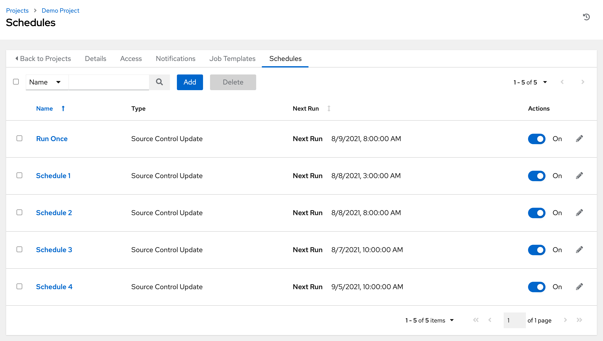
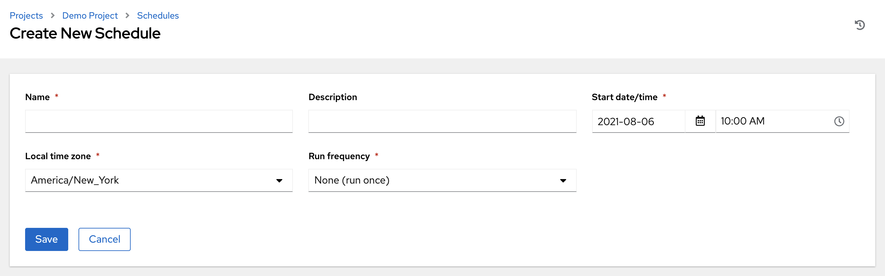

 .. _ug_scheduling:

Schedules 
===========

.. index::
   pair: projects; scheduling
   pair: job templates; scheduling
   pair: workflow templates; scheduling
   pair: inventory source; scheduling

You can access all your configured schedules by clicking **Schedules** from the left navigation bar. The schedules list may be sorted by any of the attributes from each column using the directional arrows. You can also search by name, date, or the name of the month in which a schedule runs.

Each schedule has a corresponding **Actions** column that has options to enable/disable that schedule using the **ON/OFF** toggle next to the schedule name and to allow editing (|edit|) of that schedule.

.. |edit| image:: ../common/images/edit-button.png

If you are setting up a template, a project, or an inventory source, clicking on the **Schedules** tab allows you to configure schedules for these resources. Once schedules are created, they are listed by:

- **Name**: Clicking the schedule name opens its details
- **Type**: Identifies whether the schedule is associated with a source control update or a system-managed job schedule
- **Next Run**: The next scheduled run of this task

Add a new schedule
~~~~~~~~~~~~~~~~~~~~~~~~~~~~~                    

Schedules can only be created from a template, project, or inventory source, and not directly on the main **Schedules** screen itself. To create a new schedule:

1. Click the **Schedules** tab of the resource you are configuring (template, project, or inventory source).

2. Click the **Add** button, which opens the **Create Schedule** window.

3. Enter the appropriate details into the following fields:

-  **Name** (required)
-  **Start Date** (required)
-  **Start Time** (required)
-  **Local Time Zone** - The entered Start Time should be in this timezone
-  **Repeat Frequency** - Appropriate scheduling options display depending on the frequency you select

The **Schedule Details** displays when you established a schedule, allowing you to review the schedule settings and a list of the scheduled occurrences in the selected Local Time Zone.

.. image:: ../common/images/generic-create-schedule-details.png

.. caution::

    Jobs are scheduled in UTC. Repeating jobs that run at a specific time of day may move relative to a local timezone when Daylight Savings Time shifts occur. The system resolves the local time zone based time to UTC when the schedule is saved.  To ensure your schedules are correctly set, you should set your schedules in UTC time.

4. Once done, click **Save**.

You can use the **ON/OFF** toggle button to stop an active schedule or activate a stopped schedule.

.. image:: ../common/images/generic-schedules-list-configured.png

