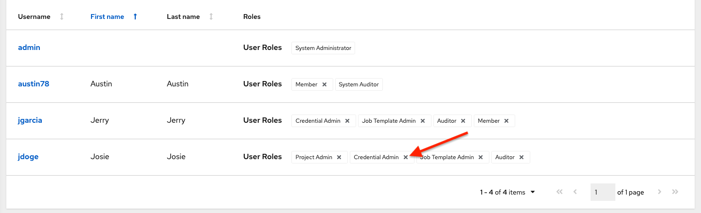

.. _ug_teams:

Teams
======

.. index::
   single: teams
   
A :term:`Team` is a subdivision of an organization with associated users, projects, credentials, and permissions. Teams provide a means to implement role-based access control schemes and delegate responsibilities across organizations. For instance, permissions may be granted to a whole Team rather than each user on the Team.

You can create as many Teams of users as make sense for your Organization. Each Team can be assigned permissions, just as with Users. Teams can also scalably assign ownership for Credentials, preventing multiple interface click-throughs to assign the same Credentials to the same user.

Access the Teams page by clicking **Teams** from the left navigation bar. The team list may be sorted and searched by **Name** or **Organization**.

.. image:: ../common/images/organizations-teams-list.png

Clicking the Edit (|edit-button|) button next to the list of **Teams** allows you to edit details about the team. You can also review **Users** and  **Permissions** associated with this Team.

.. |edit-button| image:: ../common/images/edit-button.png

.. _ug_team_create:

Create a Team
----------------

To create a new Team:

1. Click the **Add** button.

|Teams - create new team|

2. Enter the appropriate details into the following fields:

-  Name
-  Description (optional)
-  Organization (Choose from an existing organization)

3. Click **Save**.

Once the Team is successfully created, AWX opens the **Details** dialog, which also allows you to review and edit your Team information. 

|Teams - example team successfully created|

Team Access
~~~~~~~~~~~~~

.. index::
   pair: teams; users

This tab displays the list of Users that are members of this Team. This list may be searched by **Username**, **First Name**, or **Last Name**. For more information, refer to :ref:`ug_users`.

|Teams - users list|

.. |Teams - users list| image:: ../common/images/teams-users-list.png

.. _ug_teams_permissions:

Add a User
^^^^^^^^^^^

In order to add a user to a team, the user must already be created. Refer to :ref:`ug_users_create` to create a user. Adding a user to a team adds them as a member only, specifying a role for the user on different resources can be done in the **Access** tab . To add existing users to the Team:

1. In the **Access** tab, click the **Add** button. 

2. Follow the prompts to add user(s) and assign them to roles. 

3. Click **Save** when done.

To remove roles for a particular user, click the disassociate (x) button next to its resource.

This launches a confirmation dialog, asking you to confirm the disassociation.
 
.. image:: ../common/images/permissions-disassociate-confirm.png

Team Roles
~~~~~~~~~~~~

.. index::
   pair: teams; permissions
   pair: teams; roles

Selecting the **Roles** view displays a list of the permissions that are currently available for this Team. The permissions list may be sorted and searched by **Resource Name**, **Type**, or **Role**.

|Teams - permissions list|

.. |Teams - permissions list| image:: ../common/images/teams-permissions-sample-roles.png

The set of privileges assigned to Teams that provide the ability to read, modify, and administer projects, inventories, and other AWX elements are permissions. By default, the Team is given the "read" permission (also called a role).

Permissions must be set explicitly via an Inventory, Project, Job Template, or within the Organization view.

Add Team Permissions
^^^^^^^^^^^^^^^^^^^^^^

To add permissions to a Team:

1. Click the **Add** button, which opens the Add Permissions Wizard.

2. Click to select the object for which the team will have access and click **Next**.

3. Click to select the resource to assign team roles and click **Next**.

4. Click the checkbox beside the role to assign that role to your chosen type of resource. Different resources have different options available.

.. image:: ../common/images/teams-permissions-template-roles.png

5. Click **Save** when done, and the Add Permissions Wizard closes to display the updated profile for the user with the roles assigned for each selected resource.

.. image:: ../common/images/teams-permissions-sample-roles.png
  
To remove Permissions for a particular resource, click the disassociate (x) button next to its resource. This launches a confirmation dialog, asking you to confirm the disassociation.

.. note:: 

   You can also add teams, individual, or multiple users and assign them permissions at the object level (projects, inventories, job templates, and workflow templates) as well. This feature reduces the time for an organization to onboard many users at one time. 

