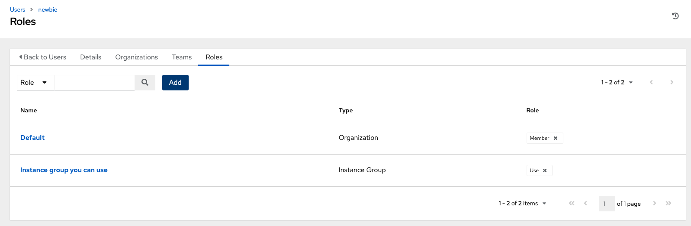

.. _ug_users:

Users
-----

.. index:: 
   single: users

A :term:`User` is someone who has access to AWX with associated permissions and credentials. Access the Users page by clicking **Users** from the left navigation bar. The User list may be sorted and searched by **Username**, **First Name**, or **Last Name** and click the headers to toggle your sorting preference. 

.. image:: ../common/images/users-home-with-example-users.png
   :alt: Users - home with example users

You can easily view permissions and user type information by looking beside their user name in the User overview screen.

.. _ug_users_create:    
    
Create a User
~~~~~~~~~~~~~~~

To create a new user:

1. Click the **Add** button, which opens the Create User dialog.

2. Enter the appropriate details about your new user. Fields marked with an asterisk (*) are required.

.. note::

   When modifying your own password, log out and log back in again in order for it to take effect.

Three types of Users can be assigned:

- **Normal User**: Normal Users have read and write access limited to the resources (such as inventory, projects, and job templates) for which that user has been granted the appropriate roles and privileges.

- **System Auditor**: Auditors implicitly inherit the read-only capability for all objects within the environment.

- **System Administrator**: A System Administrator (also known as Superuser) has full system administration privileges -- with full read and write privileges over the entire installation. A System Administrator is typically responsible for managing all aspects of AWX and delegating responsibilities for day-to-day work to various Users. Assign with caution!

.. image:: ../common/images/users-create-user-form-types.png
   :alt: User Types   

.. note::

    The initial user (usually "admin") created by the installation process is a Superuser. One Superuser must always exist. To delete the "admin" user account, you must first create another Superuser account.

3. Select **Save** when finished.

Once the user is successfully created, the **User** dialog opens for that newly created User. 

.. |edit-button| image:: ../common/images/edit-button.png
                 :alt: Edit button

You may delete the user from its Details screen by clicking **Delete**, or once you exit the details screen, you can delete users from a list of current users. See :ref:`ug_users_delete` for more detail.

The same window opens whether you click on the user's name, or the Edit (|edit-button|) button beside the user. Here, the User's **Organizations**, **Teams**, and **Roles**, as well as other user membership details, may be reviewed and modified.

.. note::

   If the user is not a newly-created user, the user's details screen displays the last login activity of that user. 

   .. image:: ../common/images/users-last-login-info.png
      :alt: User details with last login information

When you log in as yourself, and view the details of your own user profile, you can manage tokens from your user profile. See :ref:`ug_users_tokens` for more detail.

.. image:: ../common/images/user-with-token-button.png
   :alt: User details with Tokens tab highlighted

.. _ug_users_delete:
    
Delete a User
~~~~~~~~~~~~~~~

Before you can delete a user, you must have user permissions. When you delete a user account, the name and email of the user are permanently removed from AWX.

1. Expand the **Access** menu from the left navigation bar, and click **Users** to display a list of the current users.

2. Select the check box(es) for the user(s) that you want to remove and click **Delete**.

.. image:: ../common/images/users-home-users-checked-delete.png
   :alt: Users list view with two users checked

3. Click **Delete** in the confirmation warning message to permanently delete the user.

Users - Organizations
~~~~~~~~~~~~~~~~~~~~~

.. index:: 
   pair: users; organizations

This displays the list of organizations of which that user is a member. This list may be searched by Organization Name or Description.
Organization membership cannot be modified from this display panel.

|Users - Organizations list for example user|

.. |Users - Organizations list for example user| image:: ../common/images/users-organizations-list-for-example-user.png
                                              :alt: Users - Organizations list for example user

Users - Teams
~~~~~~~~~~~~~

.. index::
   pair: users; teams

This displays the list of teams of which that user is a member. This list may be searched by **Team Name** or **Description**. Team membership cannot be modified from this display panel. For more information, refer to :ref:`ug_teams`.

Until a Team has been created and the user has been assigned to that team, the assigned Teams Details for the User appears blank.

|Users - teams list for example user|

.. |Users - teams list for example user| image:: ../common/images/users-teams-list-for-example-user.png
                                      :alt: Users - teams list for example user - empty

.. _ug_users_roles:

Users - Roles
~~~~~~~~~~~~~~

.. index:: 
   pair: users; permissions
   pair: users; roles

The set of permissions assigned to this user (role-based access controls) that provide the ability to read, modify, and administer projects, inventories, job templates, and other AWX elements are Roles. 

.. note::

   It is important to note that the job template administrator may not have access to other resources (inventory, project, credentials, or instance groups) associated with the template. Without access to these, certain fields in the job template are not editable. System Administrators may grant individual users permissions to certain resources as necessary. See :ref:`ug_users_permissions` for detail.

This screen displays a list of the roles that are currently assigned to the selected User and can be sorted and searched by **Name**, **Type**, or **Role**.

|Users - permissions list for example user|

.. |Users - permissions list for example user| image:: ../common/images/users-permissions-list-for-example-user.png
                                            :alt: Users - permissions list for example user

.. _ug_users_permissions:

Add Permissions
^^^^^^^^^^^^^^^^

To add permissions to a particular user:

1. Click the **Add** button, which opens the Add Permissions Wizard.

.. image:: ../common/images/users-add-permissions-form.png
   :alt: Add User Permissions Form, first step, Add resource type

2. Click to select the object for which the user will have access and click **Next**.

3. Click to select the resource to assign team roles and click **Next**.

4. Click the checkbox beside the role to assign that role to your chosen type of resource. Different resources have different options available.

5. Click **Save** when done, and the Add Permissions Wizard closes to display the updated profile for the user with the roles assigned for each selected resource.

  
To remove Permissions for a particular resource, click the disassociate (x) button next to its resource. This launches a confirmation dialog, asking you to confirm the disassociation.

.. note:: 

   You can also add teams, individual, or multiple users and assign them permissions at the object level (templates, credentials, inventories, projects, organizations, or instance groups) as well. This feature reduces the time for an organization to onboard many users at one time. 

.. _ug_users_tokens:

Users - Tokens
~~~~~~~~~~~~~~~

The **Tokens** tab will only be present for your user (yourself). Before you add a token for your user, you may want to :ref:`create an application <ug_applications_auth_create>` if you want to associate your token to it. You may also create a personal access token (PAT) without associating it with any application. To create a token for your user:

1. If not already selected, click on your user from the Users list view to configure your OAuth 2 tokens.

.. include:: ../common/add-token.rst
