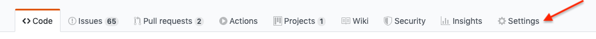
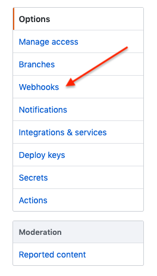
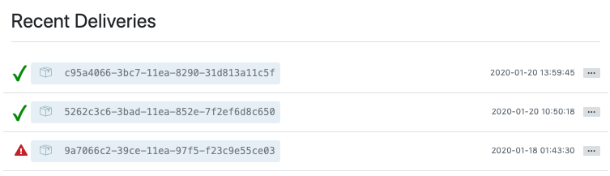
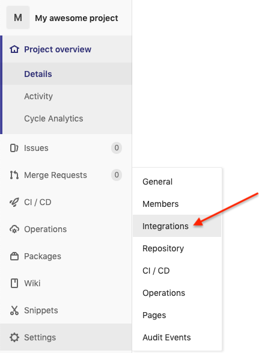
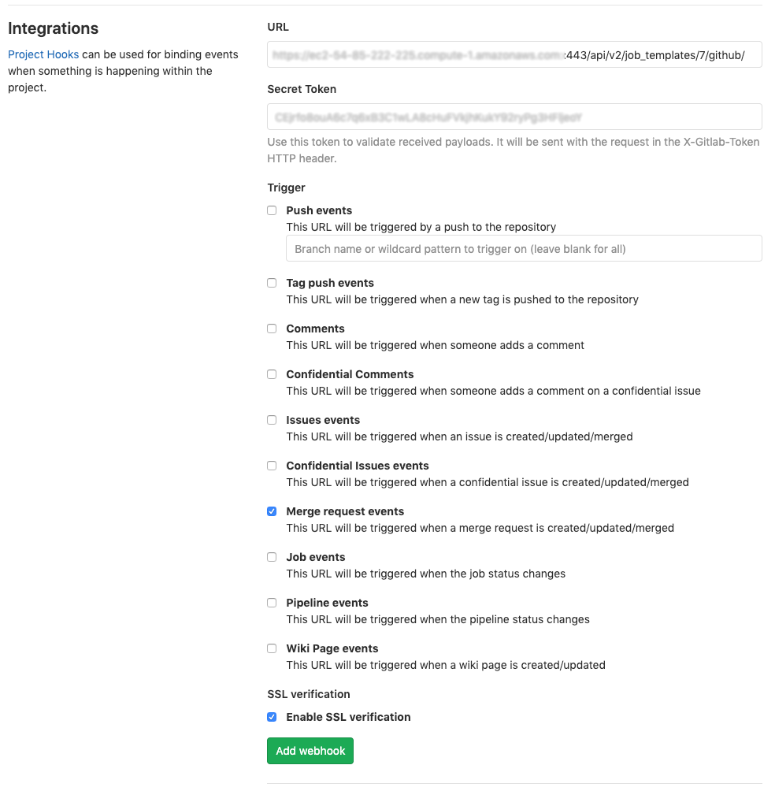
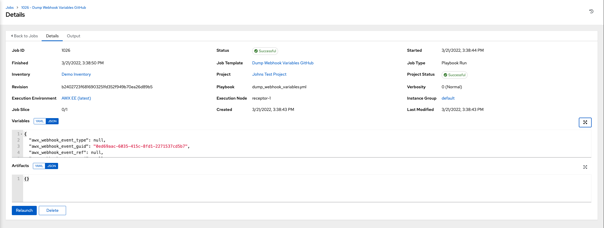
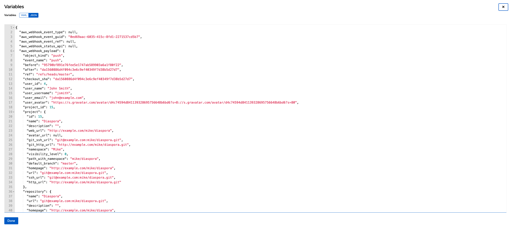

.. _ug_webhooks:

Working with Webhooks
======================

.. index::
   single: webhooks
   pair: webhooks; GitHub
   pair: webhooks; GitLab
   pair: webhooks; payload

A :term:`Webhook` provides the ability to execute specified commands between apps over the web. AWX currently provides webhook integration with GitHub and GitLab. This section describes the procedure for setting up a webhook through their respective services. 

.. contents::
    :local:

The webhook post-status-back functionality for GitHub and GitLab is designed for work only under certain CI events. Receiving another kind of event will result in messages like the one below in the service log:

::

	awx.main.models.mixins Webhook event did not have a status API endpoint associated, skipping.

GitHub webhook setup
---------------------

AWX has the ability to run jobs based on a triggered webhook event coming in. Job status information (pending, error, success) can be sent back only for pull request events. If you determine you do not want AWX to post job statuses back to the webhook service, skip steps 1-2, and go directly to :ref:`step 3 <ug_webhooks_setup_github>`.

1. Optionally generate a personal access token (PAT) for use with AWX.

	a. In the profile settings of your GitHub account, click **Settings**.
	
	b. At the very bottom of the settings, click **<> Developer Settings**.

	c. In the Developer settings, click **Personal access tokens**.
	d. From the Personal access tokens screen, click **Generate new token**.
	e. When prompted, enter your GitHub account password to continue.
	f. In the **Note** field, enter a brief description about what this PAT will be used for.
	g. In the Scope fields, the automation webhook only needs repo scope access, with the exception of invites. For information about other scopes, click the link right above the table to access the docs. 

	.. image:: ../common/images/webhooks-create-webhook-github-scope.png
		:alt: Link to more information on scopes

	h. Click the **Generate Token** button.  

	i. Once the token is generated, make sure you copy the PAT, as it will be used in a later step. You will not be able to access this token again in GitHub.

2. Use the PAT to optionally create a GitHub credential:

	a. Go to your instance, and :ref:`create a new credential for the GitHub PAT <ug_credentials_github>` using the above generated token. 
	b. Make note of the name of this credential, as it will be used in the job template that posts back to GitHub.

	.. image:: ../common/images/webhooks-create-credential-github-PAT-token.png
		:alt: Enter your generated PAT into the Token field

	c. Go to the job template with which you want to enable webhooks, and select the webhook service and credential you created in the previous step.

	.. image:: ../common/images/webhooks-job-template-gh-webhook-credential.png
		:alt: Select the webhook service and credential you created

	| 

	d. Click **Save**. Now your job template is set up to be able to post back to GitHub. An example of one may look like this:

	.. image:: ../common/images/webhooks-awx-to-github-status.png
		:alt: An example GitHub status that shows all checks have passed

.. _ug_webhooks_setup_github:

3. Go to a specific GitHub repo you want to configure webhooks and click **Settings**.

4. Under Options, click **Webhooks**.

5. On the Webhooks page, click **Add webhook**.

6. To complete the Add Webhook page, you need to :ref:`enable webhooks in a job template <ug_jt_enable_webhooks>` (or in a :ref:`workflow job template <ug_wfjt_enable_webhooks>`), which will provide you with the following information:

	a. Copy the contents of the **Webhook URL** from the job template, and paste it in the **Payload URL** field. GitHub uses this address to send results to.
	b. Set the **Content type** to **application/json**.
	c. Copy the contents of the **Webhook Key** from the job template above and paste it in the **Secret** field. 
	d. Leave **Enable SSL verification** selected.

	.. image:: ../common/images/webhooks-github-repo-add-webhook.png
		:alt: Add Webhook page

	e. Next, you must select the types of events you want to trigger a webhook. Any such event will trigger the Job or Workflow. In order to have job status (pending, error, success) sent back to GitHub, you must select **Pull requests** in the individual events section.

	.. image:: ../common/images/webhooks-github-repo-choose-events.png
		:alt: List of trigger events for the webhook

	f. Leave **Active** checked and click **Add Webhook**.

	 .. image:: ../common/images/webhooks-github-repo-add-webhook-actve.png
		:alt: Active option and Add Webhook button

7. After your webhook is configured, it displays in the list of webhooks active for your repo, along with the ability to edit or delete it. Click on a webhook, and it brings you to the Manage webhook screen. Scroll to the very bottom of the screen to view all the delivery attempts made to your webhook and whether they succeeded or failed.

For more information, refer to the `GitHub Webhooks developer documentation <https://developer.github.com/webhooks/>`_.

GitLab webhook setup
---------------------

AWX has the ability to run jobs based on a triggered webhook event coming in. Job status information (pending, error, success) can be sent back only for merge request events. If you determine you do not want AWX to post job statuses back to the webhook service, skip steps 1-2, and go directly to :ref:`step 3 <ug_webhooks_setup_gitlab>`.

1. Optionally, generate a personal access token (PAT). This token gives AWX the ability to post statuses back when we run jobs based on a webhook coming in. 

	a. In the profile settings of your GitLab account, click **Settings**.
	
	b. On the sidebar, under User Settings, click **Access Tokens**.

		.. image:: ../common/images/webhooks-create-webhook-gitlab-settings.png
			:alt: Access Tokens link under User Settings

	c. In the **Name** field, enter a brief description about what this PAT will be used for.
	d. Skip the **Expires at** field unless you want to set an expiration date for your webhook.
	e. In the Scopes fields, select the ones applicable to your integration. For AWX, API is the only selection necessary.

	.. image:: ../common/images/webhooks-create-webhook-gitlab-scope.png
		:alt: Personal Access Token page

	f. Click the **Create personal access token** button. 

	g. Once the token is generated, make sure you copy the PAT, as it will be used in a later step. You will not be able to access this token again in GitLab.

2. Use the PAT to optionally create a GitLab credential:

	a. Go to your instance, and :ref:`create a new credential for the GitLab PAT <ug_credentials_gitlab>` using the above generated token. 
	b. Make note of the name of this credential, as it will be used in the job template that posts back to GitHub.

	.. image:: ../common/images/webhooks-create-credential-gitlab-PAT-token.png
		:alt: Create New Credential page

	c. Go to the job template with which you want to enable webhooks, and select the webhook service and credential you created in the previous step.

	.. image:: ../common/images/webhooks-job-template-gl-webhook-credential.png
		:alt: Select the webhook credential you created

	| 

	d. Click **Save**. Now your job template is set up to be able to post back to GitLab. An example of one may look like this:

	.. image:: ../common/images/webhooks-awx-to-gitlab-status.png
		:alt: An example GitLab status message

.. _ug_webhooks_setup_gitlab:

3. Go to a specific GitLab repo you want to configure webhooks and click **Settings > Integrations**.

4. To complete the Integrations page, you need to :ref:`enable webhooks in a job template <ug_jt_enable_webhooks>` (or in a :ref:`workflow job template <ug_wfjt_enable_webhooks>`), which will provide you with the following information:

	a. Copy the contents of the **Webhook URL** from the job template above, and paste it in the **URL** field. GitLab uses this address to send results to.
	b. Copy the contents of the **Webhook Key** from the job template above and paste it in the **Secret Token** field. 
	c. Next, you must select the types of events you want to trigger a webhook. Any such event will trigger the Job or Workflow. In order to have job status (pending, error, success) sent back to GitLab, you must select **Merge request events** in the Trigger section.
	d. Leave **Enable SSL verification** selected.
	e. Click **Add webhook**.

5. After your webhook is configured, it displays in the list of Project Webhooks for your repo, along with the ability to test events, edit or delete the webhook. Testing a webhook event displays the results at the top of the page whether it succeeded or failed.

For more information, refer to the `GitLab webhooks integrations documentation <https://docs.gitlab.com/ee/user/project/integrations/webhooks.html>`_.

Payload output
---------------

The entire payload is exposed as an extra variable. To view the payload information, go to the Jobs Detail view of the job template that ran with the webhook enabled. In the **Extra Variables** field of the Details pane, view the payload output from the ``awx_webhook_payload`` variable, as shown in the example below.

