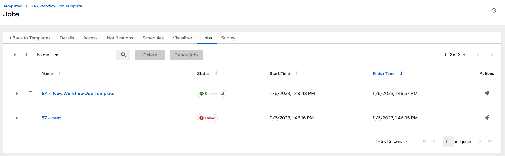
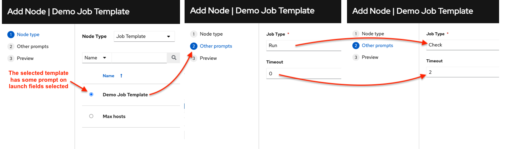
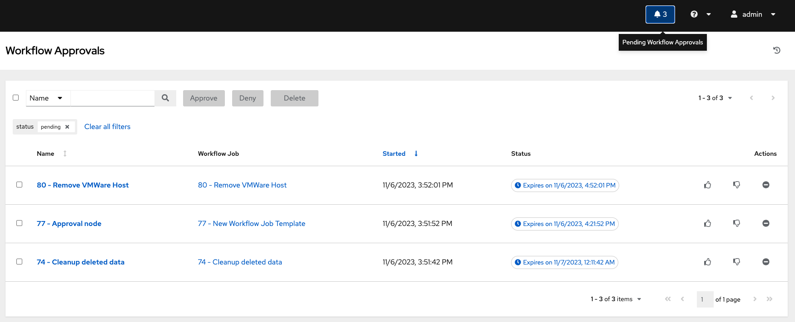
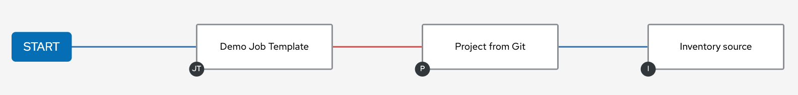

.. _ug_wf_templates:

Workflow Job Templates
========================

.. index::
   single: workflow job templates

A :term:`workflow job template` links together a sequence of disparate resources that accomplishes the task of tracking the full set of jobs that were part of the release process as a single unit. These resources may include:

- job templates
- workflow templates
- project syncs
- inventory source syncs

The **Templates** menu opens a list of the workflow and job templates that are currently available. The default view is collapsed (Compact), showing the template name, template type, and the statuses of the jobs that ran using that template, but you can click **Expanded** to view more information. This list is sorted alphabetically by name, but you can sort by other criteria, or search by various fields and attributes of a template. From this screen, you can launch (|launch|), edit (|edit|), and copy (|copy|) a workflow job template. 

Only workflow templates have the Workflow Visualizer icon (|wf-viz-icon|) as a shortcut for accessing the workflow editor.

.. |wf-viz-icon| image:: ../common/images/wf-viz-icon.png
    :alt: Workflow vizualizer icon

|Wf templates - home with example wf template|

.. |Wf templates - home with example wf template| image:: ../common/images/wf-templates-home-with-example-wf-template.png
    :alt: Job templates list view with example of workflow template and arrow pointing to the Workflow vizualizer icon.

.. note::

      Workflow templates can be used as building blocks for another workflow template. Many parameters in a workflow template allow you to enable **Prompt on Launch** that can be modified at the workflow job template level, and do not affect the values assigned at the individual workflow template level. For instructions, see the :ref:`ug_wf_editor` section. 

Create a Workflow Template
----------------------------

To create a new workflow job template:

1. Click the |add options template| button then select **Workflow Template** from the menu list.

|Wf templates - create new wf template|

.. |Wf templates - create new wf template| image:: ../common/images/wf-templates-create-new-wf-template.png
    :alt: Create new workflow template form.

2. Enter the appropriate details into the following fields:

.. note::

    If a field has the **Prompt on launch** checkbox selected, launching the workflow template, or when the workflow template is used within another workflow template, it will prompt for the value for that field upon launch. Most prompted values will override any values set in the workflow job template; exceptions are noted below.

.. list-table::
   :widths: 10 35 30
   :header-rows: 1

   * - Field
     - Options
     - Prompt on Launch
   * - **Name**
     - Enter a name for the job.
     - N/A
   * - **Description**
     - Enter an arbitrary description as appropriate (optional).
     - N/A
   * - **Organization**
     - Choose the organization to be used with this template from the organizations available to the currently logged in user.
     - N/A
   * - **Inventory**
     - Optionally choose the inventory to be used with this template from the inventories available to the currently logged in user.
     - Yes
   * - **Limit**
     - A host pattern to further constrain the list of hosts managed or affected by the playbook. Multiple patterns can be separated by colons (``:``). As with core Ansible, ``a:b`` means "in group a or b", ``a:b:&c`` means "in a or b but must be in c", and ``a:!b`` means "in a, and definitely not in b". For more information and examples refer to `Patterns <https://docs.ansible.com/ansible/latest/inventory_guide/intro_patterns.html>`_ in the Ansible documentation.
     - Yes
   * - **Source control branch**
     - Select a branch for the workflow. This branch is applied to all workflow job template nodes that prompt for a branch.
     - Yes
   * - **Labels**
     - * Optionally supply labels that describe this workflow job template, such as "dev" or "test". Labels can be used to group and filter workflow job templates and completed jobs in the display.
       * Labels are created when they are added to the workflow template. Labels are associated to a single Organization using the Project that is provided in the workflow template. Members of the Organization can create labels on a workflow template if they have edit permissions (such as an admin role). 
       * Once the workflow template is saved, the labels appear in the WFJT's Details view.
       * Click the (|x|) beside a label to remove it. When a label is removed, it is no longer associated with that particular workflow template, but it will remain associated with any other jobs or job templates that reference it. 
       * Labels are only applied to the workflow templates not the job template nodes that are used in the workflow.
     - * Yes. If selected, even if a default value is supplied, you will be prompted upon launch to supply additional labels if needed. 
       * You will not be able to delete existing labels - clicking (|x-circle|) only removes the newly added labels, not existing default labels.
   * - **Variables**
     - * Pass extra command line variables to the playbook. This is the "-e" or "--extra-vars" command line parameter for ansible-playbook that is documented in the Ansible documentation at `Passing Variables on the Command Line <https://docs.ansible.com/ansible/latest/reference_appendices/general_precedence.html>`_.
       * Provide key/value pairs using either YAML or JSON. These variables have a maximum value of precedence and overrides other variables specified elsewhere. An example value might be:

        ::

          git_branch: production
          release_version: 1.5
     - * Yes. If you want to be able to specify ``extra_vars`` on a schedule, you must select **Prompt on Launch** for **Variables** on the workflow job template, or a enable a survey on the workflow job template, then those answered survey questions become ``extra_vars``.
       * For more information about extra variables, refer to :ref:`ug_wf_templates_extravars`.
   * - **Job Tags**
     - Begin typing and selecting the **Create x** drop-down to specify which parts of the playbook should be executed.
     - Yes
   * - **Skip Tags**
     - Begin typing and selecting the **Create x** drop-down to specify certain tasks or parts of the playbook to skip.
     - Yes

For more information about **Job Tags** and **Skip Tags**, refer to `Tags <https://docs.ansible.com/ansible/latest/playbook_guide/playbooks_tags.html>`_ in the Ansible documentation.

.. |x| image:: ../common/images/x-button.png
   :alt: x button

3. **Options**: Specify options for launching this workflow job template, if necessary.

  - Check **Enable Webhooks** to turn on the ability to interface with a predefined SCM system web service that is used to launch a workflow job template. Currently supported SCM systems are GitHub and GitLab.

.. _ug_wfjt_enable_webhooks:

  If you enable webhooks, other fields display, prompting for additional information:

    - **Webhook Service**: Select which service to listen for webhooks from
    - **Webhook Credential**: Optionally, provide a GitHub or GitLab personal access token (PAT) as a credential to use to send status updates back to the webhook service. Before you can select it, the credential must exist. See :ref:`ug_credentials_cred_types` to create one.

    Upon **Save**, additional fields populate and the Workflow Visualizer automatically opens.

    - **Webhook URL**: Automatically populated with the URL for the webhook service to POST requests to.
    - **Webhook Key**: Generated shared secret to be used by the webhook service to sign payloads sent to AWX. This must be configured in the settings on the webhook service in order for AWX to accept webhooks from this service.  

    For additional information on setting up webhooks, see :ref:`ug_webhooks`.

  - Check **Enable Concurrent Jobs** to allow simultaneous runs of this workflow. Refer to :ref:`ug_job_concurrency` for additional information.  

4. When you have completed configuring the workflow template, click **Save**.

Saving the template exits the workflow template page and the Workflow Visualizer opens to allow you to build a workflow. See the :ref:`ug_wf_editor` section for further instructions. Otherwise, you may close the Workflow Visualizer to return to the Details tab of the newly saved template in order to review, edit, add permissions, notifications, schedules, and surveys, or view completed jobs and build a workflow template at a later time. Alternatively, you can click **Launch** to launch the workflow, but you must first save the template prior to launching, otherwise, the **Launch** button remains grayed-out. Also, note the **Notifications** tab is present only after the template has been saved.

Work with Permissions
-----------------------

Clicking on **Access** allows you to review, grant, edit, and remove associated permissions for users as well as team members.

.. image:: ../common/images/wf-template-completed-permissions-view.png
   :alt: Access tab of the newly created workflow template showing two user roles and their permissions.

Click the **Add** button to create new permissions for this workflow template by following the prompts to assign them accordingly.

Work with Notifications
------------------------

Clicking on **Notifications** allows you to review any notification integrations you have setup. The **Notifications** tab is present only after the template has been saved.

.. image:: ../common/images/wf-template-completed-notifications-view.png
   :alt: Notifications tab of the newly created workflow template showing four notification configurations with one notification set for Approval.

Use the toggles to enable or disable the notifications to use with your particular template. For more detail, see :ref:`ug_notifications_on_off`. 

If no notifications have been set up, see :ref:`ug_notifications_create` for detail.

.. image:: ../common/images/wf-template-no-notifications-blank.png
   :alt: Notifications tab of the newly created workflow template showing no notifications set up.

Refer to :ref:`ug_notifications_types` for additional details on configuring various notification types.

View Completed Jobs
--------------------

The **Completed Jobs** tab provides the list of workflow templates that have ran. Click **Expanded** to view the various details of each job. 

From this view, you can click the job ID - name of the workflow job and see its graphical representation. The example below shows the job details of a workflow job.  

.. image:: ../common/images/wf-template-jobID-detail-example.png
   :alt: Details of the job output for the selected workflow template by job ID

The nodes are marked with labels that help you identify them at a glance. See the legend_ in the :ref:`ug_wf_editor` section for more information.

Work with Schedules
----------------------

.. index:: 
   pair: workflow template; scheduling

Clicking on **Schedules** allows you to review any schedules set up for this template. 

.. .. image:: ../common/images/templates-schedules-example-list.png
   :alt: workflow template - schedule list example

Schedule a Workflow Template
~~~~~~~~~~~~~~~~~~~~~~~~~~~~~~~~~~

.. index::
   pair: workflow templates; scheduling
   single: scheduling; add new

To schedule a wokflow job template run, click the **Schedules** tab.

- If schedules are already set up; review, edit, or enable/disable your schedule preferences. 
- If schedules have not been set up, refer to :ref:`ug_scheduling` for more information.  

If a workflow template used in a nested workflow has a survey, or the **Prompt on Launch** selected for the inventory option, the **PROMPT** button displays next to the **SAVE** and **CANCEL** buttons on the schedule form. Clicking the **PROMPT** button shows an optional INVENTORY step where you can provide or remove an inventory or skip this step without any changes.

.. _ug_wf_surveys:

Surveys
---------

.. index::
   pair: workflow templates; surveys

Workflows containing job types of Run or Check provide a way to set up surveys in the Workflow Job Template creation or editing screens. Surveys set extra variables for the playbook similar to 'Prompt for Extra Variables' does, but in a user-friendly question and answer way. Surveys also allow for validation of user input. Click the **Survey** tab to create a survey.

Use cases for surveys are numerous. An example might be if operations wanted to give developers a "push to stage" button they could run without advanced Ansible knowledge. When launched, this task could prompt for answers to questions such as, "What tag should we release?"

Many types of questions can be asked, including multiple-choice questions.

.. _ug_wf_surveys_create:

Create a Survey
~~~~~~~~~~~~~~~~~~~

.. index::
   single: workflow templates; survey creation
   single: surveys; creation

To create a survey:

1. Click the **Survey** tab to bring up the **Add Survey** window.

.. image:: ../common/images/wf-template-create-survey.png
   :alt: Workflow Job Template showing the Create survey form.

Use the **ON/OFF** toggle button at the top of the screen to quickly activate or deactivate this survey prompt.

2. A survey can consist of any number of questions. For each question, enter the following information:

-  **Name**: The question to ask the user.
-  **Description**: (optional) A description of what's being asked of the user.
-  **Answer Variable Name**: The Ansible variable name to store the user's response in. This is the variable to be used by the playbook. Variable names cannot contain spaces.
-  **Answer Type**: Choose from the following question types.

   -  *Text*: A single line of text. You can set the minimum and maximum length (in characters) for this answer.
   -  *Textarea*: A multi-line text field. You can set the minimum and maximum length (in characters) for this answer.
   -  *Password*: Responses are treated as sensitive information, much like an actual password is treated. You can set the minimum and maximum length (in characters) for this answer.
   -  *Multiple Choice (single select)*: A list of options, of which only one can be selected at a time. Enter the options, one per line, in the **Multiple Choice Options** box.
   -  *Multiple Choice (multiple select)*: A list of options, any number
      of which can be selected at a time. Enter the options, one per
      line, in the **Multiple Choice Options** box.
   -  *Integer*: An integer number. You can set the minimum and maximum length (in characters) for this answer.
   -  *Float*: A decimal number. You can set the minimum and maximum length (in characters) for this answer.

-  **Default Answer**: Depending on which type chosen, you can supply the default answer to the question. This value is pre-filled in the interface and is used if the answer is not provided by the user.

-  **Required**: Whether or not an answer to this question is required from the user.

3. Once you have entered the question information, click the **Add** button to add the question.

A stylized version of the survey is presented in the Preview pane. For any question, you can click on the **Edit** button to edit the question, the **Delete** button to delete the question, and click and drag on the grid icon to rearrange the order of the questions. 

4. Return to the left pane to add additional questions.

5. When done, click **Save** to save the survey.

|Workflow-template-completed-survey|

.. |Workflow-template-completed-survey| image:: ../common/images/wf-template-completed-survey.png
   :alt: Workflow Job Template showing completed survey and arrows pointing to the re-ordering icons.

Optional Survey Questions
~~~~~~~~~~~~~~~~~~~~~~~~~~

.. index::
   single: workflow templates; survey optional questions
   single: surveys; optional questions

The **Required** setting on a survey question determines whether the answer is optional or not for the user interacting with it.

Behind the scenes, optional survey variables can be passed to the playbook in ``extra_vars``, even when they aren't filled in.

- If a non-text variable (input type) is marked as optional, and is not filled in, no survey ``extra_var`` is passed to the playbook.

- If a text input or text area input is marked as optional, is not filled in, and has a minimum ``length > 0``, no survey ``extra_var`` is passed to the playbook.

- If a text input or text area input is marked as optional, is not filled in, and has a minimum ``length === 0``, that survey ``extra_var`` is passed to the playbook, with the value set to an empty string ( "" ).

.. _ug_wf_editor:

Workflow Visualizer
-----------------------

.. index::
   pair: workflow templates; workflow visualizer
   pair: visualizer; workflow

The Workflow Visualizer provides a graphical way of linking together job templates, workflow templates, project syncs, and inventory syncs to build a workflow template. Before building a workflow template, refer to the :ref:`ug_workflows` section for considerations associated with various scenarios on parent, child, and sibling nodes. 

Build a Workflow
~~~~~~~~~~~~~~~~~~~

You can set up any combination of two or more of the following node types to build a workflow: Template (Job Template or Workflow Job Template), Project Sync, Inventory Sync, or Approval. Each node is represented by a rectangle while the relationships and their associated edge types are represented by a line (or link) that connects them.

1. In the details/edit view of a workflow template, click the **Visualizer** tab or from the Templates list view, click the (|wf-viz-icon|) icon to launch the Workflow Visualizer.

.. image:: ../common/images/wf-editor-create-new.png
   :alt: Workflow Visualizer start page.

2. Click the |start| button to display a list of nodes to add to your workflow.

.. image:: ../common/images/wf-editor-create-new-add-template-list.png 
   :alt: Workflow Visualizer wizard, step 1 specifying the node type.

3. On the right pane, select the type of node you want to add from the drop-down menu:

.. image:: ../common/images/wf-add-node-selections.png
   :alt: Node type showing the drop-down menu of node type options.

If selecting an **Approval** node, see :ref:`ug_wf_approval_nodes` for further detail.

Selecting a node provides the available valid options associated with it.

.. note::
  If you select a job template that does not have a default inventory when populating a workflow graph, the inventory of the parent workflow will be used. Though a credential is not required in a job template, you will not be able to choose a job template for your workflow if it has a credential that requires a password, unless the credential is replaced by a prompted credential.

4. Once a node is selected, the workflow begins to build, and you must specify the type of action to be taken for the selected node. This action is also referred to as *edge type*. 

5. If the node is a root node, the edge type defaults to **Always** and is non-editable. 

For subsequent nodes, you can select one of the following scenarios (edge type) to apply to each:
  
  - **Always**: Continue to execute regardless of success or failure.
  - **On Success**: Upon successful completion, execute the next template.
  - **On Failure**: Upon failure, execute a different template.

.. _convergence_node:

6. Select the behavior of the node if it is a convergent node from the **Convergence** field:

  - **Any** is the default behavior, allowing *any* of the nodes to complete as specified, before triggering the next converging node. As long as the status of one parent meets one of those run conditions, an ANY child node will run. In other words, an ANY node requires **all** nodes to complete, but only one node must complete with the expected outcome.

  - Choose **All** to ensure that *all* nodes complete as specified, before converging and triggering the next node. The purpose of ALL nodes is to make sure that every parent met it's expected outcome in order to run the child node. The workflow checks to make sure every parent behaved as expected in order to run the child node. Otherwise, it will not run the child node. 

  If selected, the graphical view will indicate the node type with a representative color. Refer to the legend (|compass|) to see the corresponding run scenario and their job types.

.. note::

  If a node is a root node, or a node that does not have any nodes converging into it, setting the **Convergence** rule does not apply, as its behavior is dictated by the action that triggers it.

7. If a job template used in the workflow has **Prompt on Launch** selected for any of its parameters, a **Prompt** button appears, allowing you to change those values at the node level. Use the wizard to change the value(s) in each of the tabs and click **Confirm** in the Preview tab.

Likewise, if a workflow template used in the workflow has **Prompt on Launch** selected for the inventory option, use the wizard to supply the inventory at the prompt. If the parent workflow has its own inventory, it will override any inventory that is supplied here.

.. image:: ../common/images/wf-editor-prompt-button-inventory-wizard.png
   :alt: Workflow Visualizer wizard with Prompt on Launch for Inventory.

.. note::

  For workflow job templates with promptable fields that are required, but do not have a default, you must provide those values when creating a node before the **Select** button becomes enabled. The two cases that disable the **Select** button until a value is provided via the **Prompt** button: 1) when you select the **Prompt on Launch** checkbox in a workflow job template, but do not provide a default, or 2) when you create a survey question that is required but do not provide a default answer. However, this is **NOT** the case with credentials. Credentials that require a password on launch are **not permitted** when creating a workflow node, since everything needed to launch the node must be provided when the node is created. So, if a workflow job template prompts for credentials, AWX prevents you from being able to select a credential that requires a password.

Once the node is created, it is labeled with its job type. A template that is associated with each workflow node will run based on the selected run scenario as it proceeds. Click the compass (|compass|) icon to display the legend for each run scenario and their job types.

.. _legend:

.. |compass| image:: ../common/images/wf-editor-compass-button.png
   :alt: Workflow Visualizer legend button.

.. image:: ../common/images/wf-editor-key-dropdown-list.png
   :alt: Workflow Visualizer legend expanded.

8. Hovering over a node allows you to add |add node| another node, view info |info node| about the node, edit |edit| the node details, edit an existing link |edit link|, or delete |delete node| the selected node.

.. |add node| image:: ../common/images/wf-editor-add-button.png
   :alt: Add node icon.

.. |delete node| image:: ../common/images/wf-editor-delete-button.png
   :alt: Delete node icon.
.. |info node| image:: ../common/images/wf-editor-info-button.png
   :alt: View node details icon.
.. |edit| image:: ../common/images/edit-button.png
   :alt: Edit node details icon.

.. image:: ../common/images/wf-editor-create-new-add-template.png
   :alt: Building a new example workflow job template in the Workflow Visualizer

9. When done adding/editing a node, click **Save** to save any modifications and render it on the graphical view. For possible ways to build your workflow, see :ref:`ug_wf_building_scenarios`.

10. When done with building your workflow template, click **Save** to save your entire workflow template and return to the new workflow template details page.

.. important:: 
  
  Closing the wizard without saving will not save your work, but instead, closes the entire Workflow Visualizer and you will have to start where you last saved. 

.. _ug_wf_approval_nodes:

Approval nodes
^^^^^^^^^^^^^^^

Choosing an **Approval** node requires user intervention in order to advance the workflow. This functions as a means to pause the workflow in between playbooks so that a user can give approval to continue on to the next playbook in the workflow, giving the user a specified amount of time to intervene, but also allows the user to continue as quickly as possible without having to wait on some other trigger. 

The default for the timeout is none, but you can specify the length of time before the request expires and automatically gets denied. After selecting and supplying the information for the approval node, it displays on the graphical view with a pause (|pause|) icon next to it.

The approver is anyone who can execute the workflow job template containing the approval nodes, has org admin or above privileges (for the org associated with that workflow job template), or any user who has the *Approve* permission explicitly assigned to them within that specific workflow job template.

If pending approval nodes are not approved within the specified time limit (if an expiration was assigned) or they are denied, then they are marked as "timed out" or "failed", respectively, and move on to the next "on fail node" or "always node". If approved, the "on success" path is taken. If you try to POST in the API to a node that has already been approved, denied or timed out, an error message notifies you that this action is redundant, and no further steps will be taken.

Below shows the various levels of permissions allowed on approval workflows:

.. source file located on google spreadsheet "Workflow approvals chart"

.. _ug_wf_building_scenarios:

Node building scenarios
^^^^^^^^^^^^^^^^^^^^^^^^

You can add a sibling node by clicking the |add node| on the parent node: 

You can insert another node in between nodes by hovering over the line that connects the two until the |add node| appears. Clicking on the |add node| automatically inserts the node between the two nodes. 

.. image:: ../common/images/wf-editor-insert-node-template.png
   :alt: Workflow Visualizer showing how to insert a node.

To add a root node to depict a split scenario, click the |start| button again:

.. image:: ../common/images/wf-editor-create-new-add-template-split.png
   :alt: Workflow Visualizer showing how depict a split scnario.

At any node where you want to create a split scenario, hover over the node from which the split scenario begins and click the |add node|. This essentially adds multiple nodes from the same parent node, creating sibling nodes:

.. image:: ../common/images/wf-editor-create-siblings.png
   :alt: Workflow Visualizer showing how to create sibling nodes.

.. note::

  When adding a new node, the **PROMPT** button applies to workflow templates as well. Workflow templates will prompt for inventory and surveys.

If you want to undo the last inserted node, click on another node without making a selection from the right pane. Or, click **Cancel** from the right pane.

Below is an example of a workflow that contains all three types of jobs that is initiated by a job template that if it fails to run, proceed to the project sync job, and regardless of whether that fails or succeeds, proceed to the inventory sync job.  

Remember to refer to the Legend at the top of the window to identify the meaning of the symbols and colors associated with the graphical depiction. 

.. note::

  In a workflow with a set of sibling nodes having varying edge types, and you remove a node that has a follow-on node attached to it, the attached node automatically joins the set of sibling nodes and retains its edge type:

  .. image:: ../common/images/wf-node-delete-scenario.png
   :alt: Workflow Visualizer showing a workflow job with a deleted node.

The following ways you can modify your nodes:

- If you want to edit a node, click on the node you want to edit. The right pane displays the current selections. Make your changes and click **Select** to apply them to the graphical view.

- To edit the edge type for an existing link (success/failure/always), click on the link. The right pane displays the current selection. Make your changes and click **Save** to apply them to the graphical view.

 .. image:: ../common/images/wf-editor-wizard-edit-link.png
   :alt:  Workflow Visualizer showing the wizard to edit the link.

- To add a new link from one node to another, click the link |edit link| icon that appears on each node. Doing this highlights the nodes that are possible to link to. These feasible options are indicated by the dotted lines. Invalid options are indicated by grayed out boxes (nodes) that would otherwise produce an invalid link. The example below shows the **Demo Project** as a possible option for the **e2e-ec20de52-project** to link to, as indicated by the arrows:

 .. image:: ../common/images/wf-node-link-scenario.png
   :alt:  Workflow showing linking scenerio between two nodes.

 When linked, specify the type of run scenario you would like the link to have in the Add Link prompt.

 .. image:: ../common/images/wf-editor-wizard-add-link-prompt.png
   :alt:  Workflow Visualizer prompt specifying the run type when adding a new link.

- To remove a link, click the link and click the **Unlink** (|delete node|) icon and click **Remove** at the prompt to confirm. 

 .. image:: ../common/images/wf-editor-wizard-unlink.png
   :alt: Workflow Visualizer showing the wizard to remove the link.

This button only appears in the right hand panel if the target or child node has more than one parent. All nodes must be linked to at least one other node at all times so you must create a new link before removing an old one.

Click the Tools icon (|tools|) to zoom, pan, or reposition the view. Alternatively, you can drag the workflow diagram to reposition it on the screen or use the scroll on your mouse to zoom.

Launch a Workflow Template
-------------------------------

.. index::
   pair: workflow templates; jobs, launching

Launch a workflow template by any of the following ways:

- Access the workflow templates list from the **Templates** menu on the left navigation bar or while in the workflow template Details view, scroll to the bottom to access the |launch| button from the list of templates.

.. image:: ../common/images/wf-templates-wf-template-launch.png
   :alt: Templates list view with arrow pointing to the launch button of the workflow job template.

- While in the Workflow Job Template Details view of the job you want to launch, click **Launch**. 

.. |launch| image:: ../common/images/launch-button.png
   :alt: Workflow template launch button.

Along with any extra variables set in the workflow job template and survey, AWX automatically adds the same variables as those added for a workflow job template upon launch. Additionally, AWX automatically redirects the web browser to the Jobs Details page for this job, displaying the progress and the results.

Events related to approvals on workflows display at the top in the Activity Stream (|activity-stream|) with detailed information about the approval requests, if any. 

Copy a Workflow Template
-------------------------------

AWX allows you the ability to copy a workflow template. If you choose to copy a workflow template, it **does not** copy any associated schedule, notifications, or permissions. Schedules and notifications must be recreated by the user or admin creating the copy of the workflow template. The user copying the workflow template will be granted the admin permission, but no permissions are assigned (copied) to the workflow template.

1. Access the workflow template that you want to copy from the **Templates** menu on the left navigation bar or while in the Workflow Job Template Details view, scroll to the bottom to access it from a list of templates.

2. Click the |copy| button.

A new template opens with the name of the template from which you copied and a timestamp.

.. image:: ../common/images/wf-list-view-copy-example.png
   :alt: Templates list view with example copied workflow.

Select the copied template and replace the contents of the **Name** field with a new name, and provide or modify the entries in the other fields to complete this template.

3. Click **Save** when done.

.. note::

  If a resource has a related resource that you don't have the right level of permission to, you cannot copy the resource, such as in the case where a project uses a credential that a current user only has *Read* access. However, for a workflow template, if any of its nodes uses an unauthorized job template, inventory, or credential, the workflow template can still be copied. But in the copied workflow template, the corresponding fields in the workflow template node will be absent. 

.. _ug_wf_templates_extravars:

Extra Variables
----------------

.. index::
   pair: workflow templates; survey extra variables
   pair: surveys; extra variables

.. <- Comment to separate the index and the note to avoid rendering issues.

.. note::

    ``extra_vars`` passed to the job launch API are only honored if one of the following is true:

    - They correspond to variables in an enabled survey
    - ``ask_variables_on_launch`` is set to True

When you pass survey variables, they are passed as extra variables (``extra_vars``). This can be tricky, as passing extra variables to a workflow template (as you would do with a survey) can override other variables being passed from the inventory and project.

For example, say that you have a defined variable for an inventory for ``debug = true``. It is entirely possible that this variable, ``debug = true``, can be overridden in a workflow template survey.

To ensure that the variables you need to pass are not overridden, ensure they are included by redefining them in the survey. Keep in mind that extra variables can be defined at the inventory, group, and host levels.

.. index::
   pair: workflow templates; job variables
   single: workflow templates, overview
   single: workflow templates, hierarchy
   single: variable precedence
   single: extra_vars

The following table notes the behavior (hierarchy) of variable precedence in AWX as it compares to variable precedence in Ansible.

**Variable Precedence Hierarchy (last listed wins)**

.. image:: ../common/images/Architecture-AWX_Variable_Precedence_Hierarchy-Workflows.png
   :alt: AWX Variable Precedence Hierarchy for Workflows
