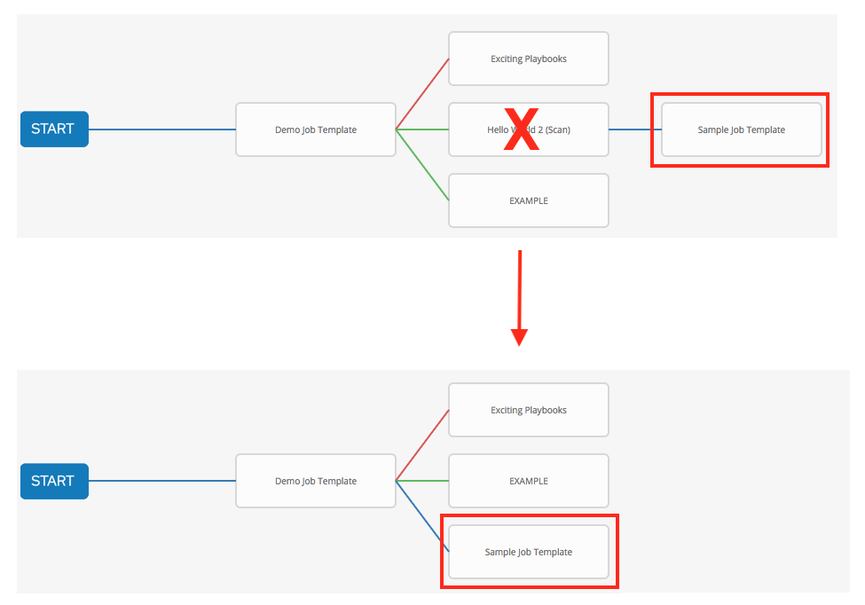
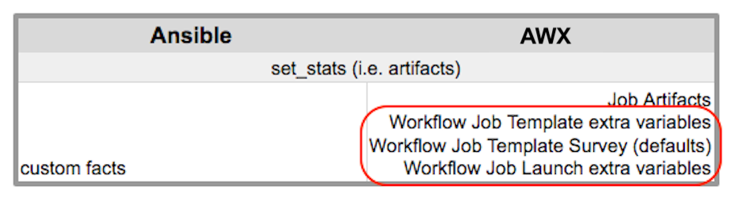

.. _ug_workflows:

Workflows
============

.. index::
   single: workflows
   
Workflows allow you to configure a sequence of disparate job templates (or workflow templates) that may or may not share inventory, playbooks, or permissions. However, workflows have ‘admin’ and ‘execute’ permissions, similar to job templates. A workflow accomplishes the task of tracking the full set of jobs that were part of the release process as a single unit. 

Job or workflow templates are linked together using a graph-like structure called nodes. These nodes can be jobs, project syncs, or inventory syncs. A template can be part of different workflows or used multiple times in the same workflow. A copy of the graph structure is saved to a workflow job when you launch the workflow.

The example below shows a workflow that contains all three, as well as a workflow job template:

As the workflow runs, jobs are spawned from the node's linked template. Nodes linking to a job template which has prompt-driven fields (``job_type``, ``job_tags``, ``skip_tags``, ``limit``) can contain those fields, and will not be prompted on launch. Job templates with promptable credential and/or inventory, WITHOUT defaults, will not be available for inclusion in a workflow.

Workflow scenarios and considerations
----------------------------------------

Consider the following scenarios for building workflows:

- A root node is set to ALWAYS by default and it not editable.

.. image:: ../common/images/wf-root-node-always.png

- A node can have multiple parents and children may be linked to any of the states of success, failure, or always. If always, then the state is neither success or failure. States apply at the node level, not at the workflow job template level. A workflow job will be marked as successful unless it is canceled or encounters an error. 

- If you remove a job or workflow template within the workflow, the node(s) previously connected to those deleted, automatically get connected upstream and retains its edge type as in the example below:

- You could have a convergent workflow, where multiple jobs converge into one. In this scenario, any of the jobs or all of them must complete before the next one runs, as shown in the example below: 

  .. image:: ../common/images/wf-node-convergence.png

In the example provided, AWX runs the first two job templates in parallel. When they both finish and succeed as specified, the 3rd downstream (:ref:`convergence node <convergence_node>`), will trigger.

- Prompts for inventory and surveys will apply to workflow nodes in workflow job templates.

- If you launch from the API, running a ``get`` command displays a list of warnings and highlights missing components. The basic workflow for a workflow job template is illustrated below. 

- It is possible to launch several workflows simultaneously, and set a schedule for when to launch them. You can set notifications on workflows, such as when a job completes, similar to that of job templates. 

.. note::

  .. include:: ../common/job-slicing-rule.rst

- You can build a recursive workflow, but if AWX detects an error, it will stop at the time the nested workflow attempts to run.

- Artifacts gathered in jobs in the sub-workflow will be passed to downstream nodes.

- An inventory can be set at the workflow level, or prompt for inventory on launch.

- When launched, all job templates in the workflow that have ``ask_inventory_on_launch=true`` will use the workflow level inventory.

- Job templates that do not prompt for inventory will ignore the workflow inventory and run against their own inventory.

- If a workflow prompts for inventory, schedules and other workflow nodes may provide the inventory.

- In a workflow convergence scenario, ``set_stats`` data will be merged in an undefined way, so it is recommended that you set unique keys.

Extra Variables
----------------

.. index::
   pair: workflows; survey extra variables
   pair: surveys; extra variables

Also similar to job templates, workflows use surveys to specify variables to be used in the playbooks in the workflow, called extra_vars. Survey variables are combined with extra_vars defined on the workflow job template, and saved to the workflow job extra_vars. extra_vars in the workflow job are combined with job template variables when spawning jobs within the workflow.

Workflows utilize the same behavior (hierarchy) of variable precedence as Job Templates with the exception of three additional variables. Refer to the Variable Precedence Hierarchy in the :ref:`ug_jobtemplates_extravars` section of the Job Templates chapter of this guide. The three additional variables include:

Workflows included in a workflow will follow the same variable precedence - they will only inherit variables if they are specifically prompted for, or defined as part of a survey.

In addition to the workflow ``extra_vars``, jobs and workflows ran as part of a workflow can inherit variables in the artifacts dictionary of a parent job in the workflow (also combining with ancestors further upstream in its branch). These can be defined by the ``set_stats`` `Ansible module`_.

.. _`Ansible module`: https://docs.ansible.com/ansible/latest/collections/ansible/builtin/set_stats_module.html

If you use the ``set_stats`` module in your playbook, you can produce results that can be consumed downstream by another job, for example, notify users as to the success or failure of an integration run. In this example, there are two playbooks that can be combined in a workflow to exercise artifact passing:

- **invoke_set_stats.yml**: first playbook in the workflow:

::

  ---
  - hosts: localhost
    tasks:
      - name: "Artifact integration test results to the web"
        local_action: 'shell curl -F "file=@integration_results.txt" https://file.io'
        register: result

      - name: "Artifact URL of test results to Workflows"
        set_stats:
          data:
            integration_results_url:  "{{ (result.stdout|from_json).link }}"

- **use_set_stats.yml**: second playbook in the workflow

::

  ---
  - hosts: localhost
    tasks:
      - name: "Get test results from the web"
        uri:
          url: "{{ integration_results_url }}"
          return_content: true
        register: results
        
      - name: "Output test results"
        debug:
          msg: "{{ results.content }}"

The ``set_stats`` module processes this workflow as follows:

1. The contents of an integration results (example: integration_results.txt below) is first uploaded to the web. 

::

	the tests are passing!

2. Through the **invoke_set_stats** playbook, ``set_stats`` is then invoked to artifact the URL of the uploaded integration_results.txt into the Ansible variable "integration_results_url".
3. The second playbook in the workflow consumes the Ansible extra variable "integration_results_url". It calls out to the web using the ``uri`` module to get the contents of the file uploaded by the previous Job Template Job. Then, it simply prints out the contents of the gotten file.

.. note:: 

  For artifacts to work, keep the default setting, ``per_host = False`` in the ``set_stats`` module. 

Workflow States
----------------

The workflow job can have the following states (no Failed state):

- Waiting 

- Running

- Success (finished)

- Cancel 

- Error

- Failed

In the workflow scheme, canceling a job cancels the branch, while canceling the workflow job cancels the entire workflow.  

Role-Based Access Controls
-----------------------------

.. can you verify this info is still valid for 3.4?

To edit and delete a workflow job template, you must have the admin role. To create a workflow job template, you must be an organization admin or a system admin. However, you can run a workflow job template that contains job templates you don't have permissions for. Similar to projects, organization admins can create a blank workflow and then grant an 'admin_role' to a low-level user, after which they can go about delegating more access and building the graph. You must have execute access to a job template to add it to a workflow job template.

Other tasks such as the ability to make a duplicate copy and re-launch a workflow can also be performed, depending on what kinds of permissions are granted to a particular user. Generally, you should have permissions to all the resources used in a workflow (like job templates) before relaunching or making a copy.

.. ^^

For more information on performing the tasks described in this section, refer to the :ref:`Administration Guide <ag_start>`. 

