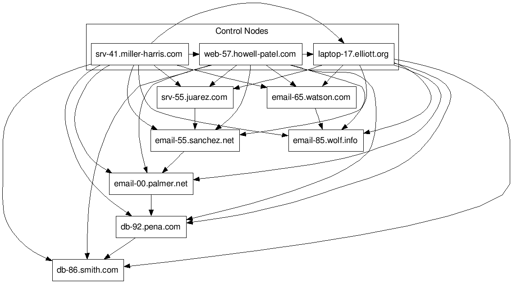
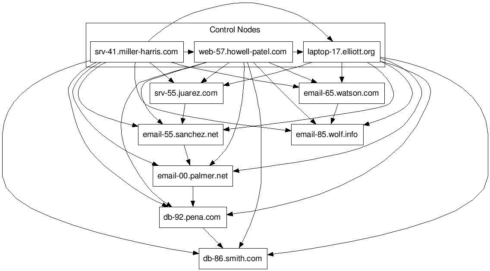
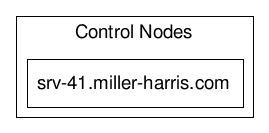
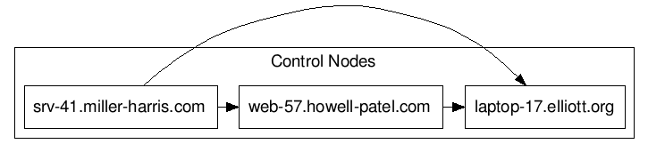
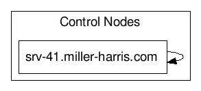
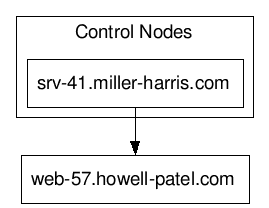

# Automation Platform Mesh Inventory Examples
<b><i>Note</b> - we use the term `mesh` in this document to describe a network comprising of vertices or `nodes`. Communication between nodes is defined by the term `edges`, or in computer terms, a connection on the transport layer such as `TCP`, `UDP` or `unix sockets`.</i>

Please refer to [this](./receptor_mesh.md) document for a more in-depth explanation of the objects in the `mesh` network. 

The examples below are an attempt to deliver `ansible` inventory files that reflect typical user environments. While we cannot encapsulate every single customer scenario, if you need a starting point to start building out your inventory file, please refer to the examples [below](##Example-Inventory-Files).

| Node Type | Description |
| --------- | ----------- |
| Control | Nodes that run persistent AWX services, and delegate jobs to hybrid and execution nodes|
| Hybrid | Nodes that run persistent AWX services and execute jobs from user-space|
| Hop | Actionless nodes in a given network. They will have [receptor](./receptor_mesh.md) but remain actionless |
| Execution | Nodes that run jobs delivered from Control-Nodes (jobs submitted from the user-space) |

## Example Inventory Files
--------------------------

### Standard Control Plane (3 Node) and (n)-Execution Nodes


[Full Inventory File](./inventory/standard_control_plane_execution)
```yaml
[automationcontroller]
srv-41.miller-harris.com node_type=control
web-57.howell-patel.com node_type=control
laptop-17.elliott.org node_type=control

[automationcontroller:vars]
peers=execution_nodes

[execution_nodes]
email-85.wolf.info node_type=execution
email-65.watson.com node_type=execution peers=email-85.wolf.info
srv-55.juarez.com node_type=execution peers=email-55.sanchez.net
email-55.sanchez.net node_type=execution peers=email-00.palmer.net
email-00.palmer.net node_type=execution peers=db-92.pena.com
db-92.pena.com node_type=execution peers=db-86.smith.com
db-86.smith.com node_type=execution
```

### Standard Control plane and Execution Topology with Hop Nodes



[Full Inventory File](./inventory/standard_control_plane_execution_with_hop)
```yaml
[automationcontroller]
srv-41.miller-harris.com node_type=control
web-57.howell-patel.com node_type=control
laptop-17.elliott.org node_type=control

[automationcontroller:vars]
peers=execution_nodes

[execution_nodes]
email-85.wolf.info node_type=execution
email-65.watson.com node_type=hop peers=email-85.wolf.info
srv-55.juarez.com node_type=execution peers=email-55.sanchez.net
email-55.sanchez.net node_type=hop peers=email-00.palmer.net
email-00.palmer.net node_type=hop peers=db-92.pena.com
db-92.pena.com node_type=execution peers=db-86.smith.com
db-86.smith.com node_type=execution
```

### Single Control-Node only Deployment (Non-Hybrid)


[Full Inventory File](./inventory/single_control_node)
```yaml
[automationcontroller]
srv-41.miller-harris.com node_type=control ansible_connection=local

[automationcontroller:vars]
peers=execution_nodes
```

### (n)-Node Control-Only Deployment (Non-Hybrid)


[Full Inventory File](./inventory/n_control_nodes_only)
```yaml
[automationcontroller]
srv-41.miller-harris.com node_type=control ansible_connection=local
web-57.howell-patel.com node_type=control
laptop-17.elliot.org node_type=control

[automationcontroller:vars]
peers=execution_nodes
```


### Single Hybrid-Node-Only Deployment


[Full Inventory File](./inventory/single_hybrid_node)
```yaml
[automationcontroller]
srv-41.miller-harris.com node_type=hybrid ansible_connection=local

[automationcontroller:vars]
peers=execution_nodes
```

### (n)-Node Hybrid-Node Deployment
#### <i>Similar to (n)-Node Control-Only Deployment (Non-Hybrid)</i>


[Full Inventory File](./inventory/n_hybrid_nodes)
```yaml
[automationcontroller]
srv-41.miller-harris.com node_type=hybrid ansible_connection=local
web-57.howell-patel.com node_type=hybrid
laptop-17.elliot.org node_type=hybrid

[automationcontroller:vars]
peers=execution_nodes
```
### Single Control Plane and Single Execution Node


[Full Inventory File](./inventory/single_control_single_execution)
```yaml
[automationcontroller]
srv-41.miller-harris.com node_type=control ansible_connection=local


[automationcontroller:vars]
peers=execution_nodes

[execution_nodes]
web-57.howell-patel.com node_type=execution
```