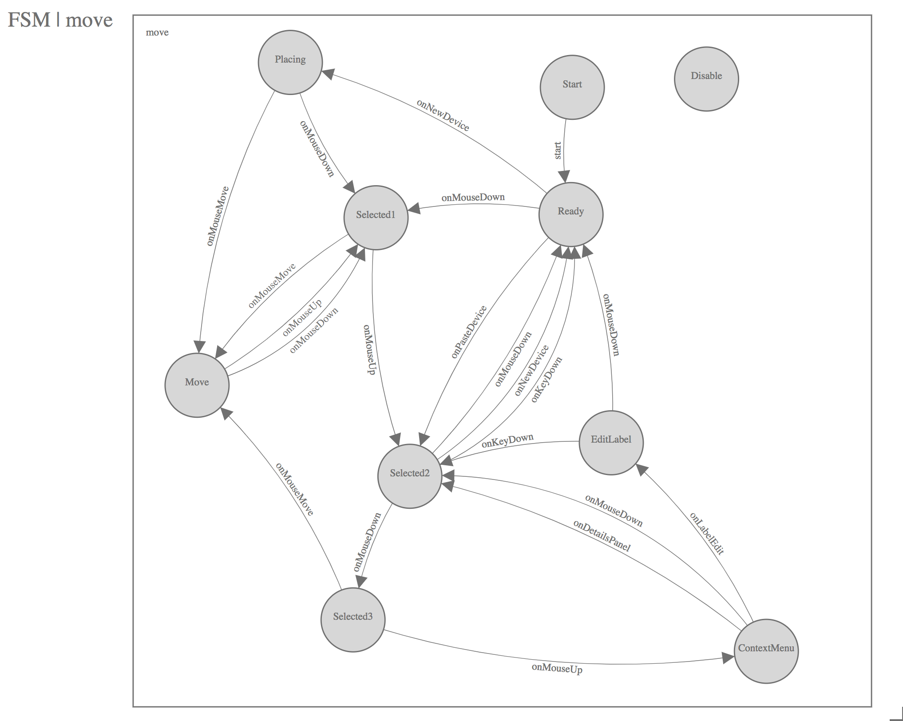

# Tower Networking Overview
The networking tool is built with the main goal of allowing users to organize hosts and their relationships in a visual tool. Upon organizing hosts, the user can export these relationships as a YAML file and use that as input to a playbook.

## Usage Manual

### Inventory Creation
The first step in is to create an inventory to be loaded into the network UI. There are no specific credentials or variables necessary to indicate that an inventory can be used in the network UI. The canvas can be used to represent any kind of inventory.

### Network Node Creation
Once the user has created an inventory, the next step is to add hosts to the inventory. This can be done manually or via an inventory source. Regardless of the import method, the host should be configured with a certain set of host varialbes that the network UI will reference when creating visual representations of the nodes. When creating a node that will be used in the network UI, the host variables follow this format:
#### YAML:
```
ansible_topology:
  type: host
```
#### JSON:
```
{
 "ansible_topology": {
  "type": "host",
 }
}
```

This structure denotes that the `type` that the network UI will use when drawing the visual representation of this node in the UI. The options for `ansible_topology` are as follows:

| Key Name               | Value Type                                                  | Description                                                                                                                                                                   |
|------------------------|-------------------------------------------------------------|-------------------------------------------------------------------------------------------------------------------------------------------------------------------------------|
| `type`                 | `str`                                                       | This will dictate what type of device the network UI will draw. Options are `host`, `switch`, and `router`. If left blank, the UI will denote the node type as `unknown`.     |
| `links`                | `array`                                                     | This array contains objects that will denote what other nodes this particular node is connected to. Each connecting node object requires a `remote_device_name`, a `name`, and a `remote_interface_name`.

Ex: suppose an inventory had three nodes, titled `host-00`, `switch-00`, and `router-00`. To connect `host-00` to the other two hosts, these would be the host variables saved to the host:
```
{
 "ansible_topology": {
  "type": "host",
  "links": [
   {
    "remote_device_name": "router-00",
    "name": "eth0",
    "remote_interface_name": "eth0"
   },
   {
    "remote_device_name": "switch-00",
    "name": "eth1",
    "remote_interface_name": "eth1"
   }
  ]
 }
}

```
Connecting the other two devices to each other, and you would get the following representation in the network UI:


### Graphical UI and Restrictions
Once the user has setup their inventory and nodes, they are ready to begin organizing their nodes using the graphical interface. The interface consists of an SVG canvas overlayed with panels that allow the user to drag nodes onto the canvas, as well as the ability to drill-down into the details of the items on the canvas. Below is a breakdown of the panels and their purpose on the interface:

1. Toolbox: This panel on the left hand side of the screen will contain all the hosts that are included in the inventory. These are returned from `'/api/v2/inventories/:inventory_id/hosts/'` and therefore are returned in a paginated list. Because of this, the UI will make recursive calls to retrieve the list of hosts. This panel is collapsible using the wrench icon in the toolbar. This panel will scroll vertically with the list of devices.
2. Canvas: The canvas takes up the full screen width and height. The canvas is where the user can drag and drop devices from the toolbox. Once a device is placed on the canvas, it is removed from the toolbox and it can interact with other devices on the canvas. If a device is removed from the canvas, it is not removed from the inventory, it is simply removed from the canvas, and will return to the toolbox
3. Context Menu: When a user clicks on a device for the first time, it selects the device. A second click will activate a context menu with actions for the user. If the user has edit permission on the inventory, they will have the options to view the details of the device, or to remove the device. If the user does not have edit permission, they will only have the option to view the details of the device.
4. Details: The right hand panel displays a read-only form for the device that is currently being inspected by the user. This panel is not shown by default, and is only shown after the user clicks the "Details" button on the context menu for a device. If mutiple devices are displayed on the canvas, the user can select different devices. As the user selects devices, the device detail panel on the right hand side will update with the host data.
5.  Search: The search dropdown is a type-ahead dropdown that has a list of the devices currently on the canvas. It is organized by device type. It should always be in sync with the list of devices on the canvas. Devices on the toolbox will not show up in the search dropdown. Selecting a device from this dropdown will focus the canvas on the device.
6. Toolbar actions: These are actions that are specific to the usability of the network UI. Currently they include the toggle for the toolbox, as well as a cheat sheet of hotkeys that can be used for shortcuts on the network UI.
7. Actions dropdown: These are actions for the content of the network UI. These include "Export YAML" and "Export SVG" which is how a user could export the relationships on the canvas to download for their own use.
8. Zoom Widget: The zoom widget ranges from 0-200%, and controls the zoom of the canvas. The user can also control the zoom using the scroll on their mouse or tracking pad. In future versions of this UI, the zoom will control what level detail they are able to see. But currently the only mode available is for devices in an inventory.


## Verification

See [networking.feature](networking.feature) for behavior scenarios.


## Implementation Details

**Introduction**

The Networking UI component of AWX works differently from the rest of the AWX
web UI to support high-scale interactive graphical design of networking
topologies.

The Networking UI is a virtual graphical canvas where graphical elements are
drawn upon.  This canvas supports panning (scrolling horizontally and
vertically) and scaling (zooming in and out), dynamic changing of modes, and
other features that would be very difficult or impossible to implement with
standard HTML events and rendering.

This interface is more like computer graphics than it is building a styled text
document with interactive components.  A good grasp of Cartesian coordinates,
trigonometry, and analytic geometry are useful when working with this code.

* See: <https://en.wikipedia.org/wiki/Analytic_geometry>

**Design choices**

Certain design choices were made to make the UI performant and scale to a large
number of nodes in a diagram.  These include the use of simple ES5 functions for
better performance over more advanced functions.  For instance C-style for-loops
were many times faster than implementations of `forEach` or iterators which make
function calls during each iteration.  This basic ES5 style should be followed
throughout the implementation of the Network UI.

**AngularJS**

The Networking UI component uses AngularJS 1.6.x for part of the rendering pipeline
but it is not a normal AngularJS web application.  AngularJS makes use of
data-binding and watchers which I found do not scale to the number of elements
we are trying to support in the Networking UI.   The Networking UI only uses
AngularJS for SVG rendering (using AngularJS templates) which does scale
sufficiently.


**AngularJS Controllers**

Instead of creating many AngularJS controllers and directives the networking UI
uses one big controller to hold the state of the entire UI.  Normally this is
an anti-pattern in AngularJS.  Here is was necessary to scale to a large number
of on-screen elements.

**AngularJS Directives**

* See: <https://docs.angularjs.org/guide/directive>

AngularJS directives are used in the networking UI application using the element
matching style and the `templateUrl` option to include a template. A majority of
the directives are defined in `network.ui.app.js`.

* See: [network.ui.app.js](../awx/ui/client/src/network-ui/network.ui.app.js)
```
    .directive('awxNetLink', link.link)
```

* See: [link.directive.js](../awx/ui/client/src/network-ui/link.directive.js)
```
const templateUrl = require('~network-ui/link.partial.svg');

function link () {
  return { restrict: 'A', templateUrl};
}
exports.link = link;
```

**AngularJS Templates**

* See: <https://docs.angularjs.org/guide/templates>

Normal AngularJS templates are used with the networking UI controller.  
The templates can be found in `/widgets`. Child
scopes are created for sub-templates using the `ng-repeat` directive.

In this example the `awx-net-link` directive expects a Link model to be
passed to it.  The Link model is defined in the `models.js` file.

* See: [link.directive.js](../awx/ui/client/src/network-ui/link.directive.js)
* See: [link.partial.svg](../awx/ui/client/src/network-ui/link.partial.svg)

* See: [network_ui.partial.svg](../awx/ui/client/src/network-ui/network_ui.partial.svg)
```
    <g ng-repeat="link in links">
    <g awx-net-link></g>
    </g>
```

* See: [models.js](../awx/ui/client/src/network-ui/models.js)
```
function Link(id, from_device, to_device, from_interface, to_interface) {
    this.id = id;
    this.from_device = from_device;
    this.to_device = to_device;
    this.from_interface = from_interface;
    this.to_interface = to_interface;
    this.selected = false;
    this.remote_selected = false;
    this.status = null;
    this.edit_label = false;
    this.name = "";
}
```
 
The following example sets the toolbox.selected_item value to the variable 
item which the directives used in the child scope expect to be set.

* See: [inventory_toolbox.html](../awx/ui/client/src/network-ui/inventory_toolbox.partial.svg)
```
<g ng-repeat="item in [toolbox.selected_item]">
```


**DOM (Document Object Model)**

No state is stored in or attached to the DOM.  All state is stored in
javascript objects attached to the network ui controller.

Direct DOM manipulation should not be used in the network UI unless absolutely
necessary. JQuery should not be used.  The DOM is generated through the use of
AngularJS templates.

**SVG (Scalable Vector Graphics)**

* See: <https://developer.mozilla.org/en-US/docs/Web/SVG>

The network UI is built as one large SVG element (the SVG canvas) with other
graphical elements (lines, circles, rectangles, paths, and text) absolutely
positioned within the outer most SVG element.  The browser is not involved with
layout of the elements within the SVG.   Each "widget" in the network UI needs
to track or calculate its own position on the SVG canvas. The z-level of the
elements are determined by the draw order on the canvas which is defined
in `network_ui.partial.svg`.  Elements drawn first will be hidden behind
elements drawn later.


**Rendering Pipeline**

Event -> Javscript objects -> AngularJS templates -> SVG

AngularJS is used to render the SVG inside the SVG canvas using directives
and templates.  AngularJS is also used to schedule when the SVG canvas will
be updated. When an input event comes from the user, or an event is received
over the websocket, javascript objects will be updated according the the network
UI code.  Then AngularJS will be notified that it needs to update the templates
either automatically for some events or explicitly using `$scope.$apply();` if
not handled automatically by AngularJS.  The templates will render to SVG and be
included in the DOM for the rest of the AWX UI.

Because the networking UI does not use watchers nor data-binding features of
AngularJS events flow in one way from event to javascript to angular to SVG.
Events do not flow backwards through this pipeline.

Clicking on an SVG element will not send the event to that SVG element directly
from the browser.   It must be routed through the network UI code first.


**SVG Primer**

SVG uses tags to define graphical elements just like HTML uses tags to define
text documents.   Commonly use tags include g, circle, rect, path, and text.
SVG elements are absolutely positioned within an SVG canvas.  The group tag, g,
is similar to the div tag in HTML.  Text in SVG must be contained in the text
tag and cannot be outside tags as in HTML.

* See: <https://developer.mozilla.org/en-US/docs/Web/SVG/Element>

Each tag that describes a visual element requires X and Y coordinates as input
to position that element. These coordinates are relative to position of the SVG
canvas. The network UI uses the entire page height and width for the SVG canvas
so that the position on the SVG on the canvas is the same as the position on
the page.


SVG supports graphical transformations on several tags to allow relative
positioning of sub-elements which makes calculating the X and Y positions
easier.   The network UI uses transformations often for this purpose.
Transformations that are often used here are the translate, scale, and rotate
transforms.  Translate moves the origin of the coordinate system to a new point
for the sub-elements.  Scale multiplies the size of the units in a coordinate
system by some factor.  Rotate performs a rotation about the origin by some
number of degrees.  These functions are converted to a matrix operation on the
coordinate system which can be efficiently applied.  It is often useful to use
the transforms to simplify the calculations of X and Y coordinates instead of
calculating those values in Javascript. Also these transforms make developing
widgets much easier since we only need to keep up with a single point for the
widget and all other points can be relatively positioned from that point.
Hard-coding positions in widget development is the normal case since transforms
can change the size and position of the widget when the widget is applied to
the canvas.  Only when necessary should we calculate positions of parts of a
widget in javascript.

* See: <https://developer.mozilla.org/en-US/docs/Web/SVG/Attribute/transform>


SVG paths are a mini-language for defining graphics operations in one tag. It
is often used to create shapes that are more complex than lines, rectangles,
and circles.  It is very useful for defining arcs.

* See: <https://developer.mozilla.org/en-US/docs/Web/SVG/Tutorial/Paths>

**SVG and CSS**

CSS and SVG work really nicely together for setting style, colors, and fonts in SVG.
The SVG uses different attributes for setting colors than does HTML elements.
Most SVG elements use `stroke` and `fill` to define the colors and `stroke-width`
to define the width of lines and curves. The attributes `font-family` and `font-size`
are used to set the font for text elements in SVG.  The network UI uses the Less
CSS compiler and BEM naming conventions to simplify and organize CSS.

* See: [style.less](../awx/ui/client/src/network-ui/style.less)
* See: <http://lesscss.org/>
* See: <http://getbem.com/introduction/>

**Events**

All mouse and keyboard events are captured by the outer most element of the
network UI.  Mouse movements, mouse clicks, and key presses are all routed by
the network UI code and not by the browser.  This is done to implement
interactions with the virtual graphical canvas that are not supported by the
browser.  "Simple" things like buttons and text fields have to be handled by
the network UI code instead of relying on the browser to route the mouse click
to the appropriate object.


The following code captures all the mouse movements, mouse clicks, mouse wheel,
and touch events and sends them to the corresponding network UI controller functions.

* See: [network_ui.partial.svg](../awx/ui/client/src/network-ui/network_ui.partial.svg#L3)

```
    <svg id="frame" class="NetworkUI"
         ng-attr-height="{{graph.height}}"
         ng-attr-width="{{graph.width}}"
         ng-mousedown="onMouseDown($event)"
         ng-mouseup="onMouseUp($event)"
         ng-mouseenter="onMouseEnter($event)"
         ng-mouseleave="onMouseLeave($event)"
         ng-mousemove="onMouseMove($event)"
         ng-mouseover="onMouseOver($event)"
         ng-touchstart="onTouchStart($event)"
         ng-touchmove="onTouchMove($event)"
         ng-touchend="onTouchEnd($event)"
         ng-tap="onTap($event)"
         msd-wheel="onMouseWheel($event, $delta, $deltaX, $deltaY)">
```


Key events are captured by the following code:

* See: [network.ui.controller.js](../awx/ui/client/src/network-ui/network.ui.controller.js)

```
    $document.bind("keydown", $scope.onKeyDown);
```

**Event Processing**

This code works as an event processing pipeline where the source of the events
may be mouse clicks, keystrokes, or messages from the server over the
websocket.  This allows the appropriate processor to handle each event in turn
or delegate the message to another processor.

The following diagram documents the pipeline processors that handle the events.
Events are injected into to the pipeline at `Start` and travel through the
pipeline along the arrows. Events may be handled at a node in the pipeline,
passed along to the next node, discarded, or transformed into another message
and sent along the pipeline.  For instance `hotkeys_fsm` generates new and
different type of events based on key presses that are injected at the
beginning of the pipeline.


**Describing Behavior with Finite State Machines**

To implement complex UI interactions predictably and correctly is a tough
problem.  Often the problem is solved by creating a large library of generic
reusable components that are rigorously tested and hardened by a large group of
developers over a period of several years. Eventually the myriad bugs are
hammered out at great expense.  Only then can the UI components be reliably
used.  This code does not follow that approach.

The workflows this code supports require very specific UI components that are
not found in generic libraries.  The interactions we want to support are not
available in generic libraries.  This code develops from scratch only the
components that are necessary to implement the workflows of designing and
operating networks of devices.

This code defines those elements using finite state machines to process the
events from user input and other software components.  Programming with finite
state machines allows us to define formally complex behavior that would
normally be informally defined by branches, functions, object interactions, and
object inheritance.  Formal definition eliminates much of the unexpected
behavior that causes defects in the software.

* See: <https://en.wikipedia.org/wiki/Finite-state_machine>

Finite state machines can be represented as a directed graph of labeled nodes and labeled edges
which can be both be represented visually and in machine readable code.

The network UI uses finite state machines to describe what happens when the software receives
an input.

**Move FSM**



For example the move FSM describes how devices are moved about the virtual
canvas.  The FSM diagram above maps out the states and the events that will
select a device to move.  FSMs traditionally start in the `Start` state.  We
get a free transition to the `Ready` state by handling the special event called
`start` and changing state to `Ready`.  When the user presses the mouse button
if the cursor is over a device the FSM changes state to `Selected1`.  If the
user then moves the mouse while the button is still pressed the device will be
moved along with the mouse cursor. When the mouse button is lifted the FSM
changes to the `Selected1` and then also to the `Selected2` state. This
implements clicking and dragging devices around the virtual canvas. Clicking on
the canvas background will return the FSM to the `Ready` state.

* See: [networking/move.yml](networking/move.yml)
* See: [move.fsm.js](../awx/ui/client/src/network-ui/move.fsm.js)

The move FSM diagram has an equivalent machine readable representation in
`networking/move.yml`. This representation is useful for comparing the current
implementation in `move.fsm.js` to the design to see if they are out-of-sync.
If they are out-of-sync either the design or the implementation can be updated
depending on if you are changing the design or implementation first.  This
machine readable representation of the FSM can be used to generate test inputs
to the FSM to achieve high test coverage of all states and transitions in the
FSM.


**Finite State Machine Implementation**

The implementation of a finite state machine in the network UI is split into
two parts: the declaration of the states and the event-handlers which may cause
FSM transitions using `controller.changeState`.

**FSM States**

* See: [networking/README.md](networking/README.md)
* See: <https://en.wikipedia.org/wiki/Flyweight_pattern>
* See: <https://en.wikipedia.org/wiki/Singleton_pattern>

States are implemented using an object-oriented style in ES5 using the
flyweight and singleton patterns. This means that the state objects store no
information on themselves and that there is only one instance of each state
class.  All states should provide a `start` and `end` function which will be
called when a FSM state is entered and exited respectively. Subclassing
[fsm.State](../awx/ui/client/src/network-ui/fsm.js) will provide empty `start` and `end` functions that
can be overridden as necessary.

* See: [fsm.js](../awx/ui/client/src/network-ui/fsm.js)

The state variable is stored on another object called an FSMController (which
should not be confused with an AngularJS controller). The FSMController holds
all the state for each FSM instance.  If you need more than one copy of an FSM
(for buttons for instance) use more than one instance of FSMController and
pass the same FSM starting state to their constructor e.g. `button.Start`.
Variables other than `state` should not be stored on the FSMController. A
special variable named `scope` is useful for that. The scope can be used
to hold arbitrary data that the FSM code will use in addition to the messages
in the event handlers. In the network UI often the `scope` is a reference
to the network UI AngularJS controller's scope. In the case of a button
the scope is a reference to the `Button` model.

* See: [models.js](../awx/ui/client/src/network-ui/models.js)

The following code creates a new instance of `FSMController` using the
`Button` model as the scope and the `button.Start` state as the initial
state.

```
    this.fsm = new fsm.FSMController(this, button.Start, null);
```

* See: [move.fsm.js](../awx/ui/client/src/network-ui/move.fsm.js)

This code block defines the `_Selected1` class in ES5 style and uses the
`inherits` NPM module to define that the class is a subclass of `_State`.  We
also create a single instance (a singleton) of this class named `Selected1`.

```
    function _Selected1 () {
        this.name = 'Selected1';
    }
    inherits(_Selected1, _State);
    var Selected1 = new _Selected1();
    exports.Selected1 = Selected1;
```

**FSM Event Handlers and Transitions**

After all the states are defined the event handlers for those state classes can be defined.
We do this to prevent forward references in the file.

* See: [move.fsm.js](../awx/ui/client/src/network-ui/move.fsm.js)

In this code we define an event handler for the `MouseUp` event on the `Selected1` state. This
code should select a single device if the mouse is over that device.  It should store
that device somewhere and change to the `Selected2` state.

Event handlers must start with the prefix of `on` and a suffix of the name of the messsage
type. The special functions `start` and `end` do not follow this rule nor do
they receive a message.

The event handler must also define its `transitions` as a list so that `./extract.js` can
find them.

```
    _Selected1.prototype.onMouseUp = function (controller, msg_type, message) {

        ...

    };
    _Selected1.prototype.onMouseUp.transitions = ['Selected2'];

```

**FSM Designs**

All the finite state machines for the network UI have been designed using the
[fsm-designer-svg](https://github.com/benthomasson/fsm-designer-svg) tool
and their designs are stored in the `networking` directory.

* See: [networking/README.md](networking/README.md)


**Data Models**

There are two types of data structures used in the network UI: messages and
models.  Models are used for long-lived data that is used to render the UI
whereas messages are used for ephemeral data that is passed from one part of
the system to another.  Models may be unpacked from or serialized into messages that
are sent to other FSMControllers in the client or sent over a websocket to the
server.

* See: [models.js](../awx/ui/client/src/network-ui/models.js)

The models defined in [models.js](../awx/ui/client/src/network-ui/models.js) are:

* Device - a networking device i.e. a router, a switch, or a host
* Interface - a networking interface
* Link - a connection between interfaces
* Button - a UI button
* ToggleButton - a togglable UI button
* Task - a playbook task
* ToolBox - a UI element for holding things that can be placed on the virtual canvas


**Message Types**

Message types define the structure of the data that is passed between the server
and the client and between different parts of the client. This provides a known and
well defined data structure that can be counted up on the code.

* See: [messages.js](../awx/ui/client/src/network-ui/messages.js)

The messages defined are [messages.js](../awx/ui/client/src/network-ui/messages.js):

* DeviceMove - Device has changed x,y position
* DeviceCreate - A device was created
* DeviceDestroy - A device was destroyed
* DeviceSelected - A device was selected
* DeviceUnSelected - A device was unselected
* InterfaceCreate - An interface was created
* InterfaceLabelEdit - The label of an interface was changed
* LinkCreate - A link was created
* LinkDestroy - A link was destroyed
* LinkSelected - A link was selected
* LinkUnSelected -  A link was unselected
* MultipleMessage - A collection of messages that should be handled together
* Coverage - A coverage report
* MouseEvent - A generic mouse event
* MouseWheelEvent  - A mouse wheel event
* KeyEvent - A key press event
* StartRecording - Start recording user interactions
* StopRecording - Stop recording user interactions
* ViewPort - Update the view port onto the virtual canvas
* NewDevice - Request for a new device
* PasteDevice - Paste a device from a toolbox


Server-Side Details
-----------------------

The Network UI is a UX driven feature to provide a graphical user
experience that fits well into the network engineer's normal workflow. Their
normal workflow includes a diagram drawn in a graphical drawing program, a
spreadsheet, and the command line interface of their network gear.  Network
architects design the network on the graphical diagram and then hand off the
architecture to network operators who implement the architecture on the network
using spreadsheets to manage their data and manually converting the data into
CLI commands using their networking expertise and expertise with their physical
gear.

The server-side code supports the persistence needed to provide this graphical
user experience of architecting a network and using that information along with
additional information (stored in vars files) to configure the network devices
using the CLI or NETCONF using Ansible playbooks and roles.

Network UI Data Schema
----------------------

For the 3.3 release the persistence needed includes the position information of
the devices on the virtual canvas and the type of the devices as well as
information about the interfaces on the devices and the links connecting those
interfaces.

These requirements determine the database schema needed for the network UI which
requires these models: Topology, Device, Interface, Link, Client, and TopologyInventory.


This diagram shows the relationships between the models in the Network UI schema.

The models are:

* Device - a host, switch, router, or other networking device
* Interface - a connection point on a device for a link
* Link - a physical connection between two devices to their respective interfaces
* Topology - a collection of devices and links
* TopologyInventory - a mapping between topologies and Tower inventories
* Client - a UI client session


Network UI Websocket Protocol
-----------------------------

Persistence for the network UI canvas state is implemented using an
asynchronous websocket protocol to send information from the client to the
server and vice-versa.  This two-way communication was chosen to support future
features for streaming data to the canvas, broadcast messaging between clients,
and for interaction performance on the UI.


Messages
--------

JSON messages are passed over the `/network_ui/topology/` websocket between the
test client and the test server.  The protocol that is used for all messages is
in ABNF (RFC5234):


    message_type    =  'DeviceMove' / 'DeviceCreate' / 'DeviceDestroy' / 'DeviceLabelEdit' / 'DeviceSelected' / 'DeviceUnSelected' / 'InterfaceCreate' / 'InterfaceLabelEdit' / 'LinkLabelEdit' / 'LinkCreate' / 'LinkDestroy' / 'LinkSelected' / 'LinkUnSelected' / 'MultipleMessage' / 'Snapshot'
    message_data    = '{' 'msg_type' ': ' message_type ', ' key-value *( ', ' key-value ) '}'
    message         = '[ id , ' posint ']' / '[ topology_id , ' posint ']' / '[' message_type ', ' message_data ']'

See https://github.com/AndyA/abnfgen/blob/master/andy/json.abnf for the rest of
the JSON ABNF.

See [networking/messages.yml](networking/messages.yml) for the allowable keys and
values for each message type.


Initially when the websocket is first opened the server will send four messages
to the client.  These are:

* the client id using the `id` message type.
* the topology id using the `topology` message type.
* a Topology record containing data for the canvas itself.
* a Snapshot message containing all the data of the data on the canvas.

As the user interacts with the canvas messages will be generated by the client
and the `network_ui.consumers.NetworkEvents` class will update the models that
represent the canvas.


Persistence
-----------

The class `awx.network_uiconsumers.NetworkEvents` provides persistence for the Network UI canvas.
It does so by providing message handlers that handle storage of the canvas change events
into the database. Each event has a message handle with name `onX` where `X` is the name of the message
type.  The handlers use the `filter/values_list`, `filter/values`, `filter/update`, and `filter/delete`
patterns to update the data in the database quickly with a constant O(1) number of queries per event
often with only one query needed. With `filter/update` and `filter/delete` all the work is done
in the database and Python never needs to instaniate and garbage collect the model objects.

Bulk operations (`filter/values`) in `send_snapshot` are used to produce a constant number of
queries produce a snapshot when the canvas is first loaded.  This method avoids creating
the model objects since it only produces dicts that are JSON serializable which are bundled
together for the `Snapshot` message type.

This method of persistence uses Django as a database query-compiler for transforms from
the event types to the database types.  Using Django in this way is very performant since
Python does very little work processing the data and when possible the data never leaves
the database.


Client Tracking
---------------

Each user session to the network UI canvas is tracked with the `Client` model.  Multiple
clients can view and interact with the network UI canvas at a time.  They will see each other's
edits to the canvas in real time.  This works by broadcasting the canvas change events to
all clients viewing the same topology.

```
    # Send to all clients editing the topology
    Group("topology-%s" % message.channel_session['topology_id']).send({"text": message['text']})
```

API
---

There is no user accessible API for this feature in the 3.3 release.
