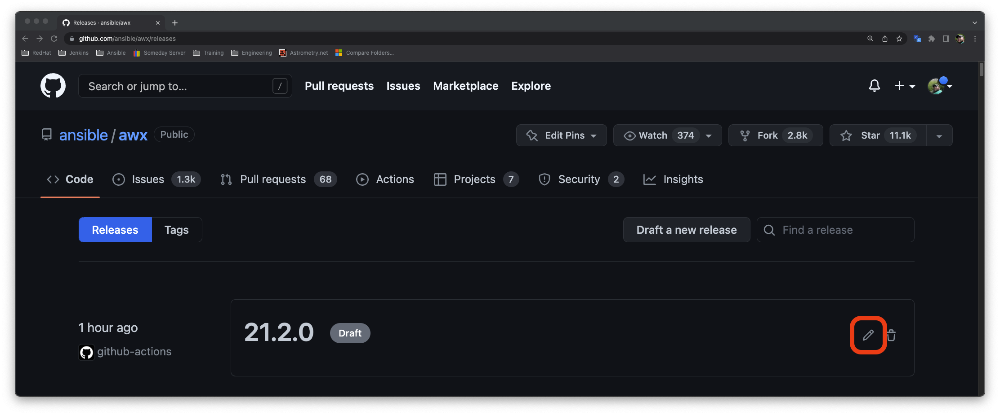

# Releasing AWX (and awx-operator)

The release process for AWX is almost completely automated as of version 19.5.0 it just needs a human to string a couple items together. 

If you need to revert a release, please refer to the [Revert a Release](#revert-a-release) section.

## Select the next release version

Our release number for AWX uses [semver](https://semver.org/#summary) in the form of X.Y.Z

Based on the content of the PRs included in a release we need to decide if this is a X-stream (major) release, Y-stream (minor) release, or a Z-stream (patch) release.

Indicators of a Z-stream release:

- No significant new features have been merged into devel since the last release.

Indicators of a Y-stream release:

- Additional features, non disrupting change of subcomponents.

Indicators of an X-stream release:

- Disruptive changes.

If the latest release of `AWX` is 19.5.0:

- X-stream release version will be 20.0.0.
- Y-stream release version will be 19.6.0.
- Z-stream release version will be 19.5.1.

With very few exceptions the new `AWX Operator` release will always be a Y-stream release.

We have a script which will scan the commits and their associated PRs and key word indicators in the PR body to help indicate our next release number.

This script is `tools/scripts/get_next_release_version.py`. Before running this script you need to create a GitHub Token to crawl the API with. To do this:
 1. Log into GitHub with your account.
 2. In the upper right, click on your avatar and select settings from the dropdown.
 3. At the bottom of the left hand menu click `Developer Settings`.
 4. At the bottom of this menu click `Personal access tokens` and then `Tokens (classic)` (if you have beta features enabled).
 5. On the token page click `Create new token` and then `Generate new token (classic)`.
 6. Authenticate (if required).
 7. On the new token screen give it a note and an expiration date and then click `Generate token` at the bottom of the screen (it only needs the default read permission).
 8. Create a file called `.github_creds` the script looks for this file wherever you run it from. For example, I put it in the root of my awx branch folder and then run the script like `./tools/scripts/get_next_release_version.py`.
 9. Run the script it will give you output like:
 ```
./tools/scripts/get_next_release_version.py 
Loading credentials
Getting current versions
    awx: 21.7.0
    awx-operator: 0.30.0
PR https://github.com/ansible/awx/pull/12736 votes y
PR https://github.com/ansible/awx/pull/12942 votes z
PR https://github.com/ansible/awx/pull/12949 votes z
...
PR https://github.com/ansible/awx/pull/13062 votes z
https://github.com/ansible/awx/compare/21.7.0...devel
awx devel is 98 commit(s) ahead of release 21.7.0

All commits voted, the release type suggestion is y

PR https://github.com/ansible/awx-operator/pull/1068 votes x
PR https://github.com/ansible/awx-operator/pull/1069 votes z
...
PR https://github.com/ansible/awx-operator/pull/1098 votes y
PR https://github.com/ansible/awx-operator/pull/1103 votes z
https://github.com/ansible/awx-operator/compare/0.30.0...devel
awx-operator devel is 21 commit(s) ahead of release 0.30.0

All commits voted, the release type suggestion is x


Next recommended releases:
  AWX: 21.8.0
  Operator: 1.0.0


Enter the next awx release number (21.8.0): 
```
 10. You can review the PRs as needed (recommended for X or non-votes). If you agree with the selected version you can press enter at the prompts or you can override the release numbers at the prompts. The script will then prompt you for any `known issues`:
 ```
 Enter any known issues (one per line, empty line to end)
 ```
 11. Once you enter in the versions and known issues the script will generate the body for the IRC and mailing list messages:
 ```
 Enter any known issues (one per line, empty line to end


Bullhorn/irc list message:

@newsbot We're happy to announce that the next release of AWX, version 21.8.0 is now available!
Some notable features include:
* Adding ppc64le support parameters
* Shortcut Instance.objects.me when possible
...

In addition AWX Operator version 1.0.0 has also been released!
Some notable features include:
* Change no_log type to boolean
* Enable configuration of route and ingress api versions

Please see the releases pages for more details:
AWX: [https://github.com/ansible/awx/releases/tag/21.8.0](https://github.com/ansible/awx/releases/tag/21.8.0)
Operator: [https://github.com/ansible/awx-operator/releases/tag/1.0.0](https://github.com/ansible/awx-operator/releases/tag/1.0.0)


Mailing list message:

Subject: Announcing AWX 21.8.0 and AWX-Operator 1.0.0
Body:
Hi all,

We're happy to announce that the next release of AWX, version 21.8.0 is now available!
Some notable features include:
* Adding ppc64le support parameters
* Shortcut Instance.objects.me when possible
...

In addition AWX Operator version 1.0.0 has also been released!
Some notable features include:
* Change no_log type to boolean
* Enable configuration of route and ingress api versions

Please see the releases pages for more details:
AWX: https://github.com/ansible/awx/releases/tag/21.8.0
Operator: https://github.com/ansible/awx-operator/releases/tag/1.0.0


-The AWX team.
```

**NOTE**: You should check the `notable features` sections of these messages to ensure they make sense. Massage as needed.

## Stage the release

To stage the release, maintainers of this repository can run the [Stage Release](https://github.com/ansible/awx/actions/workflows/stage.yml) workflow.

The link above will take you directly to the flow execution; if you wanted to manually navigate to the screen:

1. Click "Actions" at the top of GitHub.
2. Click on the "Stage Release" workflow.

Once you are on the Stage Release workflow page:

3. Click the "Run Workflow" drop down.
4. Populate the inputs.
5. Click the "Run workflow" button.


This workflow will:

- Build awx from devel
- Build awx-operator from devel
- Run smoke tests
- Create a draft release for both `ansible/awx` and `ansible/awx-operator`

## Promote the draft releases

### Releasing AWX, awxkit and awx.awx collection

Once staging is complete we can complete the release of awx and the operator.

1. navigate to the [Releases page](https://github.com/ansible/awx/releases) for AWX and verify things look ok.

2. Click the pencil icon on the draft:



3. Click the generate release notes button (turns grey after clicking once)

4. Add in a message of what operator version is release with this AWX version (if applicable):
```
## AWX Operator
Released with AWX Operator v0.23.0
```

5. Click "Publish Release":


Once the release is published, another workflow called [Promote Release](https://github.com/ansible/awx/actions/workflows/promote.yml) will start running:


This workflow will take the generated images and promote them to quay.io in addition it will also release awxkit and the awx.awx collection. The overall process will not take long.

6. Once the workflow is finished, verify that the new image is present on the [Repository Tags](https://quay.io/repository/ansible/awx?tag=latest&tab=tags) on Quay:


7. Go to the awx.awx collection on [Ansible Galaxy](https://galaxy.ansible.com/awx/awx) and validate the latest version matches and was updated recently:


8. Go to awxkit's page on [PiPy](https://pypi.org/project/awxkit/#history) and validate the latest release is there:


### Releasing the AWX operator

Once the AWX image is live, we can now release the AWX operator.

1. Navigate to the [Releases page](https://github.com/ansible/awx-operator/releases) for AWX operator and follow the same process used for publishing the AWX draft except note the version of AWX released with Operator.

Once published, the workflow [Promote AWX Operator image](https://github.com/ansible/awx-operator/actions/workflows/promote.yaml) will run:


This workflow will take the generated images and promote them to quay.io.

2. Once complete, verify the image is on the [awx-operator Quay repository](https://quay.io/repository/ansible/awx-operator?tab=tags):


## Notify the AWX mailing list
Send an email to the [AWX Mailing List](mailto:awx-project@googlegroups.com) with a message format of type "AWX Release" from the [mailing list triage standard replies](../.github/triage_replies.md#awx-release)

## Send an IRC message over matrix to #social:ansible.com for bullhorn:

@newsbot
We're happy to announce that [AWX version 21.1.0](https://github.com/ansible/awx/releases/tag/21.1.0) is now available!
We're happy to announce that [AWX Operator version 0.22.0](https://github.com/ansible/awx-operator/releases/tag/0.22.0) is now available!

## Send the same IRC message (less the @newsbot) to #awx:ansible.com

## Revert a Release

Decide whether or not you can just fall-forward with a new AWX Release to fix a bad release. If you need to remove published artifacts from publically facing repositories, follow the steps below.

Here are the steps needed to revert an AWX and an AWX-Operator release. Depending on your use case, follow the steps for reverting just an AWX release, an Operator release or both.


1. Navigate to the [AWX Release Page](https://github.com/ansible/awx/releases) and delete the AWX Release that needs to be removed.


2. Navigate to the [AWX Tags Page](https://github.com/ansible/awx/tags) and delete the AWX Tag that got created by the Github Actions Workflow from when you originally tried to release AWX. You need delete the release in step 1 before you can do this step. The tag must not be tied to a release if you want to delete a tag.


[comment]: <> (Need an image here for actually deleting an orphaned tag, place here during next release)

3. Navigate to the [AWX Operator Release Page]() and delete the AWX-Operator release that needss to tbe removed.


4. Navigate to [quay.io](https://quay.io/repository/ansible/awx?tag=latest&tab=tags) and delete the published AWX image(s) and tags.

5. Navigate to [quay.io](https://github.com/ansible/awx-operator/releases) and delete the published AWX Operator image(s) and tags.

6. Navigate to the [Ansible Galaxy Collections](https://galaxy.ansible.com/awx/awx) website and remove the published AWX collection with the bad tag.

7. Navigate to the [PyPi](https://pypi.org/project/awxkit/#history) and delete the bad AWX tag and release that got published.

8. [Restart the Release Process](#releasing-awx-and-awx-operator)
