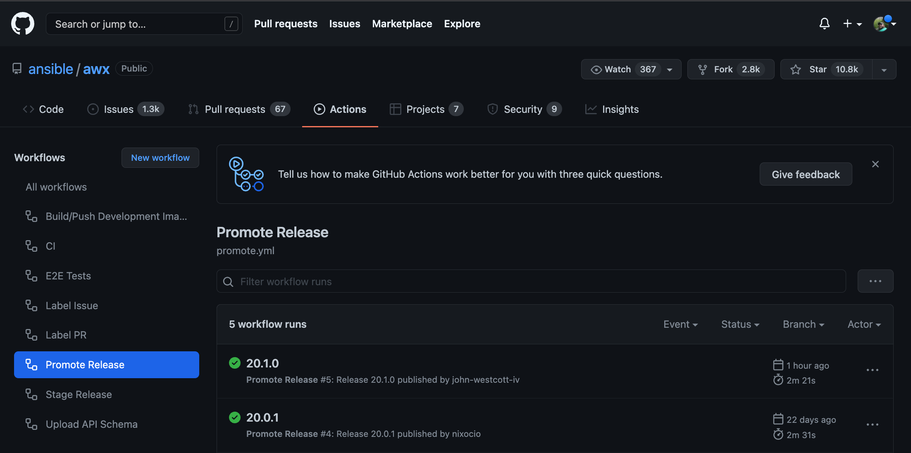

# Releasing AWX (and awx-operator)

The release process for AWX is mostly automated as of version 19.5.0.

If you need to revert a release, please refer to the [Revert a Release](#revert-a-release) section.

## Select the next release version

There are two methods you can use to get the next release version. The manual way and the automated way.

### Automated Way

#### Get a github token

Log into your github account, under your user icon go to Settings => Developer Settings => Personal Access Tokens => Tokens (classic).
Select the Generate new token => Generate new token (classic)
Fill in the note, select no scopes select "Generate token".
Copy the token and create a file at `~/.github_creds` or in your awx repo as `.github_creds`. Enter the token in this file.
Run `./tools/scripts/get_next_release.py`
This will use your token to go query for the PRs in the release and scan their bodies to select X/Y/Z and suggest new versions and spit out notifications.

### Manual Way

#### Get latest release version and list of new work

1. Open the main project page for [AWX](https://github.com/ansible/awx/releases) and [AWX Operator](https://github.com/ansible/awx-operator/releases).

Find the latest releases of the projects on the right hand side of the screen:


2. Open the compare screen for the two projects [AWX](https://github.com/ansible/awx/compare) and [AWX Operator](https://github.com/ansible/awx-operator/compare).
In the two dropdowns near the top of the page leave the `compare` menu at devel and select the drop down for `base` and then select `tags` and finally select the latest release from step 1:


The page will now automatically update with a list of PRs that are in `AWX/devel` but not in the last release.


Use this list of PRs to decide if this is a X-stream (major) release, Y-stream (minor) release, or a Z-stream (patch) release. Use [semver](https://semver.org/#summary) to help determine what kind of release is needed.

#### Select the next release version

Indicators of a Z-stream release:

- No significant new features have been merged into devel since the last release.

Indicators of a Y-stream release:

- Additional features, non disrupting change of subcomponents.

Indicators of an X-stream release:

- Disruptive changes.

If the latest release of `AWX` is 19.5.0:

- X-stream release version will be 20.0.0.
- Y-stream release version will be 19.6.0.
- Z-stream release version will be 19.5.1.

With very few exceptions the new `AWX Operator` release will always be a Y-stream release.

## Stage the release

To stage the release, maintainers of this repository can run the [Stage Release](https://github.com/ansible/awx/actions/workflows/stage.yml) workflow.

The link above will take you directly to the flow execution; if you wanted to manually navigate to the screen:

1. Click "Actions" at the top of GitHub.
2. Click on the "Stage Release" workflow.

Once you are on the Stage Release workflow page:

3. Click the "Run Workflow" drop down.
4. Populate the inputs.
5. Click the "Run workflow" button.


This workflow will:

- Build awx from devel
- Build awx-operator from devel
- Run smoke tests
- Create a draft release for both `ansible/awx` and `ansible/awx-operator`

## Promote the draft releases

### Releasing AWX, awxkit and awx.awx collection

Once staging is complete we can complete the release of awx and the operator.

1. navigate to the [Releases page](https://github.com/ansible/awx/releases) for AWX and verify things look ok.

2. Click the pencil icon on the draft:


3. Click the generate release notes button (turns grey after clicking once)

4. Add in a message of what operator version is release with this AWX version (if applicable):
```
## AWX Operator
Released with AWX Operator v0.23.0
```

5. Click "Publish Release":


Once the release is published, another workflow called [Promote Release](https://github.com/ansible/awx/actions/workflows/promote.yml) will start running:



This workflow will take the generated images and promote them to quay.io in addition it will also release awxkit and the awx.awx collection. The overall process will not take long.

6. Once the workflow is finished, verify that the new image is present on the [Repository Tags](https://quay.io/repository/ansible/awx?tag=latest&tab=tags) on Quay:


7. Go to the awx.awx collection on [Ansible Galaxy](https://galaxy.ansible.com/awx/awx) and validate the latest version matches and was updated recently:


8. Go to awxkit's page on [PiPy](https://pypi.org/project/awxkit/#history) and validate the latest release is there:


### Releasing the AWX operator

Once the AWX image is live, we can now release the AWX operator.

1. Navigate to the [Releases page](https://github.com/ansible/awx-operator/releases) for AWX operator and follow the same process used for publishing the AWX draft except note the version of AWX released with Operator.

Once published, the workflow [Promote AWX Operator image](https://github.com/ansible/awx-operator/actions/workflows/promote.yaml) will run:


This workflow will take the generated images and promote them to quay.io.

2. Once complete, verify the image is on the [awx-operator Quay repository](https://quay.io/repository/ansible/awx-operator?tab=tags):


## Send notifications
Send notifications to the following groups:
  * AWX Mailing List
  * #social:ansible.com IRC (@newsbot for inclusion in bullhorn)
  * #awx:ansible.com (no @newsbot in this room)
  * #ansible-controller slack channel

These messages are templated out for you in the output of `get_next_release.yml`.

Note: the slack message is the same as the IRC message.

## Create operator hub PRs.
Operator hub PRs are generated via an Ansible Playbook. See someone on the AWX team for the location of the playbooks and instructions on how to run them.

## Adding New Operator to Operator Hub

1. If you have not already fork the repos:
  * https://github.com/redhat-openshift-ecosystem/community-operators-prod
  * https://github.com/k8s-operatorhub/community-operators

2. If you have not already, install
  * [the operator-sdk](https://sdk.operatorframework.io/docs/installation/)
  * [kustomize](https://kustomize.io/)
  * [opm](https://docs.openshift.com/container-platform/4.9/cli_reference/opm/cli-opm-install.html)

3. Download the script from https://gist.github.com/rooftopcellist/0e232f26666dee45be1d8a69270d63c2 into your awx-operator repo as release_operator_hub.sh

4. Make sure you are logged into quay.io with `docker login quay.io`

5. Run the script like `OPERATOR_PATH=<path to your operator repo> VERSION=1.1.2 PREV_VERSION=1.1.1 FORK=john-westcott-iv ./release_operator_hub.sh`
  * Make sure to change the new and previous versions and update your fork!

6. Create the PRs as described by the output of the script. Submit them just the way they are when you open them.


## Revert a Release

Decide whether or not you can just fall-forward with a new AWX Release to fix a bad release. If you need to remove published artifacts from publically facing repositories, follow the steps below.

Here are the steps needed to revert an AWX and an AWX-Operator release. Depending on your use case, follow the steps for reverting just an AWX release, an Operator release or both.


1. Navigate to the [AWX Release Page](https://github.com/ansible/awx/releases) and delete the AWX Release that needs to be removed.


2. Navigate to the [AWX Tags Page](https://github.com/ansible/awx/tags) and delete the AWX Tag that got created by the Github Actions Workflow from when you originally tried to release AWX. You need delete the release in step 1 before you can do this step. The tag must not be tied to a release if you want to delete a tag.


[comment]: <> (Need an image here for actually deleting an orphaned tag, place here during next release)

3. Navigate to the [AWX Operator Release Page]() and delete the AWX-Operator release that needss to tbe removed.


4. Navigate to [quay.io](https://quay.io/repository/ansible/awx?tag=latest&tab=tags) and delete the published AWX image(s) and tags.

5. Navigate to [quay.io](https://github.com/ansible/awx-operator/releases) and delete the published AWX Operator image(s) and tags.

6. Navigate to the [Ansible Galaxy Collections](https://galaxy.ansible.com/awx/awx) website and remove the published AWX collection with the bad tag.

7. Navigate to the [PyPi](https://pypi.org/project/awxkit/#history) and delete the bad AWX tag and release that got published.

8. [Restart the Release Process](#releasing-awx-and-awx-operator)
