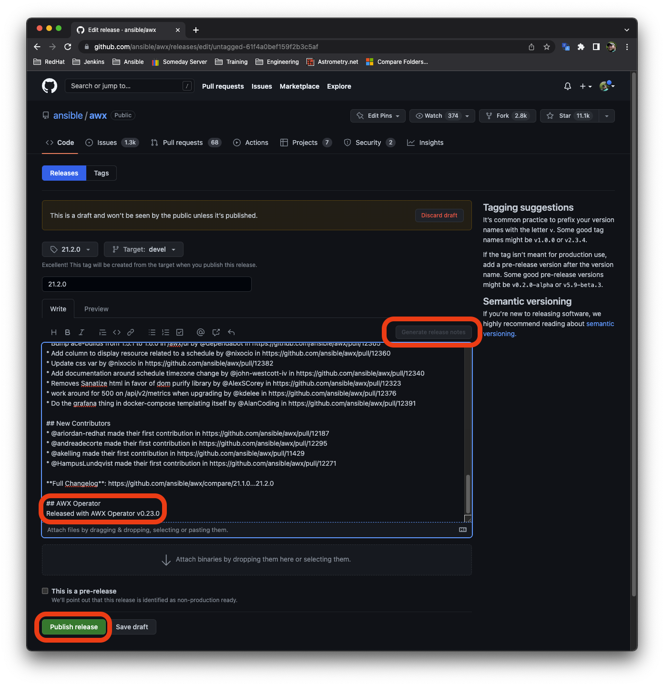

# Releasing AWX (and awx-operator)

The release process for AWX is completely automated as of version 19.5.0.

## Get latest release version and list of new work

1. Get latest version of [AWX](https://github.com/ansible/awx/releases)
2. Get latest version of [AWX Operator](https://github.com/ansible/awx-operator/releases).
3. [Compare](https://github.com/ansible/awx/compare) `latest` against `devel`

The page will automatically update with a list of PRs that are in `AWX/devel` but not in `latest`.

Use this list of PRs to decide if this is a Y-stream (minor) release, or a Z-stream release (patch). Use [semver](https://semver.org/#summary) to help determine what kind of release is needed. Indicators of a Z-stream release:

- No significant new features have been merged into devel since the last release.

## Staging the release

To stage the release, maintainers of this repository can run the [Stage Release](https://github.com/ansible/awx/blob/devel/.github/workflows/stage.yml) workflow. To start the workflow, follow this series of events:

1. Click "Actions" in the top nav bar on the repository
2. Click "Stage Release" in the left nav menu
3. Click the "Run workflow" dropdown
4. Populate the inputs.
5. Click the "Run workflow" button

If the latest release of `AWX` is 19.5.0:

- Y-stream release version will be 19.6.0.
- Z-stream release version will be 19.5.1.

With very few exceptions the new `AWX Operator` release will always be a Y-stream release.

## For AWX-Operator release version:

This workflow will:

- Build awx from devel
- Build awx-operator from devel
- Run smoke tests
- Create a draft release for both `ansible/awx` and `ansible/awx-operator`

Once complete, navigate to the [Releases page](https://github.com/ansible/awx/releases) for AWX and verify things look ok. The changelog is automatically generated using the [special comment in our Pull Request template](https://github.com/ansible/awx/commit/dc0cc0f910900c506fb6f6ce4366e0e0d1d0ee87). If things look ok, click the pencil icon on the draft:

Next, click "Publish Release":

This will not take long. Once this is complete go to [AWX-Operator release page](https://github.com/ansible/awx-operator/releases) to verify and then publish the draft release following the same steps as above.

Once the release is published, another workflow called [Promote Release](https://github.com/ansible/awx/actions/workflows/promote.yml) will start running:

Once it finished, verify that the new image is present on the [Repository Tags](https://quay.io/repository/ansible/awx?tag=latest&tab=tags) on Quay:

Once the AWX image is live, go to the [Releases page for awx-operator](https://github.com/ansible/awx-operator/releases) and follow the same process to publish the release. Once published, the workflow [Promote AWX Operator image](https://github.com/ansible/awx-operator/actions/workflows/promote.yaml) will run.

Once complete, verify the image is on the [awx-operator Quay repository](https://quay.io/repository/ansible/awx-operator?tab=tags):

