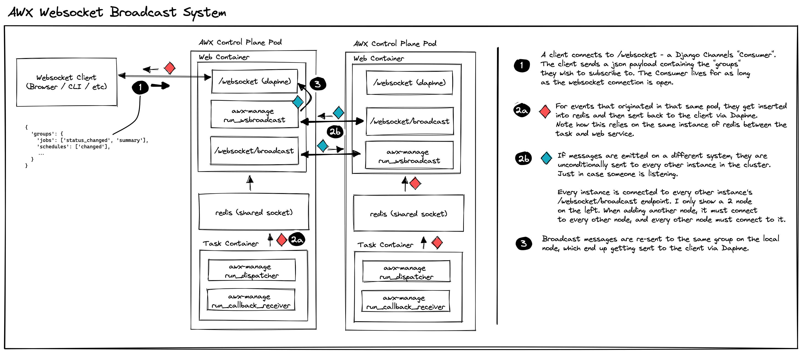
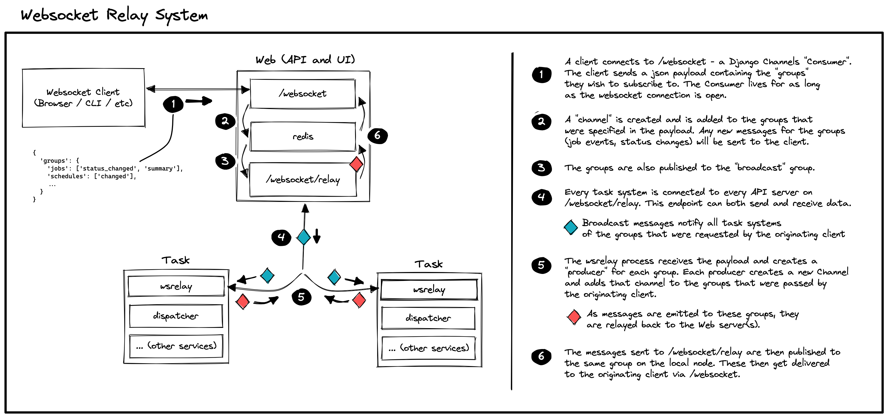

# Websockets

AWX uses websockets to update the UI in realtime as events happen within the
task backend. As jobs progress through their lifecycles, events are emitted by
the task system and send to the UI which renders this information in some useful
way for end users to see.

In this document, we do not intend to provide a code walkthrough, but an
architectural overview of how the infrastructure works. We start with a summary
of things worked historically, and then focus primarily on how things work now.

Since the [web/task split](https://github.com/ansible/awx/pull/13423) landed,
the websockets infrastructure needed to be reworked. As we will see below, the
system makes use of
[django-channels](https://channels.readthedocs.io/en/stable/) which in turn
makes use of Redis. As we wanted to have separate deployments for the web (API)
component and the task backend component, we needed to no longer depend on a
shared Redis between these pieces.

When a message gets sent, it lands in Redis (which is used as a pub/sub server
backend for django-channels), and django-channels acts on it and forwards it on
to clients. (There is a concept of "groups" of clients that we will cover
later.)

Note that django-channels processes messages in Daphne, an ASGI server. This is
in contrast to WSGI which we currently use for the rest of AWX. That is *only*
websockets endpoints are served with Daphne, and everything else is served with
uWSGI. **_Everything_ goes through nginx, and from there, based on URL path,
gets routed to uWSGI or Daphne, as required.**

The notable modules for this component are:

* `awx/main/consumers.py` - the django-channels "consumers" where websocket
  clients are actually handled (think of these like views, but specific to
  websockets).

  * This is also where `emit_channel_notification` is defined, which is what the
    task system calls to actually send out notifications. This sends a message
    to the local Redis instance where wsrelay (discussed below) will pick it
    up and relay it out to the web nodes.

* `awx/main/wsrelay.py` (formerly `awx/main/wsbroadcast.py`) - an asyncio
  websockets _client_ that connects to the "relay" (fka. "broadcast")
  endpoint. This is a daemon. It formerly ran in each web container, but now
  runs in each task container instead.

* `awx/main/management/commands/run_ws_heartbeat.py` - discussed below, used to
  send a heartbeat payload to pg_notify every few seconds, so that all task
  pods running `wsrelay.py` (above) know about each web pod.

## Before the web/task split



Consider a Kubernetes deployment of AWX. Before the web task split, each pod had
a web container, a task container, and a redis container (and possibly others,
not relevant here). A daemon existed called `wsbroadcast` which lived in the web
container and ran once within each pod. When a websocket message was emitted
(from some task system daemon, for example), the message would get sent to a
django-channels "group" which would store it in the pod-local Redis before
django-channels acted on it. It would also get sent to a special "broadcast"
group.

The `wsbroadcast` daemon acted as a full websocket client and connected to a
special internal endpoint (no end-user clients connected to this
endpoint). Importantly, **it connected to this endpoint on all pods (nods)
except for the one it was running on**. Immediately after connecting, it got
added to the "broadcast" group on each pod and would thus receive a copy of each
message being sent from each node.

It would then "re-send" this message to its local clients by storing it in its
own pod-local Redis for django-channels to process it.

## Current Implementation



In the post web/task split world, web and task containers live in entirely
independent pods, each with their own Redis. The former `wsbroadcast` has been
renamed to `wsrelay`, and we have moved to a kind of "fan-out" architecture.

Messages (only) originate from the task system (container). The `wsrelay` daemon
initiates a websocket connection to each web pod on its "relay" endpoint (which
corresponds to the `RelayConsumer` class). As a task progresses and events are
emitted, websocket messages get sent to Redis (via django-channels) and
`wsrelay` running in the same pod picks them up. It then takes each message and
passes it along to every web pod, via the websocket connection it already has
open.

There is actually a bit more going on here, and the interested reader is invited
to read through the `EventConsumer` class and `wsrelay` code for the full
deep-dive. But, briefly, a few pieces not covered above:

### Only Relaying Messages When Necessary

The `RelayConsumer` class can communicate to and from the `wsrelay`
client. Because of this, we are able to inform `wsrelay` when there is a client
actively listening for websocket updates. Then, `wsrelay` can keep note of that
(and which web pod they are coming from), and only send messages to web pods
which have active clients on them. This prevents us from sending lots of
messages to web pods which immediately discard them due to having no clients
that care about them.

### The Heartbeet

There is also a "ws_heartbeat" system, that goes along with
the above. Remember that `wsrelay` lives in each task pod, and there could be an
arbitrary number of web and task pods (independent of each other). Because of
this, `wsrelay` (on all task pods) needs to know which web pods are up and need
to be connected to (on their "relay" endpoints). To accomplish this, we use
pg_notify, since web and task pods are all able to connect to the database and
we are safely able to use it as a central communication point.

In each web container, there is a process, `run_ws_heartbeat.py` which will send
out a heartbeat payload to pg_notify, every
`settings.BROADCAST_WEBSOCKET_BEACON_FROM_WEB_RATE_SECONDS` seconds. This is
done in a broadcast fashion to a specific pg_notify channel, and each `wsrelay`
instance (running in each task pod) is concurrently listening to pg_notify for
these messages. When `wsrelay` sees this heartbeat packet, it checks to see if
the web node is known already. If not, it creates a connection to it, and adds
it to its list of nodes to relay websocket messages to.

It can also handle web nodes going offline. If `run_ws_heartbeat.py` detects
SIGTERM or SIGINT, it will send an "offline" heartbeat packet, and `wsrelay`
will work to *remove* the web node from its list of active connections.

This also gracefully handles the situation where there is a network blip, or a
web pod *unexpectedly* goes offline. Eventually the connection to the node will
time out and `wsrelay` will remove the pod from its list. The next time it sees
a heartbeat from the node, it will reconnect as normal. Similarly, this handles
new web pods scaling up at random.

### The Relay Endpoint and Security

The relay endpoint, the endpoint that `wsrelay` connects to as a client, is
protected so that only `wsrelay` can connect to it. This is important, as
otherwise anyone could connect to the endpoint and see information (such as
playbook output) that they might not otherwise have necessary permissions to
see.

Authentication is accomplished via a shared secret that is generated and set at
playbook install time. The shared secret is used to derive a payload that is
exchanged via the http(s) header `secret`. The shared secret payload consists of
a `secret` field, containing the shared secret, and a `nonce` which is used to
mitigate replay attack windows.

Note that the nonce timestamp is considered valid if it is within 300 second
threshold. This is to allow for machine clock skews.

```python
{
    "secret": settings.BROADCAST_WEBSOCKET_SECRET,
    "nonce": time.now()
}
```

The payload is encrypted using HMAC-SHA256 with
`settings.BROADCAST_WEBSOCKET_SECRET` as the key. The final payload that is
sent, including the http header, is of the form:

`secret: nonce_plaintext:HMAC_SHA256({"secret": settings.BROADCAST_WEBSOCKET_SECRET, "nonce": nonce_plaintext})`

Upon receiving the payload, `RelayConsumer` decrypts the `secret` header using
the known shared secret and ensures the secret value of the decrypted payload
matches the known shared secret, `settings.BROADCAST_WEBSOCKET_SECRET`. If it
does not match, the connection is closed. If it does match, the nonce is
compared to the current time. If the nonce is off by more than 300 seconds, the
connection is closed. If both tests pass, the connection is accepted.

## Protocol

You can connect to the AWX channels implementation using any standard websocket
library by pointing it to `/websocket/`. You must provide a valid Auth Token in
the request URL. This will drop you into the `EventConsumer`.

Once you've connected, you are not subscribed to any event groups. You subscribe
by sending a JSON payload that looks like the following:

```json
"groups": {
    "jobs": ["status_changed", "summary"],
    "schedules": ["changed"],
    "ad_hoc_command_events": [ids...],
    "job_events": [ids...],
    "workflow_events": [ids...],
    "project_update_events": [ids...],
    "inventory_update_events": [ids...],
    "system_job_events": [ids...],
    "control": ["limit_reached_<user_id>"],
}
```

These map to the event group and event type that the user is interested
in. Sending in a new groups dictionary will clear all previously-subscribed
groups before subscribing to the newly requested ones. This is intentional, and
makes the single page navigation much easier since users only need to care about
current subscriptions.

Note that, as mentioned above, `wsrelay` will only relay messages to a web pod
if there is a user actively listening for a message of whatever type is being
sent.
