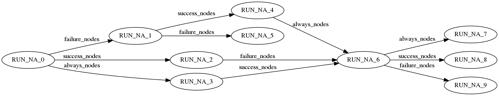
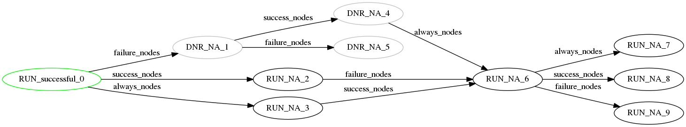
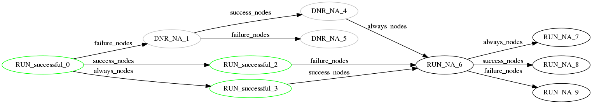
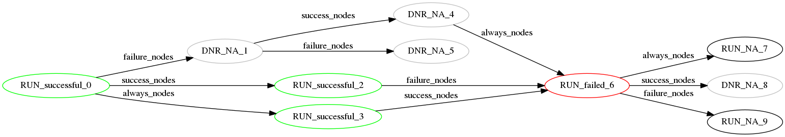
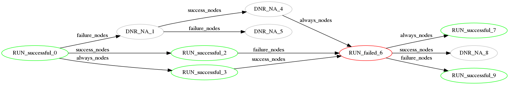

## Tower Workflow Overview

Workflows are structured compositions of Tower job resources. The only job of a workflow is to trigger other jobs in specific orders to achieve certain goals, such as tracking the full set of jobs that were part of a release process as a single unit.

A workflow has an associated tree-graph that is composed of multiple nodes. Each node in the tree has one associated template (job template, inventory update, project update, approval template, or workflow job template) along with related resources that, if defined, will override the associated job template resources (*i.e.*, credential, inventory, etc.) if the job template associated with the node is selected to run.


## Usage Manual

### Workflow Create-Read-Update-Delete (CRUD)

Like other job resources, workflow jobs are created from workflow job templates. The API exposes common fields similar to job templates, including labels, schedules, notification templates, extra variables and survey specifications. Other than that, in the API, the related workflow graph nodes can be accessed via the related `workflow_nodes` field.

The CRUD operations against a workflow job template and its corresponding workflow jobs are almost identical to those of normal job templates and related jobs.

By default, organization administrators have full control over all workflow job templates under the same organization, and they share these abilities with users who have the `workflow_admin_role` in that organization. Permissions can be further delegated to other users via the workflow job template roles.


### Workflow Nodes

Workflow Nodes are containers of workflow-spawned job resources and function as nodes of workflow decision trees. Like that of the workflow itself, the two types of workflow nodes are workflow job template nodes and workflow job nodes.

Workflow job template nodes are listed and created under the `/workflow_job_templates/\d+/workflow_nodes/` endpoint to be associated with the underlying workflow job template, or directly under endpoint `/workflow_job_template_nodes/`. The most important fields of a workflow job template node are `success_nodes`, `failure_nodes`, `always_nodes`, `unified_job_template` and `workflow_job_template`. The first three are lists of workflow job template nodes that, in union, forms the set of all of its child nodes; specifically, `success_nodes` are triggered when the parent node job succeeds, `failure_nodes` are triggered the when parent node job fails, and `always_nodes` are triggered regardless of whether the parent job succeeds or fails. The latter two fields reference the job template resource it contains and workflow job template it belongs to.

Workflow nodes also have an `identifier` field, which enables clients to do idempotent CRUD actions.
This can function the same as the `name` field for other resources, in that the client can set its value as needed.
Unlike `name`, if the client does not provide the `identifier` field, the server will assign a random UUID4 value.
Any workflow job nodes spawned from that node will share the `identifier` value, so that clients
can track which job nodes correspond to which template nodes.


#### Workflow Launch Configuration

Workflow job templates can contain launch configuration items. So far, these only include:

 - `extra_vars`
 - `inventory`
 - `limit`
 - `scm_branch`

The `extra_vars` field may have specifications via
a survey, in the same way that job templates work.

Workflow nodes may also contain the launch-time configuration for the job it will spawn.
As such, they share all the properties common to all saved launch configurations.

When a workflow job template is launched, a workflow job is created. If the workflow
job template is set to prompt for a value, then the user may provide this on launch,
and the workflow job will assume the user-provided value.

A workflow job node is created for each WFJT node and all fields from the WFJT node are copied. Note that workflow job nodes contain all fields that a workflow job template node contains plus an additional field, `job`, which is a reference to the to-be-spawned job resource.

If the workflow job and the node both specify the same prompt, then the workflow job
takes precedence and its value will be used. In either case, if the job template
the node references does not have the related prompting field set to `true`
(such as `ask_inventory_on_launch`), then the prompt will be ignored, and the
job template default, if it exists, will be used instead.

See the document on saved launch configurations for how these are processed
when the job is launched, and the API validation involved in building
the launch configurations on workflow nodes.


#### Workflows as Workflow Nodes

A workflow can be added as a node in another workflow. The child workflow is the associated
`unified_job_template` that the node references when that node is added to the parent workflow.
When the parent workflow dispatches that node, then the child workflow will begin running, and
the parent will resume execution of that branch when the child workflow finishes.
Branching into success / failed pathways is decided based on the status of the child workflow.

In the event that spawning the workflow would result in recursion, the child workflow
will be marked as failed with a message explaining that recursion was detected.
This is to prevent saturation of the task system with an infinite chain of workflows.


#### Workflow Approval Nodes

The workflow approval node feature enables users to add steps in a workflow in between nodes within workflows so that a user (as long as they have approval permissions, explained in further detail below) can give the "yes" or "no" to continue on to the next step in the workflow.

**RBAC Setup for Workflow Approval Nodes**

A user can _create_ a workflow approval if they are:
- a Superuser
- an Org Admin of the organization connected to the workflow
- a Workflow Admin in the organization connected to the workflow
- assigned as admins to a particular workflow

A user can _approve_ a workflow when they are:
- a Superuser
- a Workflow Admin
- an Organization Admin
- any user who has explicitly been assigned the "approver" role

A user can _view_ approvals if they:
- have Read access to the associated Workflow Job Template

**Other Workflow Approval Node Features**

A timeout (in minutes and seconds) can be set for each approval node. These fields default to `0` for no expiration.


### DAG Formation and Restrictions

The directed acyclic graph (DAG) structure of a workflow is enforced by associating workflow job template nodes via endpoints `/workflow_job_template_nodes/\d+/*_nodes/`, where `*` has options `success`, `failure` and `always`. There is one restriction that is enforced when setting up new connections and that is the cycle restriction, since it's a DAG.


### Workflow Run Details

A typical workflow run starts by either POSTing to endpoint `/workflow_job_templates/\d+/launch/`, or being triggered automatically by related schedule. At the very first, the workflow job template creates a workflow job, and all related workflow job template nodes create workflow job nodes. Right after that, all root nodes are populated with corresponding job resources and start running. If nothing goes wrong, each decision tree will follow its own route to completion. The entire workflow finishes running when all of its decision trees complete.

As stated, workflow job templates can be created with populated `extra_vars`. These `extra_vars` are combined with the `extra_vars` of any job template launched by the workflow with higher variable precedence, meaning they will overwrite job template variables with the same name. Note that before the `extra_vars` set is applied as runtime job extra variables, it might be expanded and over-written by the cumulative job artifacts of ancestor nodes. The meaning of 'cumulative' here is children overwriting parent. For example, if a node has a parent node and a grandparent node, and both ancestors generate job artifacts, then the job artifacts of grandparent node is overwritten by that of parent node to form the set of cumulative job artifacts of the current node.

Job resources spawned by workflow jobs are necessary for workflows to run correctly. Therefore, the deletion of spawned job resources is blocked while the underlying workflow job is executing.

Other than success and failure, a workflow spawned job resource can also end with status 'error' and 'canceled'. When a workflow spawned job resource errors or is canceled, it is treated the same as failure. If the unified job template of the node is null (which could be a result of deleting the unified job template or copying a workflow when the user lacks necessary permissions to use the resource), then the node will be treated as 'failed' and the failure paths will continue to execute.

A workflow job itself can also be canceled. In this case all of its spawned job resources will be canceled (if cancellation is allowed) and its following paths stop executing.

Like job templates, workflow job templates can be associated with notification templates and notifications work exactly the same as that of job templates. One distinction is the notification message body. Workflow jobs send a notification body that contains not only the status of itself, but also status of all its spawned jobs. A typical notification body looks like this:

```
Workflow job summary:

- node #141 spawns no job.
- node #139 spawns job #212, "foo", which finished with status successful.
- node #140 spawns job #213, "bar", which finished with status failed.
...
```

Starting from Tower 3.2, Workflow jobs support simultaneous job runs just like that of ordinary jobs. It is controlled by the `allow_simultaneous` field of underlying workflow job template. By default, simultaneous workflow job runs are disabled and users should be prudent in enabling this functionality, since the performance boost of simultaneous workflow runs will only manifest when a large portion of jobs contained by a workflow allow simultaneous runs. Otherwise, it is expected to have some long-running workflow jobs since its spawned jobs can be in pending state for a long time.

A workflow job is marked as failed if a job spawned by a workflow job fails, without a failure handler. A failure handler is a `failure` or `always` link in the workflow job template. A job that is canceled is, effectively, considered a failure for the purposes of determining if a job nodes is failed.


### Workflow Copy and Relaunch

Other than the normal way of creating workflow job templates, it is also possible to copy existing workflow job templates. The resulting new workflow job template will be mostly identical to the original, except for the `name` field which will be appended in a way to indicate that it's a copy.

Workflow job templates can be copied by POSTing to endpoint `/workflow_job_templates/\d+/copy/`. After the copy finishes, the resulting new workflow job template will have identical fields including description, `extra_vars`, and survey-related fields (`survey_spec` and `survey_enabled`). More importantly, the workflow job template nodes of the original workflow job template, as well as the topology they bear, will be copied. Note that there are RBAC restrictions on copying workflow job template nodes. A workflow job template is allowed to be copied if the user has permission to add an equivalent workflow job template. If the user performing the copy does not have access to a node's related resources (job template, inventory, or credential), those related fields will be null in the copy's version of the node. Schedules and notification templates of the original workflow job template will not be copied nor shared, and the name of the created workflow job template is the original name plus a special-formatted suffix to indicate its copy origin as well as the copy time, such as `'copy_from_name@10:30:00 am'`.

Workflow jobs cannot be copied directly; instead, a workflow job is implicitly copied when it needs to relaunch. Relaunching an existing workflow job is done by POSTing to endpoint `/workflow_jobs/\d+/relaunch/`. What happens next is the original workflow job's prompts are re-applied to its workflow job template to create a new workflow job. Finally, the full-fledged new workflow job is triggered to run, thus fulfilling the purpose of relaunch. Survey password-type answers should also be redacted in the relaunched version of the workflow job.


### Artifacts

Support for artifacts starts in Ansible and is carried through in Tower. The `set_stats` module is invoked by users, in a playbook, to register facts. Facts are passed in via the `data:` argument. Note that the default `set_stats` parameters are the correct ones to work with Tower (*i.e.*, `per_host: no`). Now that facts are registered, we will describe how facts are used. In Ansible, registered facts are "returned" to the callback plugin(s) via the `playbook_on_stats` event. Ansible users can configure whether or not they want the facts displayed through the global `show_custom_stats` configuration. Note that the `show_custom_stats` does not effect the artifact feature of Tower. This only controls the displaying of `set_stats` fact data in Ansible output (also the output in Ansible playbooks that get run in Tower). Tower uses a custom callback plugin that gathers the fact data set via `set_stats` in the `playbook_on_stats` handler and "ships" it back to Tower, saves it in the database, and makes it available on the job endpoint via the variable `artifacts`. The semantics and usage of `artifacts` throughout a workflow is described elsewhere in this document.


### Workflow Run Example

To best understand the nuances of workflow run logic, we will look at an example workflow run as it progresses through the 'running' state. In the workflow examples below, nodes are labeled `<do_not_run, job_status, node_id>` where `do_not_run` can be `RUN` or `DNR` where `DNR` means 'do not run the node' and `RUN` which means 'run the node'. Nodes start out with `do_not_run = False` depicted as `RUN` in the pictures below. When nodes are known to not run they will be marked `DNR` and the state will not change. `job_status` is the job's status associated with the node. `node_id` is the unique ID for the workflow job node.

<p align="center">
    
    Workflow before running has started.
</p>
<p align="center">
    
    Root nodes are selected to run. A root node is a node with no incoming nodes. Node 0 is selected to run and results in a status of `'successful'`. Nodes 1, 4, and 5 are marked `'DNR'` because they are in the failure path. Node 6 is not marked `'DNR'` because nodes 2 and 3 may run and result and node 6 running. The same reasoning is why nodes 7, 8, 9 are not marked `'DNR'`.
</p>
<p align="center">
    
    Nodes 2 and 3 are selected to run and their job results are both `'successful'`. Node 6 is not marked `'DNR'` because node 3 will trigger node 6.
</p>
<p align="center">
    
    Node 6 is selected to run and the job results in `'failed'`. Node 8 is marked `'DNR'` because of the success path. Nodes 7 and 8 will be ran in the next cycle.
</p>
<p align="center">
    
    Node 7 and 8 are selected to run and their job results are both `'successful'`.
</p>

The resulting state of the workflow job run above would be `'successful'`. Although individual nodes fail, the overall workflow job status is `'successful'` because all individual node failures have error handling paths (`'failed_nodes'` or `'always_nodes'`).


## Test Coverage

### CRUD-related

* Verify that CRUD operations on all workflow resources are working properly. Note that workflow job nodes cannot be created or deleted independently, but verifications are needed to ensure that when a workflow job is deleted, all its related workflow job nodes are also deleted.
* Verify the RBAC property of workflow resources. In specific:
  * Workflow job templates can only be accessible by superusers ---- system admin, admin of the same organization and system auditor and auditor of the same organization with read permission only.
  * Workflow job read and delete permissions follow from its associated workflow job template.
  * Workflow job relaunch permission consists of the union of execute permission to its associated workflow job template, and the permission to re-create all the nodes inside of the workflow job.
  * Workflow job template nodes rely on their permission rules for both their associated workflow job template and unified job template for creating and editing.
  * Workflow job template nodes can be deleted with admin permission to their workflow job template (even lacking permission to the node's job template).
  * Workflow job nodes are viewable if its workflow job is viewable.
  * No CRUD actions are possible on workflow job nodes by any user, and they may only be deleted by deleting their workflow job.
  * Workflow jobs can be deleted by superusers and org admins of the organization of its associated workflow job template, and no one else.
* Verify that workflow job template nodes can be created under, or (dis)associated with workflow job templates.
* Verify that the permitted types of job template types can be associated with a workflow job template node. Currently the permitted types are *job templates, inventory sources, projects, and workflow job templates*.
* Verify that workflow job template nodes under the same workflow job template can be associated to form a parent-child relationship of decision trees. In specific, one node takes another as its child node by POSTing another node's ID to one of the three endpoints: `/success_nodes/`, `/failure_nodes/` and `/always_nodes/`.
* Verify that workflow job template nodes are not allowed to have invalid association. Any attempt that causes invalidity will trigger 400-level response (*i.e.*, cycles).
* Verify that a workflow job template can be successfully copied, and that the created workflow job template does not miss any field that should be copied or intentionally modified.
* Verify that if a user has no access to any of the related resources of a workflow job template node, that node will not be copied and will have `null` as placeholder.
* Verify that `artifacts` is populated when `set_stats` is used in Ansible >= v2.2.1.0-0.3.rc3.


### Task-related

* Verify that workflow jobs can be launched by POSTing to endpoint `/workflow_job_templates/\d/launch/`.
* Verify that schedules can be successfully (dis)associated with a workflow job template, and workflow jobs can be triggered by the schedule of associated workflow job template at specified time point.
* Verify that extra variables work for workflow job templates as described. In specific, verify the role of workflow job extra variables as a set of global runtime variables over all its spawned jobs.
* Verify that extra variables of a workflow job node are correctly overwritten in order by the cumulative job artifacts of ancestors, and the overwrite policy of cumulative job artifacts is correct (artifacts of parent overwrite artifacts of grandparent).
* Verify that during a workflow job run, all of its decision trees follow their correct paths of execution. Unwarranted behaviors include the child node executing before its parent and wrong path being selected (*failure nodes* are executed when parent node *succeeds* and so on).
* Verify that a subtree of execution will never start if its root node runs into internal error (*not ends with failure*).
* Verify that a subtree of execution will never start if its root node is successfully canceled.
* Verify that cancelling a workflow job that is cancellable will consequently cancel any of its cancellable spawned jobs and thus interrupts the whole workflow execution.
* Verify that during a workflow job run, deleting its spawned jobs are prohibited.
* Verify that at the beginning of each spawned job run, its prompted fields will be populated by the wrapping workflow job node with corrected values. For example, related `credentials` of the workflow job node go to `credentials` of spawned job.
* Verify that notification templates can be successfully (dis)associated with a workflow job template. Later, when its spawned workflow jobs finishes running, verify that the correct type of notifications will be sent according to the job status.
* Verify that a workflow job can be successfully relaunched.


## Test Notes

* Please apply non-trivial topology when testing a workflow run. A non-trivial topology for a workflow job template should include:
  * Multiple decision trees.
  * Relatively large height in each decision tree.
  * All three types of relationships (`success`, `failure` and `always`).
