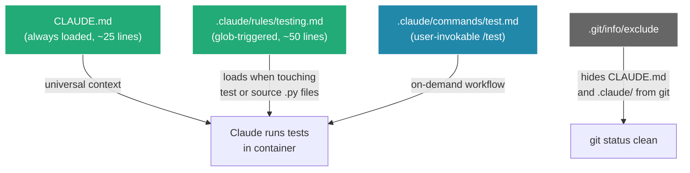
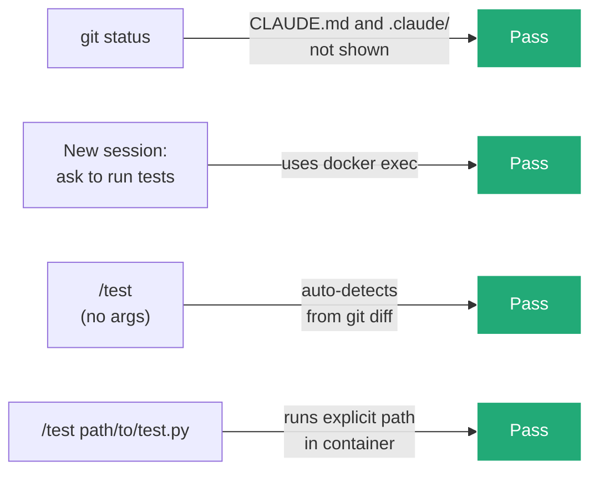

# Plan: Configure Claude Code for AWX Testing (Local-Only)

## Context

The AWX project has no Claude Code configuration. Tests must run inside the `tools_awx_1` Docker container (started via `make docker-compose`), but Claude has no way to know this and will try to run pytest on the host.

**Local-only constraint:** No files committed to the repo. Use `.git/info/exclude` to hide Claude config from git entirely.

## Feature Strategy

| Feature | Use? | Why |
|---------|------|-----|
| **CLAUDE.md** | Yes | Always-loaded. Establishes container-first mandate and source-to-test mapping |
| **Rules** | Yes | Glob-triggered on .py files. Detailed test commands load only when relevant |
| **Commands** | Yes | `/test` slash command for on-demand test runs with auto-detection |
| **`.git/info/exclude`** | Yes | Local-only gitignore -- never committed, never shows in `git status` |
| **Settings** | No | User already has `bypassPermissions` globally |
| **MCP Servers** | No | `docker exec` via Bash works fine |
| **Hooks** | No | CLAUDE.md mandate is sufficient |

## Files Created

### 1. `.git/info/exclude` -- Hide Claude config from git

Appended two lines to exclude `CLAUDE.md` and `.claude/` from git tracking. This is local-only -- never committed.

### 2. `CLAUDE.md` -- Project identity + container mandate

~25 lines. Always loaded. Contains:
- Project identity (AWX, Django, Python 3.11+)
- "All tests MUST run inside the Docker container" mandate
- Base command: `docker exec -i tools_awx_1 ...`
- Source-to-test directory mapping table
- Test runner: pytest, configured in `pytest.ini`
- Working directory inside container: `/awx_devel`

### 3. `.claude/rules/testing.md` -- Detailed test commands (glob-triggered)

Frontmatter globs: `awx/main/**/*.py`, `awx/conf/**/*.py`, `awx/main/tests/**`, `awx/conf/tests/**`, `awxkit/test/**`, `awx_collection/tests/**`

Contains:
- **Test type classification:** unit, functional, live, collection
- **Container commands:** single file, all tests, unit only
- **Feedback loop protocol:** identify changed files -> map to tests -> run `-x -v` -> parse failures -> fix -> re-run
- **Useful pytest flags:** `--reuse-db`, `--nomigrations`, `-k`, `--no-header`, `-n 0`

### 4. `.claude/commands/test.md` -- `/test` slash command

Accepts `$ARGUMENTS` for explicit test path. If no arguments, auto-detects from `git diff --name-only HEAD`, maps source files to test directories, classifies test type, and runs via `docker exec`.

## What's NOT Needed

| Item | Why not |
|------|---------|
| `.claude/settings.json` | Already have global `bypassPermissions` in `~/.claude/settings.json` |
| `.gitignore` changes | Using `.git/info/exclude` instead -- fully local, never committed |
| Hooks | CLAUDE.md mandate is sufficient |
| MCP servers | `docker exec` via Bash works fine |

## Design Decisions

**Why local-only via `.git/info/exclude`?**
The user wants Claude config to stay private -- not committed to the shared repo. `.git/info/exclude` is the standard git mechanism for local-only ignores.

**Why split CLAUDE.md and rules?**
CLAUDE.md loads every session (~25 lines). The testing rule (~50 lines) only loads when Claude touches .py files, saving context during non-test work.

**Why `docker exec` instead of `docker compose run`?**
The container is already running. `docker exec` reuses it -- no startup cost, faster feedback loop.

**Why commands/ not skills/?**
Commands are project-scoped (`/test`). Skills are user-scoped for cross-project reuse. AWX test execution is project-specific.

## Verification

1. `git status` -- confirm `CLAUDE.md` and `.claude/` do not appear (**verified**)
2. Start a new Claude Code session, ask to run tests -- verify it uses `docker exec -i tools_awx_1`
3. Run `/test` with no args -- verify auto-detection from git diff
4. Run `/test awx/main/tests/unit/test_tasks.py` -- verify explicit path works
