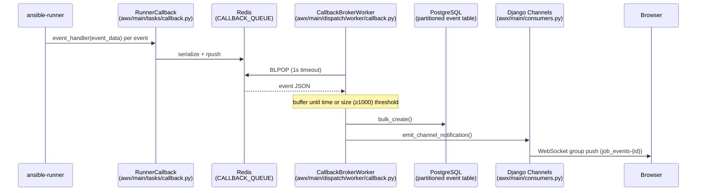

# Job Events Integration — Surface Area Map

## Overview

Job events are the atomic records produced as Ansible executes work. They flow from
ansible-runner through a Redis queue, a batch-writing worker, PostgreSQL (partitioned
tables), a REST API, and a WebSocket layer to the browser. The pipeline is shared by
five job types: Job, AdHocCommand, ProjectUpdate, InventoryUpdate, and SystemJob.

---

## 1. Models

**File:** `awx/main/models/events.py`

| Class | Extends | FK target | Extra fields |
|---|---|---|---|
| `BasePlaybookEvent` | abstract | — | event, event_data, failed, changed, uuid, playbook, play, role, task, counter, stdout, verbosity, start/end_line, parent_uuid |
| `JobEvent` | BasePlaybookEvent | Job, Host | host_name, job_created (partition key) |
| `ProjectUpdateEvent` | BasePlaybookEvent | ProjectUpdate | job_created |
| `BaseCommandEvent` | abstract | — | like above minus playbook/play/role/task/parent_uuid |
| `AdHocCommandEvent` | BaseCommandEvent | AdHocCommand, Host | host_name, job_created |
| `InventoryUpdateEvent` | BaseCommandEvent | InventoryUpdate | job_created |
| `SystemJobEvent` | BaseCommandEvent | SystemJob | job_created |

Each partitioned model has an `Unpartitioned*` proxy pointing at the legacy
`_unpartitioned_*` table for pre-partition rows.

**Key methods on BasePlaybookEvent:**
- `create_from_data(**kwargs)` — factory called by the callback worker (hot path)
- `_update_from_event_data()` — derives host_name, failed, changed from event_data
- `get_event_display2()` — human-readable event label

**Event type constants:** 31 types (runner_on_*, playbook_on_*, debug, verbose, error…)
`WRAPUP_EVENT = 'playbook_on_stats'` / `'EOF'` for command events.

**`EventQuery` model** (`awx/main/models/event_query.py`):
Stores jq queries from collection extensions (FQCN + version unique constraint).
Used post-job to count indirectly created resources.

---

## 2. Database Persistence

**Partitioning** (`awx/main/migrations/0144_event_partitions.py`):
- All five event tables partitioned by RANGE on `job_created` (timestamp).
- PK is `(id, job_created)` to satisfy partition constraint requirements.
- Unpartitioned data kept in `_unpartitioned_*` tables; a `has_unpartitioned_events`
  flag on the job selects the right event class at runtime.

**Indexes** (per event table): on `(job_fk, job_created, event)`, `uuid`, `parent_uuid`,
`counter` — covering the most common query patterns.

**Bulk insert** (`awx/main/dispatch/worker/callback.py`):
- Events accumulate in per-class in-memory buffers.
- Flush triggers: time (`JOB_EVENT_BUFFER_SECONDS`) or buffer size ≥ 1000.
- Flush uses `Model.objects.bulk_create()`; falls back to individual `save()` on error.
- NUL bytes (`\x00`) in stdout are stripped before insert (Postgres incompatibility).

---

## 3. Event Processing Pipeline

### RunnerCallback (`awx/main/tasks/callback.py`)

- One subclass per job type: `RunnerCallbackForProjectUpdate`,
  `RunnerCallbackForInventoryUpdate`, `RunnerCallbackForAdHocCommand`,
  `RunnerCallbackForSystemJob`.
- `event_handler(event_data)`: adds `parent_uuid`, `workflow_job_id`, `host_name`,
  `host_id`; applies rate limiting (skip WebSocket if >30 events/sec with no stdout);
  pushes to Redis via `CallbackQueueDispatcher`.
- `finished_callback()`: sends synthetic EOF event.
- `status_handler()`: captures `job_args`, `job_cwd`, `job_env`, `result_traceback`.
- `artifacts_handler()`: post-job — loads `ansible_data.json`, saves `EventQuery`
  records, stores installed collections / ansible version.

### CallbackQueueDispatcher (`awx/main/queue.py`)

- Serializes events with `AnsibleJSONEncoder` (handles `!vault`, `!unsafe` YAML tags).
- `rpush` onto `settings.CALLBACK_QUEUE`.

### CallbackBrokerWorker (`awx/main/dispatch/worker/callback.py`)

- `read()`: BLPOP with 1-second timeout; tracks queue depth metrics.
- `perform_work(body)`: routes by job type, handles EOF specially (no DB write,
  triggers `job_stats_wrapup`), sets `_skip_websocket_message` flag for rate-limited events.
- `flush()`: bulk insert, `emit_event_detail()` per event, `job_stats_wrapup()` on
  `playbook_on_stats`.
- `job_stats_wrapup()`: atomic `select_for_update()` update of
  `UnifiedJob.host_status_counts`; triggers notifications.

---

## 4. REST API

**URLs:**
- `awx/api/urls/job_event.py` — `/api/v2/job_events/{pk}/`, `/api/v2/job_events/{pk}/children/`
- Sublists hanging off each job type URL (e.g. `/api/v2/jobs/{pk}/job_events/`)

**Views** (`awx/api/views/__init__.py`):
| View | Pattern |
|---|---|
| `JobEventDetail` | GET `/job_events/{pk}/` |
| `JobEventChildrenList` | GET `/job_events/{pk}/children/` |
| `JobJobEventsList` | GET `/jobs/{pk}/job_events/` |
| `JobJobEventsChildrenSummary` | GET `/jobs/{pk}/job_events/children_summary/` — returns tree, meta_event_nested_uuid, event_processing_finished |
| `HostJobEventsList` / `GroupJobEventsList` | events filtered by host/group |
| `AdHocCommandAdHocCommandEventsList` | ad hoc events |
| `ProjectUpdateEventsList` | project update events |
| `SystemJobEventsList` | system job events |

**Pagination:** `UnifiedJobEventPagination` (`awx/api/pagination.py`) — supports both
`page_size` and `limit` query params.

**Mixins:**
- `NoTruncateMixin` — sets `no_truncate=True` in serializer context for full stdout.

---

## 5. Serializers (`awx/api/serializers.py`)

- `JobEventSerializer`: computes `event_display`, `event_level`; truncates stdout to
  `EVENT_STDOUT_MAX_BYTES_DISPLAY` (except `playbook_on_*` events); adds related links
  (job, children, host).
- `ProjectUpdateEventSerializer`: redacts SCM credential URIs in stdout and event_data.
- `AdHocCommandEventSerializer`: drops parent_uuid/playbook/play/task/role/verbosity.
- `InventoryUpdateEventSerializer` / `SystemJobEventSerializer`: extend AdHocCommand
  variant, swap FK reference.

---

## 6. WebSocket / Django Channels (`awx/main/consumers.py`)

- **`EventConsumer`** (AsyncJsonWebsocketConsumer):
  - Auth via CSRF token in session scope.
  - Client subscribes: `{"groups": {"job_events": [123], "ad_hoc_command_events": [456]}}`.
  - Validates object access via `consumer_access()` before joining channel group.
  - Group name format: `{event_type}-{object_id}` (e.g. `job_events-123`).

- **`RelayConsumer`**: node-to-node relay; authenticates with HMAC-SHA256 secret
  (`BROADCAST_WEBSOCKET_SECRET`).

- **`emit_channel_notification(group, payload)`**: called from flush; sends event dict
  with id, stdout, counter, uuid, parent_uuid, event, event_data, failed, changed,
  event_level, play, role, task.

- **Rate limiting / minimal events:**
  - `MINIMAL_EVENTS = {playbook_on_play_start, playbook_on_task_start, playbook_on_stats, EOF}`
    always broadcast regardless of rate.
  - Events with empty stdout AND rate >30/sec skip WebSocket broadcast.
  - `UI_LIVE_UPDATES_ENABLED` setting disables all broadcast when False.

---

## 7. Configuration Constants

| Setting | Purpose |
|---|---|
| `CALLBACK_QUEUE` | Redis key for the event queue |
| `JOB_EVENT_BUFFER_SECONDS` | Max time between flushes |
| `JOB_EVENT_STATISTICS_INTERVAL` | Metrics recording cadence |
| `EVENT_STDOUT_MAX_BYTES_DISPLAY` | Per-event stdout truncation in API |
| `STDOUT_MAX_BYTES_DISPLAY` | Full stdout download limit |
| `UI_LIVE_UPDATES_ENABLED` | Master WebSocket broadcast switch |
| `BROADCAST_WEBSOCKET_SECRET` | HMAC key for node relay auth |
| `BROADCAST_WEBSOCKET_GROUP_NAME` | Channel group for relay |

---

## 8. Testing

| File | Coverage |
|---|---|
| `awx/main/tests/functional/api/test_events.py` | API truncation, children_summary tree |
| `awx/main/tests/functional/models/test_events.py` | Model-level event behavior |
| `awx/main/tests/functional/commands/test_callback_receiver.py` | Buffer/flush logic, error handling |
| `awx/main/tests/unit/models/test_events.py` | Event model instantiation |
| `awx/main/tests/unit/tasks/test_runner_callback.py` | RunnerCallback behavior |
| `awx/main/tests/unit/commands/test_replay_job_events.py` | Event replay command |

---

## 9. Key Files Quick Reference

| File | Role |
|---|---|
| `awx/main/models/events.py` | All event models |
| `awx/main/models/event_query.py` | Collection event-query records |
| `awx/main/dispatch/worker/callback.py` | Buffer, bulk insert, WebSocket emit |
| `awx/main/tasks/callback.py` | RunnerCallback — ansible-runner integration |
| `awx/main/queue.py` | Redis queue dispatcher |
| `awx/main/consumers.py` | WebSocket consumers (EventConsumer, RelayConsumer) |
| `awx/api/views/__init__.py` | Event list/detail views |
| `awx/api/urls/job_event.py` | Event URL routing |
| `awx/api/serializers.py` | Event serializers (~lines 4340-4498) |
| `awx/api/pagination.py` | UnifiedJobEventPagination |
| `awx/main/constants.py` | MINIMAL_EVENTS, event type constants |
| `awx/main/migrations/0144_event_partitions.py` | Partition migration |
| `awx/main/management/commands/run_callback_receiver.py` | Worker process launcher |
| `awx/main/management/commands/replay_job_events.py` | Event replay for recovery |
| `awx/main/management/commands/callback_stats.py` | Queue statistics monitor |
| `awx/main/tasks/receptor.py` | Receptor remote execution (event streaming back) |
| `awx/main/tasks/jobs.py` | Job task definitions; routes to correct callback class |

---

## 10. End-to-End Flow Summary

1. **Ansible runs** → ansible-runner fires `event_handler()` in `RunnerCallback`.
2. **RunnerCallback** enriches the event dict (host ids, workflow id, parent uuid) and
   pushes it serialized to Redis (`CALLBACK_QUEUE`).
3. **CallbackBrokerWorker** (separate process) pops from Redis, classifies by job type,
   buffers in memory.
4. **Flush** (time or size trigger): `bulk_create()` into the partitioned Postgres table;
   per-event `emit_channel_notification()` call.
5. **Django Channels** delivers the payload to all WebSocket clients subscribed to
   `job_events-{job_id}`.
6. **REST API** serves historical events from Postgres, with stdout truncation and
   pagination.
7. **playbook_on_stats** event additionally updates `UnifiedJob.host_status_counts`
   and fires notification hooks.
