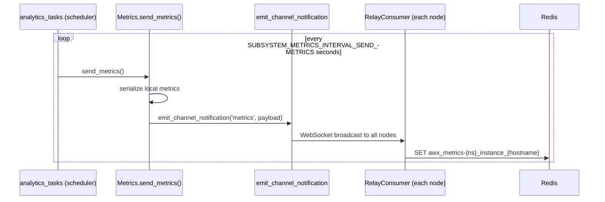
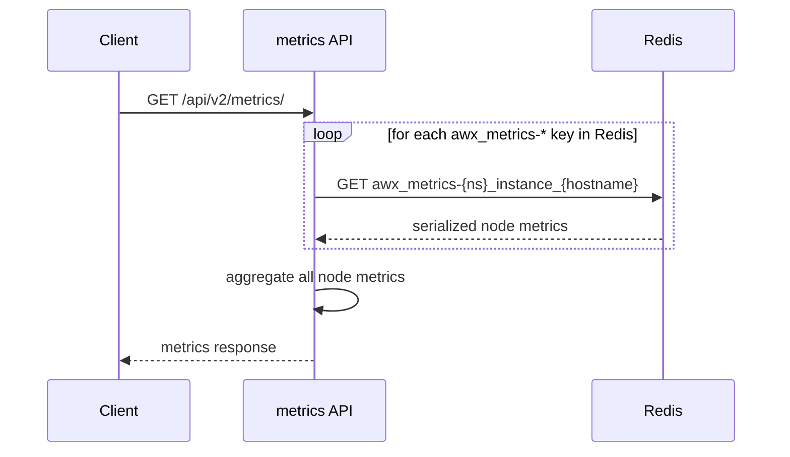
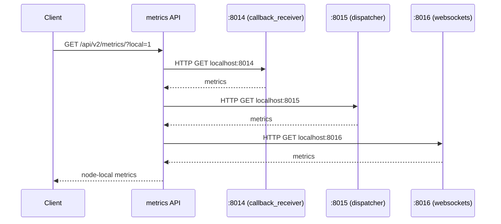
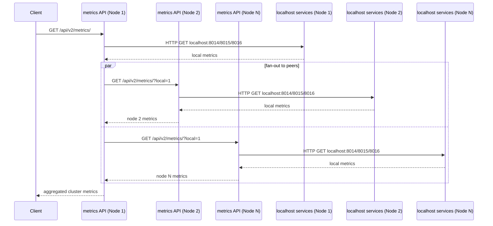

# AI Plan: Use New Metrics Design

## Goal

Replace the Redis/WebSocket-based metrics delivery system with a per-node HTTP metrics server approach. Each service (dispatcher, callback receiver, websockets) runs its own Prometheus HTTP server. The metrics API endpoint aggregates by making HTTP requests to each local service's port instead of reading from Redis. In HA environments, each node is capable of serving cluster-wide metrics by federating requests to peer nodes.

## Background

### Old Architecture (Redis + WebSocket Broadcast)

Each node periodically serializes its metrics and broadcasts them to all other nodes via Django Channels WebSocket relay (`websocket/relay/`). Each node's `RelayConsumer` receives these broadcasts and stores them in Redis under keys like `awx_metrics-{namespace}_instance_{hostname}`. The `/api/v2/metrics/` endpoint then reads all Redis keys to aggregate metrics across all nodes.

**Metric propagation and storage into Redis:**


**Metric retrieval:**


### New Architecture (Per-Node HTTP Servers + Federation)

Each service runs a `prometheus_client` HTTP server on a fixed port (localhost only). When a node receives a request for `/api/v2/metrics/`, it collects metrics from its local services and fans out to all peer nodes' `/api/v2/metrics/?local=1` endpoints, returning a cluster-wide aggregate.

**Local collection** (called with `?local=1`):


**Cluster-wide collection** (default, no `?local=1`):


Ports (from `METRICS_SUBSYSTEM_CONFIG`):
- `callback_receiver`: 8014
- `dispatcherd`: 8015
- `websockets`: 8016

## Key Files

| File | Role |
|------|------|
| `awx/main/analytics/subsystem_metrics.py` | Core metrics classes; contains both old (Redis/send_metrics) and new (MetricsServer) code |
| `awx/api/views/metrics.py` | REST endpoint that aggregates and returns metrics |
| `awx/main/consumers.py` | RelayConsumer — currently stores received metrics in Redis |
| `awx/main/analytics/analytics_tasks.py` | Scheduled task that calls `send_metrics()` |
| `awx/main/analytics/broadcast_websocket.py` | WebSocket relay metrics tracking |
| `awx/main/analytics/dispatcherd_metrics.py` | Already fetches dispatcher metrics via HTTP (port 8015) |
| `awx/settings/defaults.py` | Settings for Redis key prefix, intervals, ports |

## Implementation Steps

### Step 1 — Start HTTP metrics servers in each service

**Callback receiver startup** (`awx/main/management/commands/run_callback_receiver.py`):
- `CallbackReceiverMetricsServer` is already instantiated and `.start()` is called here — no changes needed.

**Websockets metrics server** (`subsystem_metrics.py` line 484):
- `WebsocketsMetricsServer` exists but its registry has no collectors registered.
- Register a `CustomToPrometheusMetricsCollector` wrapping websocket metrics.
- Start it during the websockets/ASGI process startup (e.g., in an ASGI lifespan handler or management command).

**Dispatcher** already has partial support via `dispatch/config.py` (line 63–68) passing `metrics_kwargs` to the dispatcherd service; verify it actually starts the HTTP server.

### Step 2 — Rewrite `MetricsView` to aggregate local services via HTTP

File: `awx/api/views/metrics.py`

Current behavior (line 48):
```python
metrics_to_show += s_metrics.metrics(request)
```

New behavior — make HTTP requests to each local service and concatenate responses:
```python
import requests

METRICS_SERVICES = [
    settings.METRICS_SUBSYSTEM_CONFIG['server']['callback_receiver']['port'],
    settings.METRICS_SUBSYSTEM_CONFIG['server']['dispatcherd']['port'],
    settings.METRICS_SUBSYSTEM_CONFIG['server']['websockets']['port'],
]

for port in METRICS_SERVICES:
    try:
        resp = requests.get(f"http://localhost:{port}/metrics", timeout=2)
        resp.raise_for_status()
        metrics_to_show += resp.text
    except Exception:
        pass  # service may not be running on this node
```

Also remove the existing call to `get_dispatcherd_metrics()` from `dispatcherd_metrics.py` since the dispatcher HTTP server is now covered by the unified loop above.

### Step 3 — Add cross-node federation to `MetricsView`

File: `awx/api/views/metrics.py`

Add a `local` query parameter. When `?local=1` is passed, `MetricsView` returns only the metrics collected from localhost services (Step 2 behavior). When called without `?local=1`, the view also fans out concurrently to all other enabled cluster nodes' `/api/v2/metrics/?local=1` endpoints and concatenates their responses.

```python
from concurrent.futures import ThreadPoolExecutor, as_completed
from awx.main.models import Instance

def _fetch_node_metrics(url, auth_header):
    try:
        resp = requests.get(url, timeout=5, headers={"Authorization": auth_header}, verify=True)
        resp.raise_for_status()
        return resp.text
    except Exception:
        return ""  # node unreachable; skip

# In MetricsView.get(), after collecting local metrics into metrics_to_show:
if not request.query_params.get('local'):
    peers = Instance.objects.filter(enabled=True).exclude(hostname=settings.CLUSTER_HOST_ID)
    auth_header = request.META.get("HTTP_AUTHORIZATION", "")
    urls = [f"https://{node.hostname}/api/v2/metrics/?local=1" for node in peers]
    with ThreadPoolExecutor(max_workers=len(urls) or 1) as pool:
        futures = {pool.submit(_fetch_node_metrics, url, auth_header): url for url in urls}
        for future in as_completed(futures):
            metrics_to_show += future.result()
```

Notes:
- Pass the original `Authorization` header to peer nodes so the request authenticates correctly.
- Fan-out is concurrent via `ThreadPoolExecutor` to avoid serialized latency across N nodes.
- A node that is unreachable or returns an error is silently skipped; the response still includes metrics from all reachable nodes.
- The current node always includes its own local metrics regardless of the `?local=1` flag.

### Step 4 — Remove `send_metrics()` and Redis broadcast from `Metrics` class

File: `awx/main/analytics/subsystem_metrics.py`

Remove or gut these methods:
- `Metrics.send_metrics()` (line ~303–334): broadcasts metrics via `emit_channel_notification` and stores in Redis.
- `Metrics.load_other_metrics()` (line ~336–356): reads metrics from Redis across all nodes.
- `Metrics.generate_metrics()` (line ~358–374): calls `load_other_metrics()`; replace with a simpler local-only generation or remove entirely if `MetricsView` now aggregates via HTTP.
- `Metrics.pipe_execute()` (line ~284–301): saves to Redis pipeline then calls `send_metrics()`; remove the `send_metrics()` call. Keep the local in-memory update if still needed.

Remove the import at line 15:
```python
from awx.main.consumers import emit_channel_notification
```

Remove Redis client initialization used only for metrics storage (`self.conn = get_redis_client()`).

### Step 5 — Remove metrics handling from `RelayConsumer`

File: `awx/main/consumers.py`

Remove the metrics branch from `RelayConsumer.receive_json()` (lines ~108–116):
```python
if group == "metrics":
    message = json.loads(message['text'])
    await self._redis_conn.set(...)
```

If this is the only use of `self._redis_conn` in `RelayConsumer`, remove the Redis client initialization in that class too.

### Step 6 — Remove or repurpose `send_subsystem_metrics` task

File: `awx/main/analytics/analytics_tasks.py`

The scheduled task `send_subsystem_metrics()` (line 15) calls `DispatcherMetrics().send_metrics()` and `CallbackReceiverMetrics().send_metrics()`. Both `send_metrics()` calls are removed in Step 4, so this task is now a no-op. Remove the task entirely and remove it from the dispatcher task schedule.

### Step 7 — Remove or simplify `broadcast_websocket.py`

File: `awx/main/analytics/broadcast_websocket.py`

`RelayWebsocketStatsManager` stores relay stats in Redis under key `broadcast_websocket_stats` and exposes them via `RelayWebsocketStats`. Determine if this data is still needed:
- If websocket relay stats are exposed via the new `WebsocketsMetricsServer` (Step 1), remove the Redis-based approach in this file.
- If nothing else depends on `RelayWebsocketStatsManager`, delete the file.

### Step 8 — Remove deprecated settings

File: `awx/settings/defaults.py`

Settings to remove (or mark deprecated) once all consumers are gone:
- `SUBSYSTEM_METRICS_REDIS_KEY_PREFIX`
- `SUBSYSTEM_METRICS_INTERVAL_SAVE_TO_REDIS`
- `SUBSYSTEM_METRICS_INTERVAL_SEND_METRICS`

Settings to keep (still used for HTTP server ports):
- `METRICS_SUBSYSTEM_CONFIG`
- `METRICS_SERVICE_CALLBACK_RECEIVER`
- `METRICS_SERVICE_DISPATCHER`
- `METRICS_SERVICE_WEBSOCKETS`

### Step 9 — Remove `CustomToPrometheusMetricsCollector` Redis reads (if applicable)

`CustomToPrometheusMetricsCollector` (line ~438) calls `load_other_metrics()` which reads Redis. After Step 4, this method is gone. If `CustomToPrometheusMetricsCollector` is used by the new `MetricsServer` classes, rewrite it to collect metrics directly from the in-memory `Metrics` object instead of from Redis.

### Step 10 — Clean up `dispatcherd_metrics.py`

File: `awx/main/analytics/dispatcherd_metrics.py`

This file already makes an HTTP GET to `http://localhost:8015/metrics`. After Step 2 consolidates all HTTP fetching in `MetricsView`, this helper is redundant. Remove it and its call site in `views/metrics.py`.

## Testing

- Verify `GET /api/v2/metrics/` (no `?local=1`) returns metrics from all nodes in the cluster.
- Verify `GET /api/v2/metrics/?local=1` returns only metrics from services co-located on the receiving node.
- Verify graceful degradation: if a service is not running (e.g., callback receiver is off), the endpoint still returns metrics from other services and doesn't 500.
- Verify graceful degradation: if a peer node is unreachable during fan-out, its metrics are omitted but the response still includes all reachable nodes.
- Confirm no metrics data is written to or read from Redis after the change.
- Confirm `RelayConsumer` no longer handles "metrics" group messages.
- Run existing metrics unit tests; update mocks that previously patched Redis reads.

## Open Problems

### OpenShift / Kubernetes pod topology

In the AWX OpenShift/Kubernetes deployment, the web pod and task pod are separate pods with separate network namespaces. The web pod serves `/api/v2/metrics/` but the callback receiver (port 8014) and dispatcher (port 8015) run in the task pod. `localhost` in the web pod does not reach those services. The per-node HTTP approach in Steps 2–3 assumes all co-located services share a network namespace, which is not true in this deployment model. This plan does not yet address how the web pod collects metrics from the task pod's services.

## Risk / Notes

- The `MetricsServer.start()` binds to `localhost` only — the per-node HTTP servers are never exposed cross-node. Only the Django API (`/api/v2/metrics/?local=1`) is called by peer nodes, going through normal AWX auth.
- Fan-out requests from Node 1 to peer nodes use the caller's `Authorization` header. Ensure the token has permission to read metrics on all nodes (any authenticated admin token should suffice given the existing `MetricsView` permission check).
- The dispatcher HTTP metrics server (port 8015) is managed by the dispatcherd process itself, not by AWX. Verify the dispatcher project already starts it correctly before removing the old Redis path for dispatcher metrics.
- Ensure `prometheus_client.start_http_server()` is idempotent / guarded against double-start in process restarts.
- Fan-out timeout (5 s per peer) means a slow node can delay the response. Consider making the timeout configurable or adding an overall deadline.
