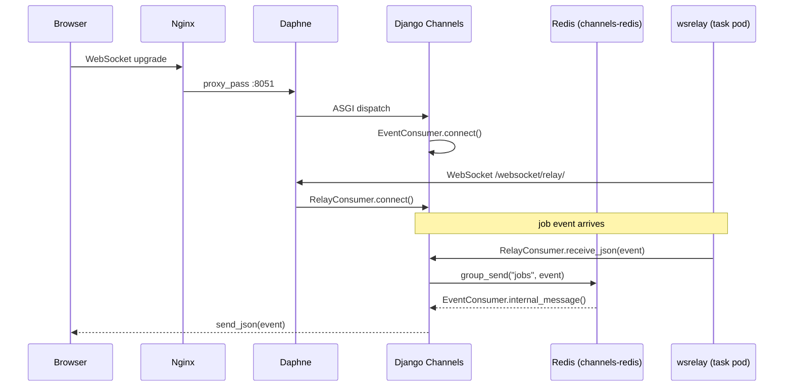
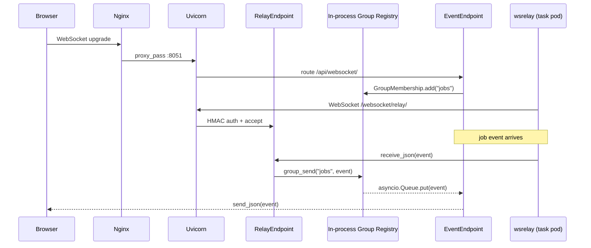

# Plan: Replace Daphne + Django Channels with Starlette

## Overview

Replace AWX's ASGI websocket layer (Daphne + Django Channels + channels-redis) with
Starlette + Uvicorn + in-process asyncio pub/sub. The Django HTTP/WSGI stack is
unchanged; only the websocket ASGI path is affected.

## Motivation

- Django Channels adds significant complexity: a channel layer abstraction, a separate
  process protocol, and a Twisted-based server (Daphne).
- Starlette is a minimal, well-maintained ASGI framework with native WebSocket support,
  no Twisted dependency, and integrates cleanly into a standard Python async stack.
- Uvicorn (uvloop-backed) is faster and simpler to operate than Daphne.
- In-process asyncio queues replace the Redis channel layer entirely for the websocket
  path. Cross-pod fan-out is already handled by wsrelay over WebSocket; no broker is
  needed within a pod.

## Current Architecture



**Key dependencies:** `daphne==4.2.1`, `channels==4.3.1`, `channels-redis==4.3.0`, `twisted`

## Target Architecture



**New dependencies:** `starlette`, `uvicorn[standard]`

**Removed dependencies:** `daphne`, `channels`, `channels-redis`, `twisted`

**Constraint:** Uvicorn runs with `--workers 1` per pod. Horizontal scaling is achieved
by running multiple pods; wsrelay already connects to every web pod's relay endpoint
individually. In-process queues cannot span OS processes.

## Affected Files

| File | Change |
|------|--------|
| `awx/asgi.py` | Rewrite: build Starlette app instead of `get_default_application()` |
| `awx/main/consumers.py` | Rewrite: Starlette WebSocket endpoint classes |
| `awx/main/pubsub.py` | New: in-process asyncio group registry |
| `awx/main/routing.py` | Rewrite: Starlette `Router` replacing `ProtocolTypeRouter` |
| `awx/settings/defaults.py` | Remove `CHANNEL_LAYERS`, `daphne` from `INSTALLED_APPS` and logging |
| `requirements/requirements.in` | Swap dependencies |
| `requirements/requirements.txt` | Regenerate after `.in` changes |
| `tools/docker-compose/supervisor.conf` | Rename `awx-daphne` → `awx-uvicorn`, update command |
| `Makefile` | Update `daphne` target to `uvicorn` |
| `awx/main/tests/functional/test_routing.py` | Update to use Starlette test client |

Files **not** changing: nginx configs (upstream still `localhost:8051`), `wsrelay.py`
business logic, heartbeat command, `WebsocketSecretAuthHelper`, frontend code.

---

## Implementation Phases

### Phase 1 — Dependencies

**`requirements/requirements.in`**
```
# Remove:
daphne
channels
channels-redis

# Add:
starlette
uvicorn[standard]
```

Regenerate `requirements.txt` (`pip-compile requirements/requirements.in`).

**`awx/settings/defaults.py`**

1. Remove `'daphne'` from `INSTALLED_APPS` (line ~337). The `daphne` app was only needed
   to override Django's `runserver`; it is irrelevant now.
2. Remove the `CHANNEL_LAYERS` dict (lines 722-731). No replacement setting is needed;
   the in-process registry requires no configuration.
3. In `LOGGING['loggers']`, rename `'daphne'` key to `'uvicorn'` (line ~769).
4. Keep all `BROADCAST_WEBSOCKET_*` settings unchanged; they are consumed by `wsrelay`
   and heartbeat, not by Channels.

---

### Phase 2 — In-Process Group Registry (`awx/main/pubsub.py`)

Replace `channels_redis` with a pure-asyncio in-process group registry. Messages
delivered to a group are put directly into the `asyncio.Queue` of every connection
currently subscribed to that group — no broker, no network hop.

```python
# awx/main/pubsub.py
"""
In-process asyncio pub/sub group registry.

Replaces channels_redis. All state is local to the running process, so
Uvicorn must run with a single worker per pod (the default).
"""
import asyncio
from collections import defaultdict

# group name -> set of queues, one per active WebSocket connection
_groups: dict[str, set[asyncio.Queue]] = defaultdict(set)


async def group_send(group: str, message: dict) -> None:
    """Deliver message to every connection subscribed to group."""
    for queue in list(_groups.get(group, ())):
        await queue.put(message)


class GroupMembership:
    """
    Manages group subscriptions for a single WebSocket connection.

    Usage:
        async with GroupMembership() as membership:
            await membership.add("jobs")
            async for message in membership:
                await websocket.send_json(message)
    """

    def __init__(self):
        self._queue: asyncio.Queue = asyncio.Queue()
        self._joined: set[str] = set()

    async def __aenter__(self):
        return self

    async def __aexit__(self, *_):
        for group in list(self._joined):
            await self.discard(group)

    async def add(self, group: str) -> None:
        if group not in self._joined:
            self._joined.add(group)
            _groups[group].add(self._queue)

    async def discard(self, group: str) -> None:
        if group in self._joined:
            self._joined.discard(group)
            _groups[group].discard(self._queue)
            if not _groups[group]:
                del _groups[group]

    def __aiter__(self):
        return self

    async def __anext__(self) -> dict:
        return await self._queue.get()
```

---

### Phase 3 — Consumers → Starlette Endpoints (`awx/main/consumers.py`)

Rewrite `consumers.py` as plain ASGI callables. Authentication and business logic
are preserved; only the base class API changes.

**Mapping: Django Channels → Starlette**

| Channels | Starlette |
|----------|-----------|
| `AsyncJsonWebsocketConsumer` | Direct `WebSocket` usage |
| `self.channel_layer.group_add(group, self.channel_name)` | `await membership.add(group)` |
| `self.channel_layer.group_discard(group, self.channel_name)` | `await membership.discard(group)` |
| `self.channel_layer.group_send(group, msg)` | `await pubsub.group_send(group, msg)` |
| `await self.send_json(data)` | `await websocket.send_json(data)` |
| `await self.close()` | `await websocket.close()` |
| `self.scope['user']` | `scope['user']` (set by auth middleware) |
| `self.scope['headers']` | `websocket.headers` |

**`RelayEndpoint` skeleton:**

```python
import asyncio
from starlette.websockets import WebSocket, WebSocketDisconnect
from awx.main.pubsub import GroupMembership, group_send
from awx.main.utils.websockets import WebsocketSecretAuthHelper

class RelayEndpoint:
    async def __call__(self, scope, receive, send):
        websocket = WebSocket(scope, receive, send)
        if not WebsocketSecretAuthHelper.is_authorized(websocket.headers):
            await websocket.close(code=4401)
            return
        await websocket.accept()
        async with GroupMembership() as membership:
            await membership.add(settings.BROADCAST_WEBSOCKET_GROUP_NAME)
            listener = asyncio.create_task(self._forward(websocket, membership))
            try:
                while True:
                    data = await websocket.receive_json()
                    await self._handle_relay_message(data)
            except WebSocketDisconnect:
                pass
            finally:
                listener.cancel()

    async def _forward(self, websocket, membership):
        async for message in membership:
            try:
                await websocket.send_json(message)
            except Exception:
                break

    async def _handle_relay_message(self, data):
        # Fan out to target group(s); mirrors RelayConsumer.receive_json logic
        group = data.get('group')
        if group:
            await group_send(group, data)
```

**`EventEndpoint` skeleton:**

```python
class EventEndpoint:
    async def __call__(self, scope, receive, send):
        websocket = WebSocket(scope, receive, send)
        user = scope.get('user')
        if not user or not user.is_authenticated:
            await websocket.close(code=4403)
            return
        await websocket.accept()
        await websocket.send_json({'accept': True, 'type': 'auth_token'})
        async with GroupMembership() as membership:
            listener = asyncio.create_task(self._forward(websocket, membership))
            try:
                while True:
                    data = await websocket.receive_json()
                    await self._handle_subscribe(websocket, user, membership, data)
            except WebSocketDisconnect:
                pass
            finally:
                listener.cancel()

    async def _forward(self, websocket, membership):
        async for message in membership:
            try:
                await websocket.send_json(message)
            except Exception:
                break

    async def _handle_subscribe(self, websocket, user, membership, data):
        # Mirrors EventConsumer.receive_json: validate groups, check permissions,
        # call membership.add() / membership.discard()
        ...
```

---

### Phase 4 — Routing (`awx/main/routing.py`)

Replace `ProtocolTypeRouter` / `URLRouter` with a Starlette `Router`:

```python
# awx/main/routing.py
from starlette.routing import Router, WebSocketRoute
from awx.main.consumers import EventEndpoint, RelayEndpoint
from awx.main.middleware import AuthMiddlewareStack  # see Phase 5

relay_routes = [
    WebSocketRoute('/websocket/relay/', RelayEndpoint()),
]

user_routes = [
    WebSocketRoute('/api/websocket/', EventEndpoint()),
    WebSocketRoute('/websocket/', EventEndpoint()),
]

def get_application():
    return AuthMiddlewareStack(
        Router(relay_routes + user_routes)
    )

# PEP 562 lazy attribute — defers DB access until first request
def __getattr__(name):
    if name == 'application':
        return get_application()
    raise AttributeError(name)
```

> The `AWXProtocolTypeRouter` currently cleans up stale state on startup. Move that
> logic into the ASGI lifespan handler (see Phase 6).

---

### Phase 5 — Auth Middleware (`awx/main/middleware.py`)

`DrfAuthMiddlewareStack` (from `ansible_base`) wraps Django session/token auth around
a Channels ASGI scope. Replace with an equivalent plain ASGI middleware:

```python
# awx/main/middleware.py
from django.contrib.auth.models import AnonymousUser
from asgiref.sync import sync_to_async
from starlette.types import ASGIApp, Receive, Scope, Send

class DRFAuthMiddleware:
    """
    Authenticates WebSocket connections using Django session or token auth.
    Sets scope['user'] before the endpoint receives the connection.
    """
    def __init__(self, app: ASGIApp):
        self.app = app

    async def __call__(self, scope: Scope, receive: Receive, send: Send):
        if scope['type'] == 'websocket':
            scope['user'] = await self._resolve_user(scope)
        await self.app(scope, receive, send)

    async def _resolve_user(self, scope):
        # Parse session cookie from scope['headers'], look up Django session,
        # return authenticated User or AnonymousUser.
        # Use sync_to_async for ORM calls.
        ...
        return AnonymousUser()


def AuthMiddlewareStack(app: ASGIApp) -> DRFAuthMiddleware:
    return DRFAuthMiddleware(app)
```

> **Option:** Audit whether `ansible_base`'s existing middleware already works as a
> plain ASGI middleware without a Channels dependency. If so, import it directly rather
> than reimplementing.

---

### Phase 6 — ASGI Entry Point (`awx/asgi.py`)

```python
# awx/asgi.py
"""
ASGI application for AWX WebSocket handling (served by Uvicorn).
Django HTTP traffic continues through awx.wsgi via uwsgi.
"""
import os
from contextlib import asynccontextmanager

os.environ.setdefault('DJANGO_SETTINGS_MODULE', 'awx.settings.production')

import django
django.setup()

from starlette.applications import Starlette
from awx.main.routing import get_application


@asynccontextmanager
async def lifespan(app):
    # Replaces AWXProtocolTypeRouter startup cleanup
    from awx.main.routing import _startup_cleanup
    await _startup_cleanup()
    yield


application = Starlette(lifespan=lifespan)
application.mount('/', get_application())
```

---

### Phase 7 — Process Management

**`tools/docker-compose/supervisor.conf`** — rename program block:

```ini
[program:awx-uvicorn]
command=make uvicorn
autostart=true
autorestart=true
...
```

**`Makefile`** — replace `daphne` target:

```makefile
uvicorn:
	uvicorn --host 127.0.0.1 --port 8051 --workers 1 awx.asgi:application
```

`--workers 1` is required for the in-process group registry to work correctly.
Horizontal scaling is achieved by running additional pods, each with their own
single-worker Uvicorn process. wsrelay connects to each pod's relay endpoint.

---

### Phase 8 — Tests (`awx/main/tests/functional/test_routing.py`)

Replace `channels.testing.websocket.WebsocketCommunicator` with
`starlette.testclient.TestClient`:

```python
from starlette.testclient import TestClient
from awx.asgi import application

def test_relay_authorized():
    client = TestClient(application)
    with client.websocket_connect('/websocket/relay/', headers={...}) as ws:
        ws.send_json({'group': 'jobs', 'data': {}})
        ...

def test_relay_unauthorized():
    client = TestClient(application)
    with pytest.raises(WebSocketDisconnect) as exc_info:
        with client.websocket_connect('/websocket/relay/') as ws:
            pass
    assert exc_info.value.code == 4401

def test_event_consumer_unauthenticated():
    client = TestClient(application)
    with pytest.raises(WebSocketDisconnect) as exc_info:
        with client.websocket_connect('/api/websocket/') as ws:
            pass
    assert exc_info.value.code == 4403
```

---

## Call Sites: `channel_layer.group_send`

All callers must be updated to use `awx.main.pubsub.group_send`:

```bash
grep -rn "channel_layer" awx/ --include="*.py"
```

Expected locations:
- `awx/main/consumers.py` — handled in Phase 3
- `awx/main/analytics/broadcast_websocket.py` — metrics/stats publisher

Each `await get_channel_layer().group_send(group, msg)` becomes
`await pubsub.group_send(group, msg)`.

---

## Risks and Mitigations

| Risk | Mitigation |
|------|------------|
| Auth middleware regression (session, token, OAuth) | Port unit tests from `ansible_base` channels middleware; run existing auth integration tests |
| HMAC relay auth breakage | `WebsocketSecretAuthHelper` is self-contained and unchanged; add targeted test |
| In-process registry lost on crash | Uvicorn restarts cleanly; clients reconnect via existing retry logic in the frontend |
| Multiple workers breaking fan-out | Enforce `--workers 1` in Makefile and supervisor; document constraint |
| `wsrelay` compatibility | `wsrelay` connects over standard WebSocket to unchanged URL + HMAC auth — no wsrelay code changes expected |
| Twisted removal breaking other code | Audit `requirements.txt` transitive deps; `twisted` was only pulled in by `daphne` |
| Django `runserver` no longer ASGI | Dev workflow uses supervisor+uvicorn; add `uvicorn awx.asgi:application --reload` make target for local WS dev |

---

## Out of Scope

- Replacing uwsgi (HTTP/WSGI stack) — unchanged
- Frontend websocket code — unchanged
- `wsrelay` business logic — unchanged
- Nginx configuration — unchanged (upstream still `localhost:8051`)
- Heartbeat / `run_ws_heartbeat` — unchanged (uses pg_notify, not channels)

---

## Dependency Delta

```
Removed:
  daphne==4.2.1
  channels==4.3.1
  channels-redis==4.3.0
  twisted[tls]>=24.7.0   (verify no other consumer before removing)

Added:
  starlette>=0.40
  uvicorn[standard]>=0.30   (pulls in uvloop, httptools)
```

`asgiref` may remain as a Django internal dependency; do not remove without verifying.

---

## Acceptance Criteria

1. `uvicorn` starts on port 8051; nginx proxies WebSocket connections successfully.
2. Browser clients connect to `/api/websocket/` and receive job status events in real time.
3. `wsrelay` connects to `/websocket/relay/` and fan-out across pods works end-to-end.
4. Unauthenticated connections to `/api/websocket/` are rejected (close code 4403).
5. Relay connections with wrong/missing HMAC secret are rejected (close code 4401).
6. All tests in `awx/main/tests/functional/test_routing.py` pass.
7. No `channels`, `daphne`, or `twisted` imports remain in `awx/`.
